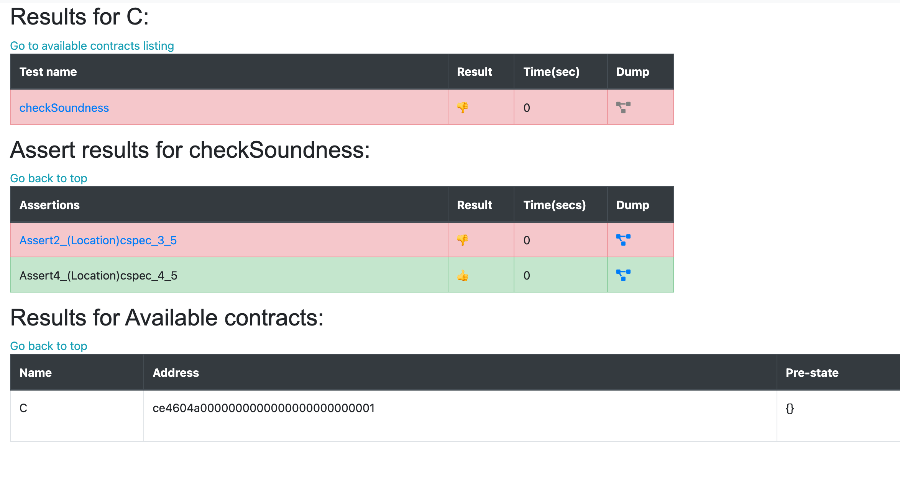
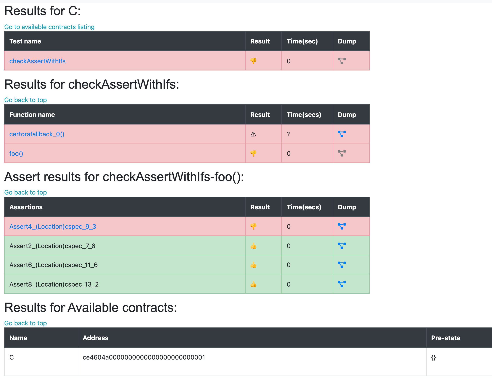
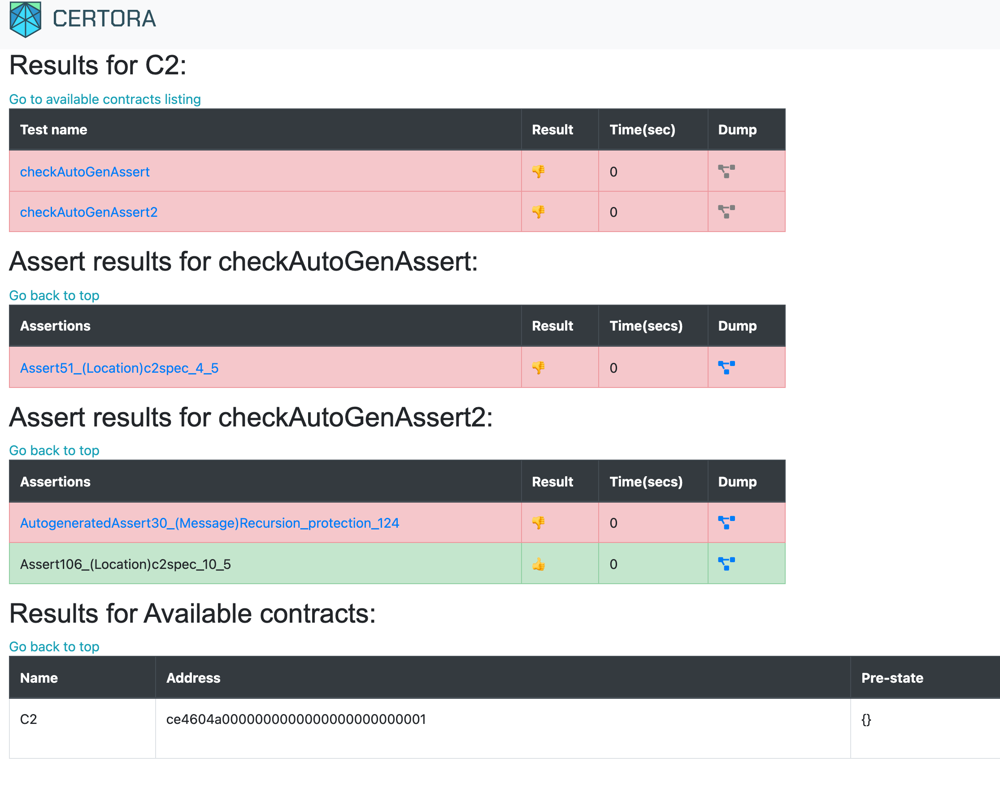

Assert splitting
================

Currently, each _rule_ in the spec file generates a **single** **result**,
highlighting a conclusion for the entire rule (fail, succeed, timeout,
unknown). Even in the case when there are multiple assert statements within a
rule, only a single result is generated. However, with the addition of assert
each rule is now split into **multiple sub rules**, one for each of the asserts
present in the rule. The rule is split not only on the user specified asserts,
but also on the asserts that are automatically generated by the tool itself
(the tool generates some assert statements to check against infinite recursion,
stack overflows, etc.).

How the sub rules are generated
-------------------------------

For each (TAC) assert command, a new sub rule ending at that assert command (_target assert)_ is generated, ignoring the remaining code after the target assert. Moreover, all the asserts that come (topologically) before the _target_ assert command are converted into **assume commands** in the sub rule. Thus, you can think of a sub rule as checking a single target assert assuming the previous asserts hold. Hence, you can think of assert splitting as follows: the following rule

```java
rule checkElseNotExecuted(mathint r) {
   uint256 curr = counter();
   env e;

   assert counter() == curr;

   uint x = true ? 7 : inc(e);
   assert counter() == curr, "Value not equal, else branch executed above";
   assert x == 7;

   uint y = 2 == 3 ? dec(e) : 42;
   assert counter() == curr, "Value not equal, then branch executed above";
   assert y == 42;

   uint z = r > 5 ? inc(e) : dec(e);
   assert counter() != curr, "Value equal, both branches executed above";
}
```

will be split into the following sub rules:

```java
rule <ruleID>1 (mathint r) {
   uint256 curr = counter();
   env e;

   assert counter() == curr;
}

rule <ruleID>2 (mathint r) {
   uint256 curr = counter();
   env e;

   assume counter() == curr;

   uint x = true ? 7 : inc(e);
   assert counter() == curr, "Value not equal, else branch executed above";
}

rule <ruleID>3 (mathint r) {
   uint256 curr = counter();
   env e;

   assume counter() == curr;

   uint x = true ? 7 : inc(e);
   assume counter() == curr, "Value not equal, else branch executed above";
   assert x == 7;
}

...

rule <ruleID>6 (mathint r) {
   uint256 curr = counter();
   env e;

   assume counter() == curr;

   uint x = true ? 7 : inc(e);
   assume counter() == curr, "Value not equal, else branch executed above";
   assume x == 7;

   uint y = 2 == 3 ? dec(e) : 42;
   assume counter() == curr, "Value not equal, then branch executed above";
   assume y == 42;

   uint z = r > 5 ? inc(e) : dec(e);
   assert counter() != curr, "Value equal, both branches executed above";
}
```

The `ruleID` for each of the sub rules above is formed based on the target assert command.

*   If it is a user specified assert, the rule name will have the form:
    
    *   `Assert51_(Message)<user specified msg with the assert>` if the user has specified an assert message or
        
    *   `Assert66_(Location)cspec_46_2` if there is no assert message associated with the assert, it displays the location of the target assert: File `c.spec`, line `46`, column `2`.
        
    *   `51` and `66` in the above rule names are assert ids assigned by the _tool_ to the target assert commands. They are mostly there for ensuring uniqueness of different assert commands
        
*   For automatically generated asserts, we have
    
    *   `AutogeneratedAssert30_(Message)Recursion_protection_124` if there is a message associated with the automatically generated assert or
        
    *   `AutogeneratedAssert30_(Symbol)b` when there is no message. (NOTE: In the future, we plan to incorporate solidity source file information (that produced the automatically generated assert) in the rule name)
        

Here is another example:

```java
rule checkSoundness {
    bool b;
    assert !b; 
    assert !b;
} 
```

The above rule will fail when the model assigns `b = true`. With assert splitting, it will show two sub rules:

```java
// fails when model assigns b = true
rule 1 {
bool b;
assert !b;    
} 

// passes
rule 2 {
bool b;
assume !b;
assert !b;
}
```

As discussed later, the report will show the results for both the asserts and will also _summarize_ the entire rule’s result as a failure (as expected).

What if I have an assert command within an if-else statement
------------------------------------------------------------

If your code has assert commands within if-else statements,

```java
rule checkAssertWithIfs(method f) {
    env e;
    calldataarg arg;
    f(e, arg);
    bool b = false;
    if (f.isFallback) {
        assert b;  
    } else if (f.selector == foo().selector) {
        assert b;	
    } else {
        assert b;  
    }
    assert false;        
}
```

You can think of assert splitting as generating the following rules:

*   **1st assert** (line 7)
    
    ```java
    rule 1(method f) {
      env e;
      calldataarg arg;
      f(e, arg);
      bool b = false;
      if (f.isFallback) {
        assert b;
      } else {
        assert true;
      }
    }
    ```
    
*   **2nd assert** (line 9)
    
    ```java
    rule 2(method f) {
      env e;
      calldataarg arg;
      f(e, arg);
      bool b = false;
      if (f.selector == foo().selector) {
        assert b;
      } else {
        assert true;
      }
    }
    ```
    
*   **3rd assert** (line 11)
    
    ```java
    rule 3(method f) {
      env e;
      calldataarg arg;
      f(e, arg);
      bool b = false;
      if (!f.isFallback && !(f.selector == foo().selector)) {
        assert b;
      } else {
        assert true;
      }
    }
    ```
    
*   **4th assert** (line 13)
    
    ```java
    rule 4(method f) {
        env e;
        calldataarg arg;
        f(e, arg);
        bool b = false;
        if (f.isFallback) {
            assume b;  
        } else if (f.selector == foo().selector) {
            assume b;	
        } else {
            assume b;  
        }
        assert false;        
    }
    ```
    

Think of the program in terms of a control flow graph. Lets call the block/node which contains the target assert the _target block_. Now, when we split a rule on the target assert, we only consider the blocks _from_ which the target block is _reachable_. If a block has two outgoing edges (e.g. if statements) and one edge points to a block **B** from which the target block cannot be reached, the subgraph beginning at B will be replaced by a **dummy block** containing a single command `assert true`. If the program execution reaches this dummy block, we'll know that the target assert is not violated for that execution. Lastly, after the control flow graph has been modified, all the previous assert commands still remaining in the modified graph are converted into assume commands as before.

Note that `rule 4` above will pass vacuously because all program paths to the target assert have `assume false` before the target assert is reached.

Report
------

These sub rules are then verified in parallel and the result of the rule is displayed in the report as follows:

*   When all the sub rules succeed, the report shows only a single SUCCESS result for the entire rule (same as what the report displayed originally)
    
*   When _any_ of these sub rules do not succeed (fail, timeout or give an unknown result), the report shows individual results for
    
    *   a) all the user specified asserts
        
    *   b) all the automatically generated asserts that **did not succeed**
        

Here are some example reports for the rules above:

`checkSoundness`:



`checkAssertWithIfs`:



Note that `checkAssertWithIfs` is a parametric rule. For parametric rules, assert splitting of the rule is performed for **each** function.

Here is also an example of automatically generated asserts:

```java
// C2.sol
contract C2 {
    function foo(uint32 _count) public returns (uint) {
        if (_count < 2)
            return 1;

        else
            return foo(_count - 1) + foo(_count - 2);
        
    }
}


// c2.spec
// auto generated asserts not violated
rule checkAutoGenAssert() {
    env e;
    assert foo(e, 3) == 4;       // fails
}

// auto generated assert violated
rule checkAutoGenAssert2() {
    env e;
    assert foo(e, 5) == 13;      // fails when recurionEntryLimit = 4
}
```


