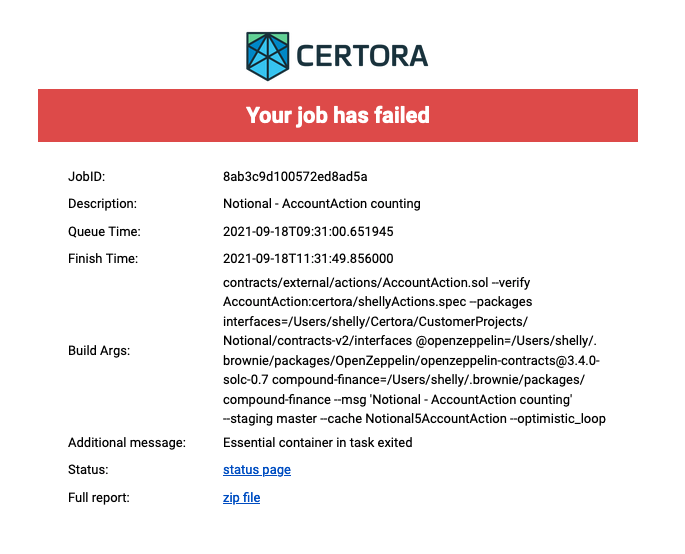

Troubleshooting
===============

Certora Prover is a complex tool, relying on many abstractions, and thus its outputs can be confusing. Moreover, it is constantly in development, and as it becomes more robust, one should still be aware of its oddities.

This page lists a few common issues that can happen and helps in their debugging.

[Ask, ask, ask](https://discord.com/channels/795999272293236746/1104825071450718338)! There’s no stupid question. There’s no not-in-place comment.
This page will only address a partial subset of the
problems that could happen.

Timeouts
--------

### Identify the kind of timeout

#### Global timeout

Every cloud run is limited to 2 hours. When 2 hours have elapsed, you will get an email that looks like this:



As you can see there’s a ~2 hours difference between “Queue Time” and “Finish Time”.

**Action items:**

1.  Figure out if the problem happened due to having too many rules and SMT taking too long, or if preprocessing has failed to complete in time. Therefore, open the linked-to **zip file**, extract it, and look into `Reports/Results.txt`. If there is no message “Has CVL checks” or “Starting to run on rule ….” then there is a good chance that preprocessing took too long.  
    If you did not even see a message “The scene contains … contracts” it means that even the first step of preprocessing took too long.
    
2.  If the problem is preprocessing, first try to run with `-enableEqualitySaturation=false`, and if that does not help try in addition `-simplificationDepth=10`. If both don't help, please report to Certora.

3.  If you’re blocked on this contract, try to make progress by either summarization, or manually removing parts of the code. The code may contain libraries that add to the complication, so try to “erase” those parts of the code first and re-run. If it works, it's better to undo the changes and apply summarizations.
    
4.  Otherwise, if rules are already starting to process, check how long approximately preprocessing took. You can measure that using the “Ping” messages. A ping message is printed every minute. If preprocessing took more than 30 minutes, report to Certora like in step 2, and either you can try removing parts of the code or just run 1 rule instead of all rules.
    
5.  If there are many rules, you could also try to set -depth=1. This implies there will be fewer SMT solver instances run per each rule. (default is 10, so 3 or 5 could also work.) It may work better with even reduced timeouts: -t=60 (default is 300.)
    

#### SMT timeouts

SMT is the hardest nut to crack! There could be so many reasons that they occur. But there’s a checklist of things that we can check off before giving up.

**Timeouts in sanity rules:**

Those would show up if the code is inherently complex. Red flags to look for:

1.  **Tool analyses failing.** Open the `statsdata.json` file. For example, if you have a link  
    ```
    https://vaas-stg.certora.com/output/43260/dafd64136c1d71ba882c/?anonymousKey=a8e7a2b10c4f9f74ea55624c166d7edee8f1e2bc
    ```
    then the file would be in  
    ```
    https://vaas-stg.certora.com/output/43260/dafd64136c1d71ba882c/**statsdata.json**?anonymousKey=a8e7a2b10c4f9f74ea55624c166d7edee8f1e2bc  
    ```
    Look at the `ANALYSIS` key. If you see any `false` entries on keys that are not `constructor()` or `ecrecover` - report to Certora.
    
2.  **A non-empty “Call Resolution” warnings table.** Delegate calls could be tricky and invalidate some of the Prover’s optimizations that were built to avoid timeouts. If such appear, try to scope out the verification to ignore the `delegatecall`s. Check with a security person, a more experienced user, or even the customer if you’re not sure if it’s safe to ignore.
    
3.  **Complex data types.** As of today, passing around complex structs and arrays between contracts and within internal functions could be complicated for the tool. Try to harness those.
    
4.  **Inline assembly and bitwise arithmetic.** It may contain complex optimized code.
    
5.  **Non-linear arithmetic.** This is usually not expected in sanity rules, but if a timeout happens and only these remain, try to remove those last.
    

It is almost always better to get the sanity rule to succeed for all functions in the contract after applying all the summaries, links, and simplifications you planned to do. If sanity is failing, probably any other rule will also fail.

**Timeouts in your rules:**

At this point, if sanity passed and in reasonable times (not more than 1-2 minutes per method), non-linear arithmetic, an abundance of complex data types management in multiple calls, and complex contract logic are to blame. Some tips:

1.  Do you have simpler rules that you did not try yet? Try them first. The simpler the rule, the easier it should be to understand timeouts in it.
    
2.  Try to summarize more extensively.
    
3.  Review your links and dispatchers. If the dispatcher can select more than 2 options (e.g. more than 2 ERC20 tokens), it could add significant overhead to SMT.
    
4.  If your rule checks more than a single assertion, select just one assertion at a time, and comment out the rest.
    
5.  Check one rule at a time and try to increase `-depth=15`. This could help if the code contains many branches.
    
6.  It could be that internal function summaries were not applied. You can check this with the `-showInternalMethods` option that prints the internal functions detected. If you provided such summaries and there is no change in run times, please report to Certora.

7. If your rule or code is heavy with bitwise operations, run with `-useBitVectorTheory`.

8. Set `-smt_hashingScheme` to either `Legacy` or `PlainInjectivity`. Default option is `Datatypes`.

9. Set `-mediumTimeout` to a value above 10.

10. Set the Prover to check every assert individually, by setting `-multiAssertCheck`.

11. If your rule or code contain divisions, see if underapproximation helps (underapproximation means a counterexample is valid but a proof is not), by using either `-divideByConstants=true` or `-divideNoRemainder=true`.

12. Make sure you set the unroll factor `--loop_iter` to the minimum that is still sound (passing sanity rule). Another option to experiment with regarding loops is `-copyLoopUnroll` (default 4, one may attempt to decrease).

13. Enable CEGAR (advanced solving mode) with `-cegar=true`.
    

Errors
------

### Out of Memory (OOM)

Report to Certora, along with the zip file for the run. Context-switch to another contract or rule if you can. If you are aware of a complex library or function in the code - try to remove it. Also, try to understand where the tool OOM’d - follow the process described in the global timeout section.

### Opaque errors in the output page

Jump to `FinalResults.html` to get more information. For example, if you have a link  
```
https://vaas-stg.certora.com/output/43260/dafd64136c1d71ba882c/?anonymousKey=a8e7a2b10c4f9f74ea55624c166d7edee8f1e2bc
```
then the file would be in  
```
https://vaas-stg.certora.com/output/43260/dafd64136c1d71ba882c/**FinalResults.html**?anonymousKey=a8e7a2b10c4f9f74ea55624c166d7edee8f1e2bc
```

Share the results with Certora. The comment could still help you get started on debugging.

### Failures to apply hooks and ghosts

One of the most common reasons for hooks failing is that the storage analysis failed. Potential causes:

1.  You have an unresolved library call in the contract. This could be seen from the Call Resolution Warnings table. Essentially, an unknown `delegatecall` can freely modify the contract's storage and violate any storage layout defined by the main contract we verify. So the storage analysis fails because it can be unsound to infer anything about the storage.
    
2.  Your code is compiled with optimizations. Solidity's optimizations are notoriously hard to process sometimes. Report to Certora and try to run without them (some codes will fail to compile, in which case a more complicated solution should be devised, ideally in cooperation with another team member or even the customer).
    

Understanding counter-examples
------------------------------

There could be many reasons for false counterexamples, but here are a few common ones.

A counterexample that looks fishy does not rule out a potential bug that the rule can uncover.

1.  **External call havocs.** Look for warnings in the Call Resolution table - this could indicate _havocs_. Havocs are a common cause of counterexamples that seem to come out of nowhere!
    
2.  **Links are not applied as expected.** Note that if you use `--link` to link, you may sometimes need to require that the field is equal to the linked-to contract's address within the rule itself. (Dispatcher links do not have this issue.)
    
3.  **Bitwise operations.** By default, the tool will overapproximate bitwise
    operations applied in a non-standard way (xor, or, and non 2^n-1 masks for
    and). Try to look over the dump and look for red-background lines.  You may
    be able to solve these by passing the `--prover_arsg -useBitVectorTheory` option
    on the command line

4.  **Math.** Sometimes the tool overapproximates math, in particular, multiplication by non-constant, division, and modulo operations. The development team tries to minimize the number of times it happens, but it could still happen. Follow guidelines for bitwise operations as stated above.
    
5.  **Aliasing.** Be on the lookout if your environment’s `msg.sender` is the same as `currentContract` or any linked contract. The tool should report these more clearly but read the call trace carefully. Also, note trivial assignments like 0.
    
6.  **Correct storage modeling.** Suppose you have a rule that calls some getter, then you call a function that’s expected to affect the results of that getter, but in the counterexample it stays the same. It could be that the code invoked is not reaching the expected write to the relevant storage slot, or it computed the slot’s address differently. The deepest level in the call trace for stores and loads will show the actual number used for the slot’s address, so you can find-in-page the slot number from the getter and see if you find any match for it inside the function.
    

### Known issues

All of these issues already appear in our to-do list, but it takes time to handle them.

1.  There is no support for structs in CVL. Struct return types can be handled as tuples, but this will work only for simple types.
    
2.  Array support is still limited in CVL. You could pass arrays as arguments, but not get them as return values. Arrays-within-arrays are not supported. You cannot dereference arrays or access their length from a quantified expression.
    
3.  Using quantifiers is generally advised against at this point.
    
4.  Writing to immutable fields in constructors cannot be reasoned about. This will affect you if you have an invariant that checks fields marked `immutable`.
    
5.  One cannot link to constructors.
    
6.  A loop with a large, statically known constant (> ~10) is impractical to handle - get rid of the relevant code snippet.
