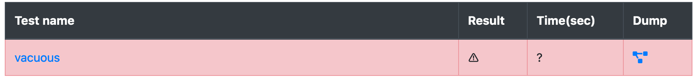

Common Pitfalls
===============

Vacuity
-------

Vacuity refers to the state where we have a spec reported to be correct by the
Prover, even for assertions that are obviously wrong. To be more precise, an
assertion in the spec is effectively not checked because no input satisfies all
requirements defined by the spec.

An obvious example of vacuity is the following rule:

```cvl
rule vacuous(uint x) {   
 require x != x;  
 assert false;
}
```

No input `x` ever satisfies `x != x`, but the `assert false` is expected to
trigger a failure. The vacuity of the `require` statement implies our assertion
is not reachable, thus the rule is proven.

Vacuity is problematic because it indicates that the spec itself is wrong.
Usually, vacuity is not as blatantly visible as in the above example, and thus
we should take precautions to avoid writing vacuous specs.

### Basic vacuity checking

Run the `certora-cli` with the following additional option: `--rule_sanity` to
run a basic vacuity check. This option will instruct the tool to prove each
rule twice: First time with the original spec, Second time with all assertions
removed, and a single `assert false` statement in the end instead. If the
second run of the rule does not fail, then a successful result of the original
run is meaningless.



Below we present a few examples of vacuous specs.

### Raw arguments (soon to be solved!)

The `calldataarg` type represents the full byte array passed as `calldata` to
the EVM bytecode. It includes, in particular, the 4-byte sighash used by the
ABI specification to identify the high-level function executed. Therefore, the
following spec will pass vacuously:

```cvl
rule dontForgetThe4Bytes {
    env e;
    calldataarg args;
    foo@norevert(e, args);
    bar@norevert(e, args);
    assert false;
}
```

`foo()` and `bar()` have different sighashes, thus a single `calldataarg`
cannot be used to run both.

`lastReverted` updates
----------------------

The `lastReverted` keyword is updated every time a Solidity function is
invoked. Therefore, it may be confusing what invocation `lastReverted` refers
to. For example:

```cvl
rule bad {
    foo();
    assert bar() => lastReverted;
}
```

The spec writer intended to check that `foo()` reverted if `bar()` returns
true. But since `bar()` appears before `lastReverted`, it means `lastReverted`
refers to whether `bar()` reverted or not. A corrected version of the spec
should like this:

```cvl
rule good1 {
    foo();
    bool fooReverted = lastReverted;
    assert bar() => fooReverted;
}
```

There are cases where we can evaluate `bar()` either before or after `foo()`.
In these cases, the following rewrite can be fitting too:

```cvl
rule good2 {
    bool barHolds = bar();
    foo();
    assert barHolds => lastReverted;
}
```
