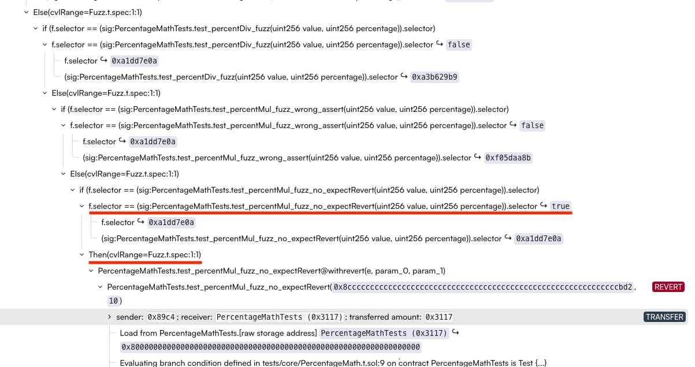
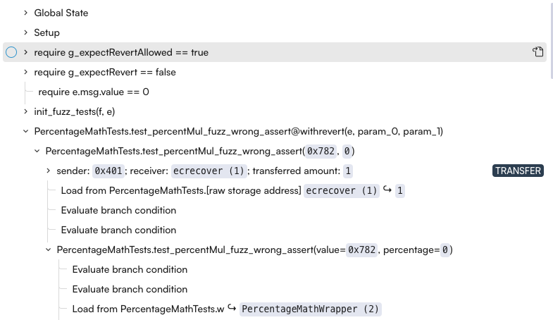

Foundry Integration (Alpha)
=================

Certora's Foundry Integration allows formally verifying [Foundry fuzz tests](https://book.getfoundry.sh/forge/fuzz-testing)
with the Certora Prover instead of writing specifications in CVL.

The Prover will yield higher guarantees of correctness than Foundry as all inputs will be evaluated. 
While fuzzing is not as complete as formal verification (a fuzzer might “miss” some inputs that would expose a bug), 
writing fuzz tests via Foundry is often easier since it uses Solidity.


```{caution}
This feature of the Certora Prover is in alpha state, so issues/unimplemented features are expected. Please contact us if you encounter 
any issue.
```

# Usage

There is a minimum of 2 required files to get the Prover to verify Foundry fuzz tests: A `.spec` file (written in CVL), and a `.conf` file. 

- First, we need a `.spec` file written in CVL to tell the Prover what to verify. The file is very simple, and in the minimal case 
has exactly one line:

```solidity
use builtin rule verifyFoundryFuzzTests;
```

- Second, you need a `.conf` file that will provide the Prover the information of which contract to verify, and what `.spec` file to use. 
A minimal `.conf` file will look like this:

```json
{
  "files": [
    "path/to/file/with/Foundry/fuzz/tests.sol:<name_of_contract_containing_the_tests>",
  ],
  "verify": "name_of_contract_containing_the_tests:path/to/spec/file.spec",
  "foundry_tests_mode": true,
}
```

- Now, to run the tests, execute:
`certoraRun path/to/conf/file.conf`
- You will receive a link to a report containing the results of the run.

For a full running example, please also see our [Foundry Integration Examples](https://github.com/Certora/Examples/tree/master/FoundryIntegration).

# Key differences vs. Foundry fuzz testing

In Foundry, fuzz tests start with a blank state as the initial state (i.e. all storage fields are explicitly set to `0`), and one can implement 
a `setUp()` function in order to bring the state to whatever initial state one wants to run the tests in. In contrast, the Prover starts with 
an arbitrary initial state and does _not_ assume all storage fields to be initialized with 0 by default. This could cause the Prover to find 
spurious counter examples. For example, a fuzz test may assume that a storage value of `balance` is zero for all addresses and the Prover may 
choose some other initial state violating this basic assumption of the test. 

To restrict the Prover's search space to match the setup of the Foundry test, it's possible write a special CVL function  `init_fuzz_tests` 
that acts as a setup in CVL. This function may or may not be required depending on how the fuzz tests are setup. 

```solidity
override function init_fuzz_tests(method f, env e) {
  // your initial state assumptions here
}
 ```
Depending on your fuzz test, you may need to use the `reset_storage` command in the `init_fuzz_tests` function. This will explicitly set all 
storage fields of a contract to `0` before running the test. Alternatively, one could try to add a call to the `setUp()` function in the 
`init_fuzz_tests` function - please note that the `init_fuzz_tests` is an empty method by default.

# Known Limitations 

- The call trace of the Foundry integration can be hard to read when there is more than one foundry test method in a job. When focusing on a particular violation 
of a fuzz test method it is helpful to use the `--method "<FUZZ_TEST_METHOD_NAME>"` [flag](https://docs.certora.com/en/latest/docs/prover/cli/options.html#method-method-signature).

The rule `verifyFoundryFuzzTests` is implemented as a parametric rule with parameter `method f` followed by a statement `if(f.selector == <FuzzTestMethod>.selector)`
for each detected fuzz method. The actual code of the fuzz test method than start within the `Then` block of the condition that evaluated to `true`. 

Here is an example of a call trace of a job that was run _without_ the `--method` flag ([Link to job](https://prover.certora.com/output/15800/70e5d5141ce34e4eae0f9966b78b34d9?anonymousKey=40a3a0266ff277d769a873681b1fc7829b0b5c55)): 


The user selected `test_percentMul_fuzz_no_expectRevert(uint256 value, uint256 percentage)` in the rules panel to the left. Observe that in the call trace 
there is an entry `f.selector == (sig:PercentageMathTests.test_percentMul_fuzz_no_expectRevert(uint256 value, uint256 percentage)).selector ↪ true` and a 
then block `Then(cvlRange=Fuzz.t.spec:1:1)`. The method has been inlined within the then block, here you can find the parameter assignments that lead to the violation.

If you run the same example the flag `--method "test_percentMul_fuzz_wrong_assert(uint256,uint256)"` ([Link to job](https://prover.certora.com/output/53900/0efb4c7272774df886203375b490300a?anonymousKey=5f95f5d1c2a0b8aac88cd6d5842e577707238747)), the call trace largely simplifies.



- Foundry's [Invariant testing](https://book.getfoundry.sh/forge/invariant-testing) is not supported, i.e. forge tests prefixed with 
`invariant` are not formally verified. Under the hood, the built-in rule `verifyFoundryFuzzTests` is a parametric rule that picks up all methods 
that start in `test*` and will use these to formally verify them. 

- One of the usual usages of the `setUp()` function is to create new contract instances for testing.
When setting up the Prover run, the way to handle such storage references to other contracts is to use linking. If, for example,
 we have the following test code

```solidity
contract TestContract is Test {
  MyContract myContract;
	
  function setUp() external {
    myContract = new MyContract();
  }
  ...
}
```

then add to the `.conf` file:

```json
  "files": [
    "...",
    "path/to/MyContract.sol"
  ],
  "link": [
    "...",
    "TestContract:myContract=MyContract"
  ]
```

This way when the Prover encounters `myContract.foo()` it knows what the implementation of `foo` is and is able to inline it.

- Only a subset of the Foundry cheatcodes are currently implemented.
The implemented cheatcodes include `vm.assume`, all `assert*` cheatcodes, `vm.expectRevert`, `prank`, `startPrank`, `stopPrank`, 
`warp`, and `deal`. Some other cheatcodes are irrelevant and are ignored, and many cheatcodes are not yet supported. One can 
recognize these by checking the **Contracts Call Resolutions** tab of the report - unimplemented cheatcodes will appear there 
as unresolved calls (which will usually lead to [havocs](https://docs.certora.com/en/latest/docs/user-guide/glossary.html#term-havoc) 
and therefore spurious counter examples). In this case, please contact Certora so we can implement the required cheatcode.

- In cases where no explicit revert is expected, and the goal is to verify values or state using `assert*` cheatcodes, 
you can use `verifyFoundryFuzzTestsNoRevert`. This ignores all code paths that lead to a revert while still verifying the `assert*` cheatcodes.

- In Foundry, the `vm.expectRevert` cheatcode can optionally take a specific revert reason. 
Foundry verifies both that the test function reverted and that it reverted with the specified reason. 
In contrast, the Prover does not analyze the revert reason. As a result, if the test function reverts for a reason other than 
the expected one, the test will still be marked as successful.
