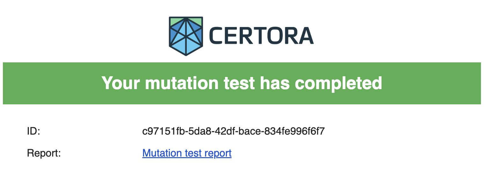
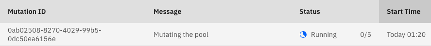
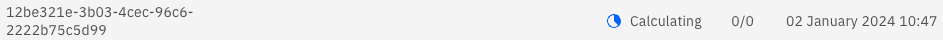
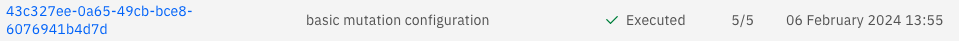
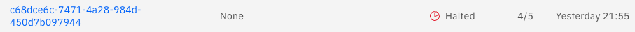
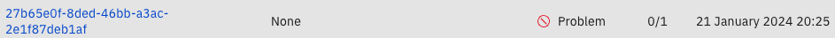
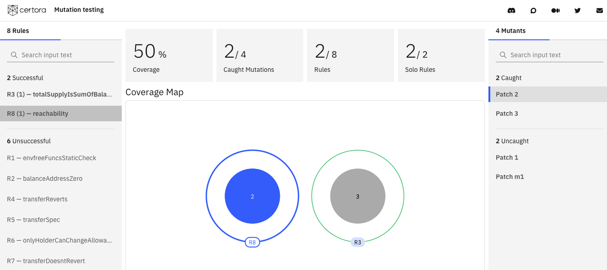
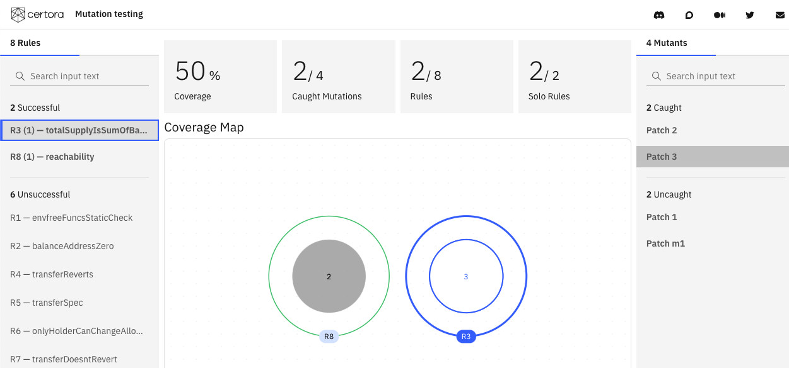
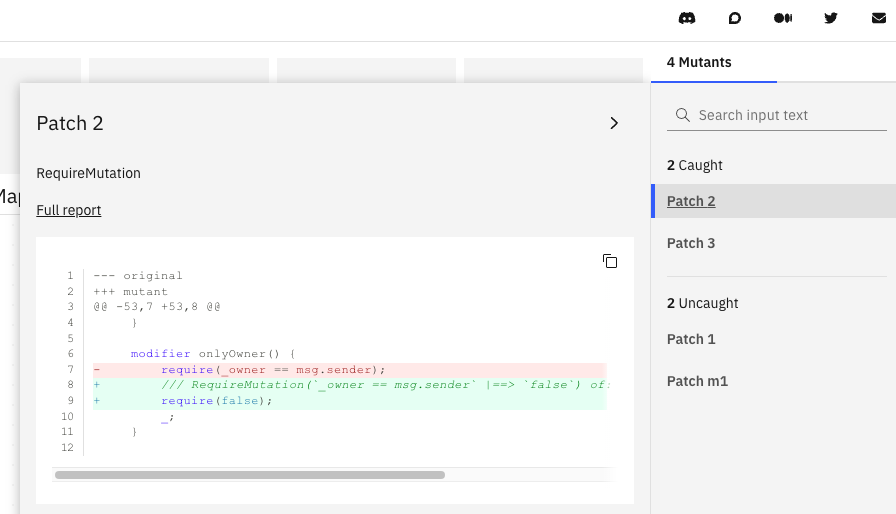
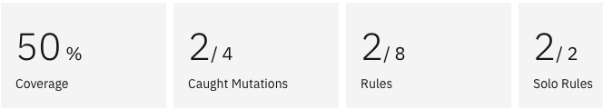

# Using Gambit with the Prover

The mutation verifier checks that variants of the original
  Solidity program do not pass verification against a given specification.
You can either use random mutations generated by {doc}`Gambit <gambit>` 
  or {ref}`man-mutants` crafted with a specific error.
If a mutated program passes the specification,
  it may indicate that the specification is vacuous or not rigorous enough.

## Installation

To use the mutation verifier,
  first {ref}`install the Certora Prover and its dependencies <installation>`.
To install it, run

```sh
pip install certora-cli
```

If you already have `certora-cli` installed and
  the `certoraMutate` command is not available,
  you may need to update to a newer version by running

```sh
pip install --upgrade certora-cli
```

```{note}
If you are on Linux, you will need pip version 20.3 or above.
```

## Running the Mutation Verifier

The mutation verification script is called `certoraMutate`.
Run it from the command line:

```sh
certoraMutate --prover_conf path/to/prover.conf --mutation_conf path/to/mutation.mconf
```

If you do, the script will generate code mutants, 
  then submit a verification job per mutant to Certora's server.

```{note}
You must run `certoraMutate` from the root of the Solidity project directory.
The files `prover.conf` and `mutation.conf` can be in their own directories, 
  but must always be within the project directory.
All paths in `mutation.conf` are relative to the parent directory containing `mutation.conf`.
Paths in `prover.conf` are all relative to the project directory's root, 
  which is assumed to be the working directory.
```

When it finishes successfully, you should see the following lines printed:

```
******************** PROVER END ********************

You will receive an email notification when this mutation test is completed. It may take several hours.
You can follow the test's progress at https://prover.certora.com/mutations
```

Verifying all the mutants is a heavy computational process that may take several hours.
The time required to verify all mutants depends on various factors, 
  such as the number of mutants, the complexity of the contracts, 
  and the complexity of the specifications. 
In some instances, the entire testing process may take several hours.

Once it is completed, you should receive an email that looks like this:



### Following test with the mutations dashboard

You can track your mutation tests at the [mutations dashboard](https://prover.certora.com/mutations).
A test that just started would look like this:



The `Mutation ID` is a unique identifier for the test. 

The `Message` column includes the description given either in the command line 
 via the `--msg` flag or the conf file's `"msg"` key.
It aids in identifying and documenting mutation tests.
By default, it will show `None`.

The `Status` column of a test includes two different parts - the status of the test and a progress counter.
The progress counter shows how many of the sent mutant verification jobs have already been executed.

A mutation test can have one of five different statuses:

- `Running`, as seen above, indicates that the verification jobs are still being computed.

- `Calculating` indicates that all the verification jobs have finished, and the results are now gathered and processed into a verification report.



- `Executed` indicates that all mutant verification jobs were executed correctly and are available in the report, which can be accessed by clicking on the `Mutation ID`.



- `Halted` indicates that the mutation test reached a global time limit and was stopped. The partial verification results that were collected before the time limit are available in the verification report.



- `Problem` indicates the test had errors. A report is usually not generated.




## Mutation Configuration
The mutation tester expects a configuration file which defines the settings for 
  mutant generation and testing (`--mutation_conf`).
Here is a simple configuration file setup using the example above in `mutation.mconf`:

```json
{ 
  "gambit": [{
    "filename" : "C.sol",
    "num_mutants": 5
  }]
}
```

### Automatic Generation
You can generate a mutation configuration automatically from a Prover configuration 
  with the flag `--generate_mutation_conf`.
The resulting configuration may need some manual path fixing or the addition of other
 `certoraMutate` specific options.

Example usage:
```sh
certoraRun path/to/prover.conf --generate_mutation_conf path/to/generated/mutation.mconf
```


(man-mutants)=
### Manual Mutations

You have the option to include manually generated mutated files, 
  not produced by Gambit, in your mutation test. 
We refer to these as 'manual mutations.' 
They can be used for regression tests, 
  or to check mutations that Gambit does not currently support.

```{note}
It is recommended to limit each manually mutated file to a single mutation for more accurate coverage analysis and better traceability.
```


To add manual mutations to `mutation.mconf`, write:

```json
{ 
  "gambit": [{
    "filename" : "C.sol",
    "num_mutants": 5
  }],
  "manual_mutants": {
     "C.sol": "path/to/dir/with/manual_mutants/for/C.m1.sol"
  }
}
```
If you don't have a `gambit` object in the `mconf` file, 
  `certoraMutate` will run only on the manual mutants, 
  and no other mutants will be generated.

```{note}
All manual mutations must be named uniquely. 
For example, if you want to generate manual mutations for `C.sol` and `D.sol`, 
  name them `C.m1.sol, C.m2.sol, D.m3.sol, D.m4.sol, ...` etc.
```

## Original Verification Run

A mutation test requires an original verification job that was completed successfully without halting. All mutant checks will be run with the same verification configuration as the original run, 
  and their results will be compared to the original run. 
Rules that are not verified on the original run will be ignored.

(orig-verification-link)=
### Original Verification Link

You can provide the original run job's link via `--orig_run`, for example: 
```sh
--orig_run https://prover.certora.com/output/53342/9487899b2afc4709899889fab6c2c673/?anonymousKey=5c365717c9c1076f0c1acb050c7eb5867f07a236
```

```{note}
The run must have the job status `Executed` on the [Prover dashboard](https://prover.certora.com).
```

The files will be downloaded to either a default directory or to one specified with `--orig_run_dir`.

(prover-conf)=
### Prover Configuration

Alternatively, you can provide a verification configuration file for the Certora Prover 
  via `--prover_conf`. 
If you do, the Prover will execute the verification job using this file on the 
  code without any mutation, which will be the original run. 
The original run job runs in parallel to the mutation verification jobs. 
A mutation testing report will not be produced if the original run job fails or halts.

Here is a simple configuration file setup using the example above in `prover.conf`:

```json
{
  "files": [
    "C.sol"
  ],
  "verify": "C:c.spec"
}
```

## CLI Options

`certoraMutate` supports the following options; for a comprehensive list, run `certoraMutate --help`:

| <div style="width:160px">Option</div> | Description                                                                                                           |
|:--------------------------------------|:----------------------------------------------------------------------------------------------------------------------|
| `--mutation_conf`                     | Specify the configuration file for mutant generation                                                                  |
| `--orig_run`                          | Specify the {ref}`orig-verification-link`                                                            |
| `--orig_run_dir`                      | Specify the folder where the files will be downloaded from the {ref}`orig-verification-link` |
| `--prover_conf`                       | Specify the {ref}`prover-conf` file for verifying mutants                                                           |
| `--msg`                               | Add a message to identify the `certoraMutate` run |
| `--gambit_only`                       | Stop processing after generating mutations |
| `--dump_failed_collects`              | Specify a log file to capture mutant collection failures |
| `--debug`                             | Show additional logging information during execution                                                                  |

## Troubleshooting

At the moment, there are a few ways in which `certoraMutate` can fail. 
Here are some suggestions on how to troubleshoot when that happens. 
We are actively working on mitigating them.

- There are currently no official Gambit binaries for Linux ARM or Windows. That means that Gambit will not be installed with `pip install certora-cli`, and must be {ref}`built from source <build-gambit-from-source>`.

- Sometimes, the problem stems from Gambit's mutant generation.
  Try running with `--gambit_only` and look at the generated mutations.

- Try running the Prover on your mutants individually using `certoraRun`. 
  Usually the mutant setup will be in `.certora_internal/applied_mutants_dir` and can be retried by running the Prover's `.conf` file with `certoraRun`.
  It is also possible that you are encountering a bug with the underlying version of the Prover.

## Visualization

The mutation verification results are
  summarized in a user-friendly visualization.


[Here](https://mutation-testing-beta.certora.com/?id=01623b02-0cda-435b-8c31-af9306d6d302&anonymousKey=857c3aeb-169c-4c93-8021-e82058603ca1) 
  is an example summary for the 
  [advanced mutation of an ERC20 example](https://github.com/Certora/CertoraInit/blob/master/mutation/advanced_mutation.conf).
The green outer circles represent the rules, 
  and the gray dots represent the mutants.



Selecting a rule shows which mutants it detected,
 and selecting a mutant shows which rules caught it.



Clicking on a mutant's patch shows the difference between it and the original program.



### Metrics

At the top bar of the report there are different coverage metrics.



- The Coverage metric is the ratio of the caught mutants to all mutants tested, 
  also shown under Caught Mutations.
- The Rules metric shows the ratio of the rules that caught at least one mutation 
  out of all the rules in the tested specification.
- The Solo Rules metric shows the ratio between the rules that caught a unique mutation 
  and all rules that caught at least one mutation.


