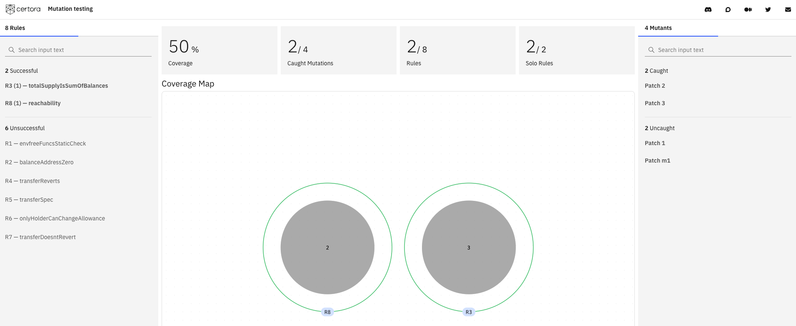

# Using Gambit with the Prover

The mutation verifier checks that variants of the original
  Solidity program do not pass the specification.
It uses mutations from the {doc}`Gambit <gambit>`
  mutation generator.
It also allows users to include manually generated mutants.
If a mutated program passes the specification,
  it may indicate that the specification is vacuous or not rigorous enough.
In the rest of the document,
  we refer to both the mutation generator and the verifier as Gambit.

## Installation

To use the mutation verifier,
  first {ref}`install the Certora Prover and its dependencies <installation>`.
To install it, run

```sh
pip install certora-cli
```

If you already have `certora-cli` installed and
  the `certoraMutate` command is not available,
  you may need to update to a newer version by running

```sh
pip install --upgrade certora-cli
```

```{note}
If you are on Linux, you will need pip version 20.3 or above.
```

## Running the Mutation Verifier

The mutation verification script is called `certoraMutate`. 
Run it from the command line:

```sh
certoraMutate --prover_conf path/to/prover.conf --mutation_conf path/to/mutation.conf
```

```{note}
You must run `certoraMutate` from the root of the Solidity project directory.
The files `prover.conf` and `mutation.conf` can be in their own directories, 
  but must always be within the project directory.
All paths in `mutation.conf` are relative to the parent directory containing `mutation.conf`.
Paths in `prover.conf` are all relative to the project directory's root, 
  which is assumed to be the working directory.
```

## Mutation Configuration
The tool expects a configuration file which defines the execution of 
  mutant generation (`--mutation_conf`).
Here is a simple configuration file setup using the example above in `mutation.conf`:

```json
{ 
  "gambit": [{
    "filename" : "C.sol",
    "num_mutants": 5
  }]
}
```

### Automatic Generation
You can generate a mutation configuration automatically from a Prover configuration 
  with the flag `--generate_mutation_conf`.
The resulting configuration may need some manual path fixing or the addition of other
 `certoraMutate` specific options.

Example usage:
```sh
certoraRun path/to/prover.conf --generate_mutation_conf path/to/generated/mutation.conf
```


### Manual Mutations

You have the option to include manually generated mutated files, 
  not produced by Gambit, in your mutation test. 
We refer to these as 'manual mutations.' 
They can be beneficial for evaluating verification coverage related to 
  specific changes that must always be checked, 
  or mutations that Gambit does not currently support.

```{note}
It is recommended to limit each manually mutated file to a single mutation for more accurate coverage analysis and better traceability.
```


To add manual mutations to `mutation.conf`, write:

```json
{ 
  "gambit": [{
    "filename" : "C.sol",
    "num_mutants": 5
  }],
  "manual_mutants": {
     "C.sol": "path/to/dir/with/manual_mutants/for/C.m1.sol"
  }
}
```
If you don't have a `gambit` object in the `conf` file, 
  `certoraMutate` will run only on the manual mutants, 
  and no other mutants will be generated.

```{note}
All manual mutations must be named uniquely. 
For example, if you want to generate manual mutations for `C.sol` and `D.sol`, 
  name them `C.m1.sol, C.m2.sol, D.m3.sol, D.m4.sol, ...` etc.
```

## Original Verification Run

A mutation test requires an original verification job that was completed successfully without halting. All mutant checks will be run with the same verification configuration as the original run, 
  and their results will be compared to the original run. 
Rules that are not verified on the original run will be ignored.

(orig-verification-link)=
### Original Verification Link

You can provide the original run job's link via `--orig_run`, for example: 
```sh
--orig_run https://prover.certora.com/output/53342/9487899b2afc4709899889fab6c2c673/?anonymousKey=5c365717c9c1076f0c1acb050c7eb5867f07a236
```

```{note}
The run must have the job status `Executed` on the [Prover dashboard](https://prover.certora.com).
```

The files will be downloaded to either a default directory or to one specified with `--orig_run_dir`.

(prover-conf)=
### Prover Configuration

Alternatively, you can provide a verification configuration file for the Certora Prover 
  via `--prover_conf`. 
If you do, the Prover will execute the verification job using this file on the 
  code without any mutation, which will be the original run. 
The original run job runs in parallel to the mutation verification jobs. 
A mutation testing report will not be produced if the original run job fails or halts.

Here is a simple configuration file setup using the example above in `prover.conf`:

```json
{
  "files": [
    "C.sol"
  ],
  "verify": "C:c.spec"
}
```

## CLI Options

`certoraMutate` supports the following options; for a comprehensive list, run `certoraMutate --help`:

| Option                         | Description                                                                                                           |
|:-------------------------------|:----------------------------------------------------------------------------------------------------------------------|
| `--mutation_conf`              | Specify the configuration file for mutant generation                                                                  |
| `--orig_run`                   | Specify the {ref}`orig-verification-link`                                                            |
| `--orig_run_dir`               | Specify the folder where the files will be downloaded from the {ref}`orig-verification-link` |
| `--prover_conf`                | Specify the {ref}`prover-conf` file for verifying mutants                                                           |
| `--prover_version`             | Specify the `certoraRun` version for verification. If not specified, the installed `certoraRun` version is used by default.        |
| `--msg`                        | Add a message to identify the `certoraMutate` run |
| `--gambit_only`                | Stop processing after generating mutations |
| `--dump_link`                  | Specify a text file to write the UI report link                                                                       |
| `--dump_failed_collects`       | Specify a log file to capture mutant collection failures |
| `--debug`                      | Show additional logging information during execution                                                                  |

## Troubleshooting

At the moment, there are a few ways in which `certoraMutate` can fail. 
Here are some suggestions on how to troubleshoot when that happens. 
We are actively working on mitigating them.

- Sometimes it is easier to understand the problem by running `gambit` directly.
  `gambit` can be found under the `site-packages` directory under `certora_bins`.
  * Run `gambit mutate --json foo.json` or `gambit mutate --filename solidity.sol` to identify the issue.
  * Here, `foo.json` can also be `foo.conf`.
  * **Note:** you must remove the field `manual_mutants` from the `json` if it is present before running `gambit`.
- Try running the Prover on your mutants individually using `certoraRun`. 
  Usually the mutant setup will be in `.certora_internal/applied_mutants_dir` and can be retried by running the Prover's `.conf` file with `certoraRun`.
  It is also possible that you are encountering a bug with the underlying version of the Prover.

## Visualization

The mutation verification results are
  summarized in a user-friendly visualization.
[Here](https://mutation-testing-beta.certora.com/?id=01623b02-0cda-435b-8c31-af9306d6d302&anonymousKey=857c3aeb-169c-4c93-8021-e82058603ca1) 
  is an example summary for the [advanced mutation of an ERC20 example]
  (https://github.com/Certora/CertoraInit/blob/master/mutation/advanced_mutation.conf).



The green outer circles represent the rules, 
  and the gray dots represent the mutants.


Selecting a rule shows which mutants it detected.


Selecting a mutant shows which rules caught it.
Clicking on a mutant's patch shows the difference between it and the original program.

The Coverage metric is the ratio of the caught mutants to all mutants tested, 
  also shown under Caught Mutations.
The Rules metric shows the ratio of the rules that caught at least one mutation 
  out of all the rules in the tested specification.
The Solo Rules metric shows the ratio between the rules that caught a unique mutation 
  and all rules that caught at least one mutation.


