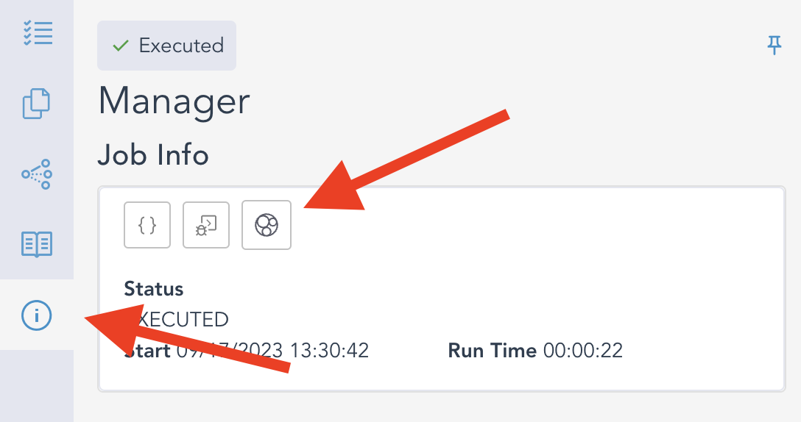
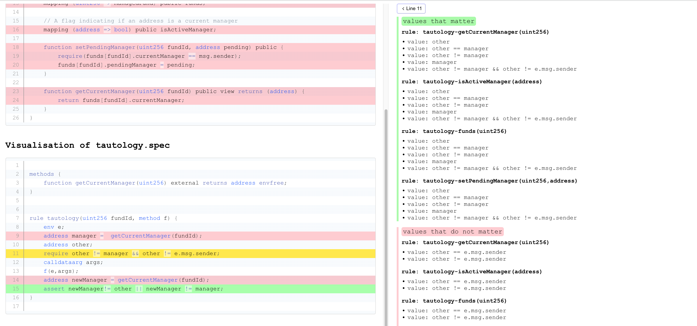
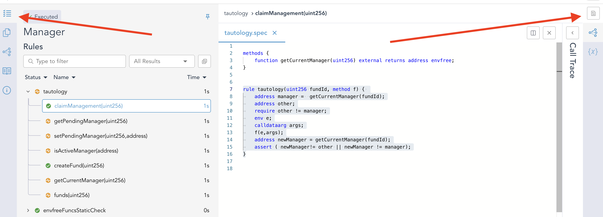
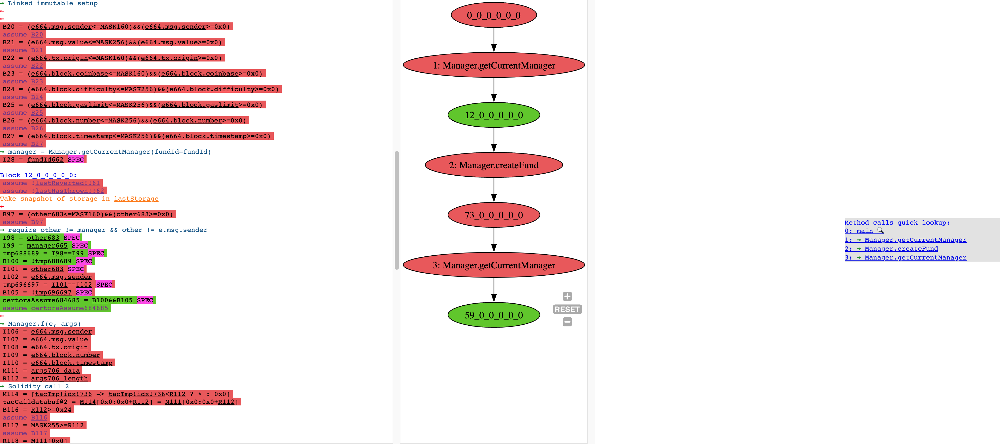
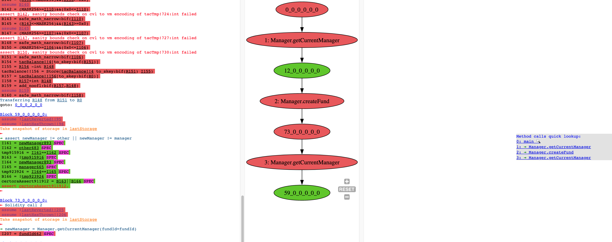

# Coverage Info via Unsat Cores

The `--coverage_info [none|basic|advanced]` flag enables automatic computation of `.sol` and `.spec` files coverage w.r.t. the underlying verification task. In particular, using this flag can help you answer questions such as:

* *Are all solidity functions from the input involed in proving my rules?*
* *Are all solidity commands from the input involed in proving my rules?*
* *Supposing an `assert` in my rule is not reachable, what is the reason for the unreachability?*
* *Do I really need all hooks that are defined in my .spec file(s)?*
* *Do I really need all `require` statements in my rule?*
* *Do I really need to initialise a CVL variable in my rule?*
* *Do I really need all preserved blocks in my CVL `invariant`?*

To answer the above questions, the Certora Prover generates a so-called *minimal unsat core* which, intuitively, represents the minimal subset of the commands in the input `.sol` and `.spec` files that are needed to prove the CVL properties. If some of the input `.sol` commands are not needed to derive the proof, it might indicate that the specification does not cover all behavior implemented in the smart contract. If some of the input `.spec` commands are not needed to derive the proof (typically unnecessary `require` statements or variable initializations), it indicates that the CVL rules/invariants can be make stronger. 

We visualize this *coverage* information in a dedicated HTML file: `zipOutput/Reports/UnsatCorevisualization.html`. Furthermore, we also visualize the unsat core coverage information on our `TAC` representation of the verification condition. 

In the rest of this section, we provide a more detailed explanation of the concept of unsat cores and demonstrate it on an example. 

 
## Unsat cores

The Certora Prover works as follows:
1. It takes as an input `.sol` and `.spec` files.
2. It compiles the `.sol` input into EVM bytecode.
3. For each single *property*, i.e. elementary rule/invariant, in the `.spec` file(s), it converts the property and the bytecode into a TAC program.
4. Each TAC program is then converted to an SMT formula such that the formula is unsatisfiable if and only if the property holds (i.e. cannot be violated). 

The SMT formula  is built from a set `A` of *assertions*, say `{A1, A2, ..., An}`, that are built over a set of *variables*. Intuitively, you can see the assertions as mathematical equations. The formula is *satisfiable* if there exists an assignment to the variables that satisfies all the assertions simultaneously. Otherwise, the formula is *unsatisfiable*. In practice, it is often the case that already a small subset of `A` is unsatisfiable. Especially, one can extract a *minimal unsatisfiable subset* `U` of `A`. The *minimality* here means that if you remove any assert from `U` then it becomes satisfiable, i.e., it is not a *minimum cardinality*. We call a minimal unsatisfiable subset of `A` an *unsat core* of `A`. 
For example, assume that `A = {a, !a, !b, a || b}` where `a` and `b` are Boolean variables. 
There are two minimal unsatisfiable subsets (i.e. unsat cores) of this formula:
`{a, !a}` and `{!a, !b, a || b}`.


There are several different kinds of assertions in `A` and some of them correspond to commands from the TAC program. In particular, for every `assign`, `assume` and `assert` command `Ci` from the TAC program, there is a corresponding assert `Ai` in `A`. Suppose we obtain an unsat core `U` of `A`. Then, the meaning of every excluded assert `Ai in (A - U)` is the following:


- If `Ci` is an `assume` or `assert` command then `Ci` can be completely removed from the TAC program without causing a violation of the underlying CVL property.
- If `Ci` is an `assign` command, for instance `R1 = R2 + R3`, then the right hand side of the equation can be `havoc'd` without violating the underlying CVL property, i.e. in our example we can replace `R1 = R2 + R3` by `R1 = havoc`.


Furthermore, we maintain a mapping between the commands in the TAC program, and the commands in the input `.sol` and `.spec` files. In particular, for `.spec` files, we usually have a mapping for a vast majority of the commands (CVL `assert`s, `require`s, and variable assignments). Unfortunately, for `.sol` files, the mapping is very limited due to the compilation to the bytecode (the compilers are not build by Certora and hence we cannot ensure preservation of mapping between commands in `.sol` and commands in the bytecode). 


## Unsat core examples

### Tautology example
Assume the following CVL rule called `tautology`. 

```cvl
rule tautology(uint256 fundId, method f) { 
	env e;
	address manager =  getCurrentManager(fundId);
	address other;
	require other != manager && other != e.msg.sender;
	calldataarg args;
	f(e,args);
	address newManager = getCurrentManager(fundId);
	assert newManager!= other || newManager != manager;
}
```

We first call a solidity function `getCurrentManager(...)` to get the address of the *current* `manager` of the underlying smart contract. Subsequently, we create another address `other` and require that `other != manager && other != e.msg.sender`. Subsequently, we call a function `f(...)` of the contract, and, assuming this function call could have changed the manager, we get the value `newManager` of the *current* manager. Finally, we assert that either `newManager!= other` or `newManager != manager`. However, notice that we required that `other != manager` and hence the `assert` is necessarily `true`. The function calls of `getCurrentManager(...)` and `f(...)` are completely irrelevant. 


###  Visualization on the `.sol` and `.spec` files

You can access the unsat cores visualization via `Job Info -> Unsat Core Page` buttons, as shown on Figure 1. 


Figure 1: The `.spec` & `.sol` visualization button.

The visualization itself is shown on Figure 2. It consists of two *panes*: 
1. The left pane shows *per-line* visualization.
2. The right pane shows detailed info about individual visualized lines. 


Figure 2: The visualization of the Tautology example on `.sol` and `.spec`. 


In particular, in the left pane, we highlight lines from individual `.sol` and `.spec` files. 
Every line can have either none, green, red or yellow background color. No background means we have no information about this line. For instance, it might not be neither `assert` nor `require` nor `assign` command, or we might not have the mapping due to compilation to the EVM bytecode. Green, red or yellow background means that we have a mapping to one or more commands on the line (one `.spec`/`.sol` line can be often broken down to several TAC commands) with the following meaning:

1. Green means that all of the TAC commands that are mapped to the line are in the unsat core, i.e. needed to prove the property. 
2. Red means that none of the TAC commands that are mapped to the line are in the unsat core, i.e. not needed to prove the property.
3. Yellow means that some of the TAC commands that are mapped to the line are in the unsat core and some of them are not in the unsat core.

Furthermore, if we have multiple rules/invariants or a parametric rule (such as our `tautology`), we can also have multiple rules/invariants mapping to a single `.sol` or `.spec` line. That is, we generate just a single, joint, visualization for all the rules/invariants (run with `--rule` and `--method` flags to get a visualization for a single rule/method/invariant). And in such case, a yellow line means that some of the commands on the line are needed to prove some of the rules/methods/invariants and some of the commands are not needed. 

The right pane provides detailed information about individual lines and commands mapped to the lines group by the rule/method/invariant name (denoted *rule*) and the *value*, where each *value* refers to a particular `assign`, `assert` or `assume` TAC command that is mapped to the line. For instance, in the Tautology example, we can see that sub-command `other != manager` of line `11` matters (is in the unsat core), whereas `other != e.msg.sender` is not in the unsat core. Also, note that the pane shows e.g. both `other != manager` and `other == manager`; this is because in our TAC representation we encode `other != manager` as `!(other == manager)`. 


### Visualization on TAC 
On contrary to `.sol` and `.spec` visualization, we generate separate TAC unsat core visualization for individual rules/methods/invariants. To access it, click first on the particular rule/method/invariant in the `Rules` pane and then on the `Dump page` button as shown in Figure 3. 


Figure 3: The TAC visualization button.

The visualization here consists only of 2 colors: `green` means that the command is needed and `red` means that the command is not needed (i.e. not in the unsat core). In particular, Figures 4a and 4b show the TAC visualization for the Tautology example. 


Figure 4a: The visualization of the Tautology example on TAC, part A. 


Figure 4b: The visualization of the Tautology example on TAC, part B.

Namely, only the following TAC commands are in the unsat core:

```
→ require other != manager && other != e.msg.sender
I95 = other287 SPEC
I96 = manager269 SPEC
tmp292293 = I95==I96 SPEC
B97 = !tmp292293 SPEC
...
certoraAssume288289 = B97&&B102 SPEC
assume certoraAssume288289
...
→ assert newManager != other || newManager != manager
I158 = newManager419 SPEC
I159 = other287 SPEC
tmp441442 = I158==I159 SPEC
B160 = !tmp441442 SPEC
I161 = newManager419 SPEC
I162 = manager269 SPEC
tmp449450 = I161==I162 SPEC
B163 = !tmp449450 SPEC
certoraAssert437438 = B160||B163 SPEC
assert certoraAssert437438,
```

Also, notice that some commands in the TAC dump are followed by "SPEC" or "SOL" with a violet background color; these are commands for which we have a mapping to `.spec` and `.sol` files, respectively. 

## Basic vs. advanced mode

The `--coverage_info` flag takes three possible values: `none`, `basic` and `advanced`:
1. `none` means no unsat core analysis and no visualization, 
2. `basic` means relatively fast bust possibly very imprecise analysis, 
3. and `advanced` means possibly slow but more precise analysis. 

In particular, the Certora Prover internally does many various transformations of the TAC program before it converts the TAC program to SMT. These transformations usually simplify the TAC program and make the whole verification task easier and faster. However, some of these transformations might lead to loosing a mapping between the initial and the final TAC program, and consequently also loosing a mapping between the SMT encoding and the input `.sol` and `.spec` files. In such case, some lines/commands in the `.spec` and `.sol` visualization might be marked as not needed even if they are actually needed; the other direction, i.e. spurious red lines, is also possible. The `basic` mode keeps all the TAC transformations and hence is faster but possibly more imprecise, whereas the `advanced` mode turns off some of the transformations to make the analysis more precise. 

## Multiple unsat cores
In general, the SMT formula can have multiple unsat cores; in fact, even exponentially many w.r.t. the number of assertions in the formula. By default, we generate just a single unsat core per rule/method/invariant. Use can use the flag `--prover_args "-numOfUnsatCores <k>"` to instruct the Certora Prover to generate up `k` unsat cores for each rule/method/invariant. At this moment, we support `k > 1` only for the TAC visualizations. In particular, 
the name of the TAC unsat core visualization file has the form 
`Report-<rule_name>-<method_name>-unsatCore<i>.html` where `i >= 1` is the index of the unsat core, e.g. `Report-tautology-createFundLPU256RP-unsatCore1.html`. The `Dump page` button always leads to the first unsat core (`i == 1`). To access the additional unsat cores, you can either manually change the HTML address, or download the `zipOutput` as all the unsat core visualizations are stored in the `zipOutput/Reports` folder. 
