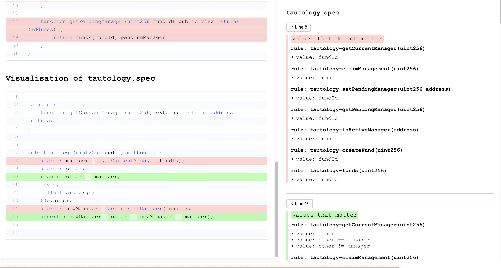
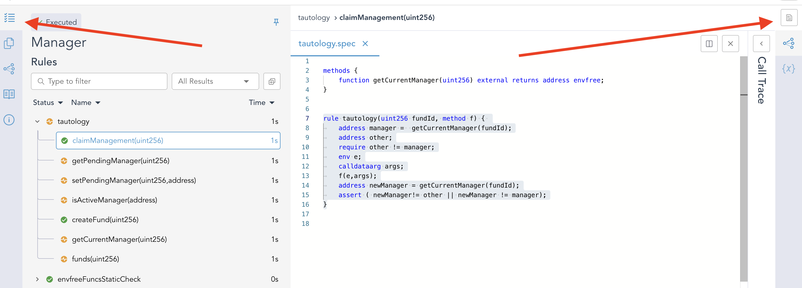
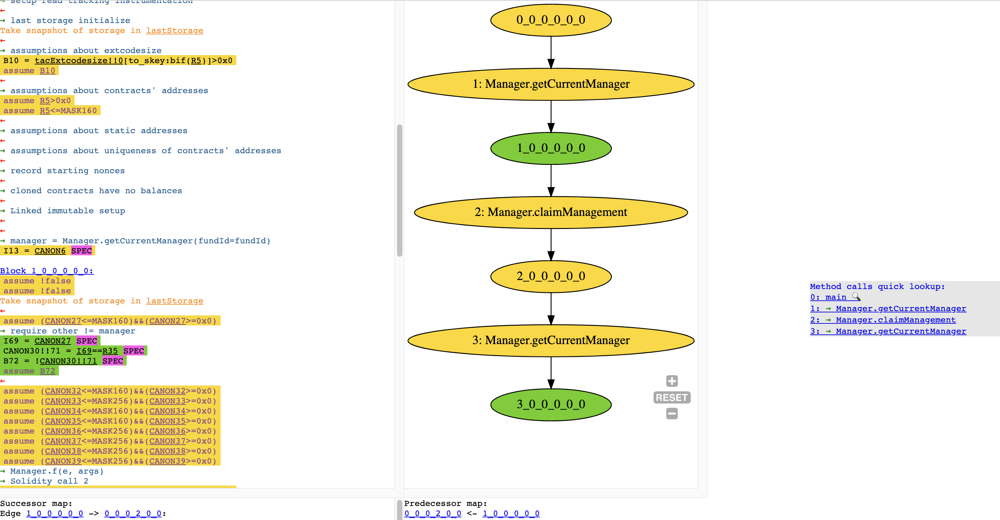
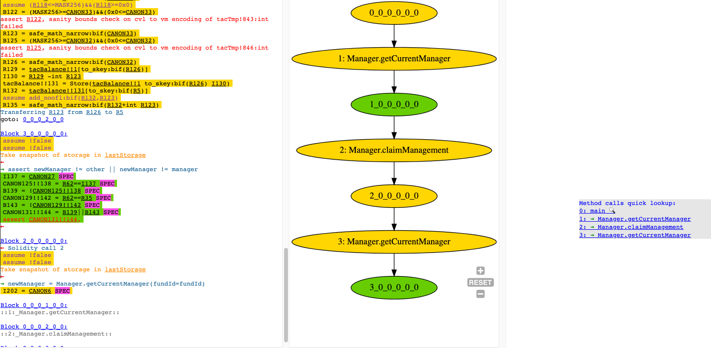

Coverage Info via Unsat Cores
==================
The {ref}`--coverage_info [none|basic|advanced]` option enables automatic computation of `.sol` and `.spec` files coverage w.r.t. the underlying Certora Prover verification task. In particular, using this flag can help you answer questions such as:

* *Are all solidity functions from the input involed in proving my rules?*
* *Are all solidity commands from the input involed in proving my rules?*
* *Supposing an `assert` in my rule is not reachable, what is the reason for the unreachability?*
* *Do I really need all hooks that are defined in my .spec file(s)?*
* *Do I really need all `require` statements in my rule?*
* *Do I really need to initialise a CVL variable in my rule?*
* *Do I really need all preserved blocks in my CVL `invariant`?*

To answer the above questions, CVT generates a so-called *minimal unsat core* which, intuitively, represents the minimal subset of the commands in the input `.sol` and `.spec` files that are needed to prove the CVL properties. If some of the input `.sol` commands are not needed to derive the proof, it might indicate that the specification does not cover all behaviour implemented in the smart contract. If some of the input `.spec` commands are not needed to derive the proof, typically unnecessary `require` statements or variable initialisations, it indicates that the CVL rules/invariants can be make stronger. 

We visualise this *coverage* information in a dedicated HTML file: `zipOutput/Reports/UnsatCoreVisualisation.html`. Furthermore, we also visualise the unsat core coverage information on our `TAC` representation of the verification condition. 

In the rest of this section, we provide a more detailed explanation of the concept of unsat cores and provide several particular example usages of the unsat cores. 

 
(unsat-cores)=
Unsat Cores
--------------
The Certora Prover prover works as follows:
1. It takes as an input `.sol` and `.spec` files.
2. It compiles the `.sol` input into EVM bytecode.
3. For each single *property*, i.e. elementary rule/invariant, in the `.spec` file(s), it converts the property & the bytecode into a TAC program.
4. Each TAC program is then converted to an SMT formula such that the formula is unsatisfiable if and only if the property holds (i.e. cannot be violated). 

The SMT formula, say `F`, is built from a set `A` of *assertions*, say `A1, A2, ..., An`, that are built over a set of *variables*. Intuitively, can see the assertions as mathematical equations. The formula is satistiable if there exists an assignment to the variables that satisfies all the assertions simultaneously. Otherwise, the formula is unsatisfiable. In practise, it is often the case that already a subset of `A` is unsatisfiable. An especially, one can extract a *minimal unsatisfiable subset* `U` of `A`. The *minimality* here means that if you remove any assert from `U` then it becames satistiable, i.e., it is not a *minimum cardinality*. We call a minimal unsatisfiable subset of `A` an *unsat core* of `A`. 

** EXAMPLE ** (TODO: Format this somehow)

Assume that `A = {a, !a, !b, a || b}` where `a` and `b` are Boolean variables. 
There are two minimal unsatisfiable subsets (i.e. unsat cores) of this formula:
`{a, !a}` and `{!a, !b, a || b}`.

** END of Example **

There are roughly two types of assertions in `A`:
1. assertions encoding the verification conditions and the program control flow, 
2. and assertions encoding individual commands from the underlying TAC program. 

In particular, for every `assign`, `assume` and `assert` command `Ci` from the TAC there is a corresponding assert `Ai` in `A`. Suppose we obtain an unsat core `U` of `A`. Then, the meaning of every excluded assert `Ai in (A - U)` is the following:


- If `Ci` is an `assume` or `assert` command then `Ci` can be completely removed from the TAC without causing a violation of the underlying CVL property.
- If `Ci` is an `assign` command, for instance `x = y + z`, then the right hand side of the equation can be `havoc'd` without violating the underlying CVL property, i.e. in our example we can replace `x = y + z` with `x = havoc`.


Furthermore, we maintaing a particular mapping between the commands in the TAC program, and the commands in the input `.sol` and `.spec` files. In particular, for `.spec` files, we usually have a mapping for a vast majority of the commands (CVL `assert`s, `require`s, and variable assignments). Unfortunately, for `.sol` files, the mapping is only particular due due to the compilation to the bytecode (the compilers are not build by Certora and hence we cannot ensure preservation of mapping between commands in `.sol` and commands in the bytecode). 


(unsat-cores-examples)=
Unsat Cores Examples
--------------


== Tautology Example ==
Assume the following cvl rule called `tautology`. 

```cvl
rule tautology(uint256 fundId, method f) { 
	address manager =  getCurrentManager(fundId);
	address other;
	require other != manager;
	env e;
	calldataarg args;
	f(e,args);
	address newManager = getCurrentManager(fundId);
	assert ( newManager!= other || newManager != manager);
}
```

We first call a solidity function `getCurrentManager(...)` to get the `address` of the *current* `manager` of the underlying smart contract. Subesequently, we create another address `other` and require that `other != manager`. Subsequently, we call a fuction `f(...)` of the contract, and assuming this function call could have changed the manager, we get the value `newManager` of *current* manager. Finally, we assert that either `newManager!= other` or `newManager != manager`. However, notice that we required that `other != manager` and hence the `assert` is necessarily `true`. The function calls of `getCurrentManager(...)` and `f(...)` are completely irrelevant. 


** Visualisation on the ** `.sol`&`.spec` files

You can access the unsat cores visualisation via `Job Info -> Unsat Core Page` buttons, as shown on Figure 1. 


Figure 1: The `.spec` & `.sol` visualisation button.

The visualisation itself is shown on Figure 2. It consists of two *panes*: 
1. the left pane shows *per-line* visualisation
2. and the right pane shows detailed info about individual visualised lines. 


Figure 2: The visualisation of the Tautology example on `.sol` and `.spec`. 


In particular, in the left pane, we highligh lines from individual `.sol` and `.spec` files. 
Every line can have either none, gree, red or yellow background color. No background means we have no information about this line. For instance, it might not be neither `assert` nor `require` nor `assign` command, or we might not have the mapping due to compilation to the EVM bytecode. Green, red or yellow background means that we have a mapping to one or more commands on the line (one `.spec`/`.sol` line can be often broke down to several TAC commands) with the following meaning:

1. Green means that all of the TAC commands that are mapped to the line are in the unsat core, i.e. needed to prove the property. 
2. Red means that none of the TAC commands that are mapped to the line are in the unsat core, i.e. not needed to prove the property.
3. Yellow means that some of the TAC commands that are mapped to the line are in the unsat core and some of them are not in the unsat core. 

Furthermore, if we have multiple rules/invarints or a parametric rule (such as our `tautology`), we can also have multiple rules/invariants mapping to a single `.sol` or `.spec` line. That is, we generate just a single, joint, visualisation for all the rules/invariants (run with `--rule` and `--method` flags to get a visualisation for a single rule/method/invariant). And in such case, a yellow line means that some of the commands on the line are needed to prove some of the rules/methods/invariants. 

The right pane provides detailed information about individual line and mapped commands on the line group by the *full-rule-name* and the *value*, where each *value* refers to a particular `assign`, `assert` or `assume` TAC command that is mapped to the line. 


** Visualisation on TAC **
On contrary to `.sol` and `.spec` visualisation, we generate separate TAC unsat core visualisation for every rule/method/invariant. To access it, click first on the particular `rule/method/invariant` in the `Rules` pane and then on the `Dump page` button as shown in Figure 3. 


Figure 3: The TAC visualisation button.

For detailed guidelines on reading TAC dumps, please refer to ..TODO..
The visualisation here consists only of 2 colors: `green` means that the command is needed and `yellow` means that the command is not needed (i.e. not in the unsat core). In particular, Figures 4a and 4b shows the TAC visualisation for the Tautology example. 


Figure 4a: The TAC visualisation button.


Figure 4b: The TAC visualisation button.

Namely, only the following TAC commands are in the unsat core:

```
→ require other != manager
I69 = CANON27 SPEC
CANON30!!71 = I69==R35 SPEC
B72 = !CANON30!!71 SPEC
assume B72
...
...
→ assert newManager != other || newManager != manager
I137 = CANON27 SPEC
CANON125!!138 = R62==I137 SPEC
B139 = !CANON125!!138 SPEC
CANON129!!142 = R62==R35 SPEC
B143 = !CANON129!!142 SPEC
CANON131!!144 = B139||B143 SPEC
assert CANON131!!144,
```

Also, notice that some commands in the TAC dump are followed by "SPEC" or "SOL" with a violet background; these are commands for which we have a mapping to `.spec` and `.sol` files, respectively. 

** Basic vs. Advanced Mode

The `--coverage_info` flag takes three possible values: `none`, `basic` and `advanced`:
1. `none` means no unsat core analysis and no visualisation, 
2. `basic` means relatively fast bust possibly very imprecise analysis, 
3. and `advanced` means possibly slow but more precise analysis. 

In particular, the Certora Prover internally does many various transformations of the TAC program before it converts the TAC to SMT. These transformations usually simplify the TAC and make the whole verification task easier and faster. However, some of these transformations might lead to loosing mapping a mapping between the initial and the final TAC, and consequently also loosing a mapping between the SMT and the input .sol and .spec files. In such case, some lines/commands in the `.spec` and `.sol` visualisation might be marked as not needed even if they are actually needed; the other direction, i.e. spurious red lines, is also possible. The `basic` mode keeps all the TAC transformations and hence is faster but possibly more imprecise, whereas the `advanced` mode turns off some of the transformations to make the analysis more precise. 


(unsat-cores-vs-sanity-checks)=
Relation to Sanity Checks
--------------
..TODO.. describe some differences

