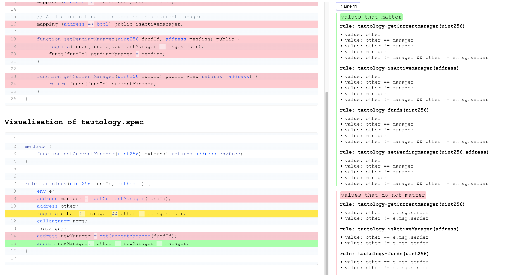

# Coverage Info

The {ref}`--coverage_info` flag enables automatic computation of coverage
information for a verification run. In particular, using this flag can help you
answer questions such as:

* *Are all solidity functions from the input involved in proving my rules?*
* *Are all solidity commands from the input involved in proving my rules?*
* *Supposing an `assert` in my rule is not reachable, what is the reason for the
  unreachability?*
* *Do I really need all hooks that are defined in my .spec file(s)?*
* *Do I really need all `require` statements in my rule?*
* *Do I really need to initialize a CVL variable in my rule?*
* *Do I really need all of the preserved blocks in my CVL `invariant`?*

To answer the above questions, the Certora Prover identifies a minimal subset of
the commands in the input `.sol` and `.spec` files that are relevant for proving
the CVL properties. If some of the input `.sol` commands are not relevant for
deriving the proof, it might indicate that the specification does not cover all
behavior implemented in the smart contract. If some of the input `.spec`
commands are irrelevant (typically unnecessary `require` statements or variable
initializations), it indicates that the CVL rules/invariants can be made
stronger. 

You can access the coverage visualization via `Job Info -> Coverage Info page`
buttons:


## Examples

### Tautology example
Consider the following CVL rule called `tautology`: 

```cvl
rule tautology(uint256 fundId, method f) { 
	env e;
	address manager =  getCurrentManager(fundId);
	address other;
	require other != manager && other != e.msg.sender;
	calldataarg args;
	f(e,args);
	address newManager = getCurrentManager(fundId);
	assert newManager!= other || newManager != manager;
}
```

Notice that we required that `other != manager` and hence the `assert` is
necessarily `true` (see the concept of a {term}`tautology`). The executions of
`getCurrentManager(...)` and `f(...)` are completely irrelevant. 


The coverage visualization is shown below. It consists of two *panes*: 
1. The left pane shows *per-line* visualization.
2. The right pane shows detailed info about individual visualized lines. 




In particular, in the left pane, we highlight lines from individual `.sol` and
`.spec` files. Every line may optionally have a green, yellow, or red background
color. No background means we have no information about this line, i.e. it might
or might not be needed for the proof. Green, red or yellow background means we
have some information about values of commands on the line:

1. Green means that all of the values on the line are relevant for proving the
   property. 
2. Red means that none of the values on the line is relevant for proving the
   property. In particular, you can arbitrary change the values and the property
   would still hold.
3. Yellow means that some of the values on the line are relevant and some are
   not. 

Furthermore, if we have multiple rules/invariants or a parametric rule (such as
our `tautology`), we can also have multiple rules/invariants mapping to a single
`.sol` or `.spec` line. In such a case, a yellow line means that some of the
values on the line are relevant for proving some of the rules/methods/invariants
and some of the values are not relevant. If you want to generate coverage
visualization for a single rule or method, use {ref}`--rule` or {ref}`--method`

The right pane provides detailed information about individual values mapped to
the lines grouped by the rule/method/invariant name (denoted *rule*). For
instance, in the Tautology example, we can see that the value of the command
`other != manager` on line `11` matters, whereas the value of `other !=
e.msg.sender` is irrelevant for the proof. Also, note that the pane shows e.g.
both `other != manager` and `other == manager`; this is due our internal
representation of the program where we encode `other != manager` as `!(other ==
manager)`. 


## Basic vs. advanced mode

The `--coverage_info` flag takes three possible values: `none`, `basic` and
`advanced`:
1. `none` means no coverage analysis, 
2. `basic` means relatively fast but possibly very imprecise analysis (i.e. can
   claim that some commands are needed even if they are not, and also vice
   versa), 
3. and `advanced` means possibly slow but more precise analysis. 

## Completeness
We perform the coverage analysis on our internal Satisfiability Modulo Theory
(SMT) representation of the verification condition, and then map the results of
the analysis to the `.sol` and `.spec` files. Unfortunately, due to the
compilation of the solidity code to EVM bytecode, we cannot maintain a complete
mapping between commands from solidity and commands in our SMT representation.
Consequently, the visualization on `.sol` files can be very limited. 