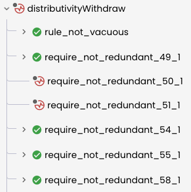
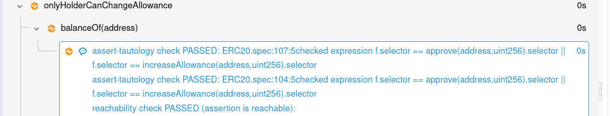

Rule Sanity Checks
==================
The {ref}`--rule_sanity` option enables some automatic checks that can warn users
about certain classes of mistakes in specifications.

There are several kinds of sanity checks:

 * {ref}`sanity-vacuity` determine whether rules pass {term}`vacuously <vacuous>` because they rule out all {term}`models <model>`.
 * {ref}`sanity-assert-tautology` determine whether individual `assert` statements are {term}`tautologies <tautology>`.
 * {ref}`sanity-trivial-invariant` detect invariants that hold in all states, rather than just reachable states.
 * {ref}`sanity-assert-structure` detect unnecessarily complex `assert` statements.
 * {ref}`sanity-redundant-require` detect unnecessary `require` statements.

The `--rule_sanity` option may be followed by one of `none`, `basic`, or
`advanced` options to control which sanity checks should be executed:
 * With `--rule_sanity none` or without passing `--rule_sanity`, no sanity
   checks are performed.
 * With `--rule_sanity basic` or just `--rule_sanity` without a mode, the
   vacuity check and the trivial invariant check are performed.
 * With `--rule_sanity advanced`, all the sanity checks will be performed for
   all invariants and rules.

We recommend starting with the `basic` mode, since not all rules flagged by the
`advanced` mode are incorrect.

When the Prover is run with any of these options, it first checks that the rule
passes; if it does pass then the sanity checks are performed.  If the sanity
checks also pass, the rule is marked as verified with a green checkmark; if the
sanity check fails, the rule is marked with a yellow symbol:



If a sanity check fails, you can expand the problems view to see the details
of the failure:



The remainder of this document describes these checks in detail.

(sanity-vacuity)=
Vacuity checks
--------------

The **vacuity** sanity check ensures that even when ignoring all the
user-provided assertions, the end of the rule is reachable. This check ensures
that that the combination of `require` statements does not rule out all
possible counterexamples.  Rules that rule out all possible counterexamples
are called {term}`vacuous` rules.  Since they don't actually check any
assertions, they are almost certainly incorrect.

For example, the following rule would be flagged by the vacuity check:
```cvl
rule vacuous {
    uint x;
    require x > 2;
    require x < 1;
    assert f(x) == 2, "f must return 2";
}
```

Since there are no models satisfying both `x > 2` and `x < 1`, this rule
will always pass, regardless of the behavior of the contract.  This is an
example of a {term}`vacuous` rule &mdash; one that passes only because the
preconditions are contradictory.

The vacuity check also flags situations where counterexamples are ruled
out for reasons other than `require` statements.  A common example comes from
reusing `env` variables.  Consider the following poorly-written rule:

```cvl
env e; uint amount; address recipient;

require balanceOf(recipient) == 0;
require amount > 0;

deposit(e, amount);
transfer(e, recipient, amount);

assert balanceOf(recipient) > 0,
    "depositing and then transferring makes recipient's balance positive";
```

Although it looks like this rule is reasonable, it may actually be vacuous.
The problem is that the environment `e` is reused, and in particular
`e.msg.value` is the same in the calls to `deposit` and `transfer`.  Since
`transfer` is not payable, it will always revert if `e.msg.value != 0`.  On the
other hand, `deposit` always reverts when `e.msg.value == 0`.  Therefore every
example will either cause `deposit` or `transfer` to revert, so there are no
models that reach the `assert` statement.

(sanity-assert-tautology)=
Assert tautology checks
---------------------

The **assert tautology** sanity check ensures that individual `assert` statements
are not {term}`tautologies <tautology>`.  A tautology is a statement that is
true on all examples, even if all the `require` and `if` conditions are
removed. Tautology checks also consider the bodies of the contract functions. For
example, `assert square(x) >= 0;` is a tautology if `square` is a contract
function that squares its input.

For example, the following rule would be flagged by the assert tautology check:

```cvl
rule tautology {
  uint x; uint y;
  require x != y;
  ...
  assert x < 2 || x >= 2,
   "x must be smaller than 2 or greater than or equal to 2";
}
```

Since every `uint` satisfies the assertion, the assertion is tautological, which
may indicate an error in the specification.

(sanity-trivial-invariant)=
Trivial invariant checks
------------------------

The **Trivial invariant** sanity check ensures that invariants are not trivial.
A trivial invariant is one that holds in all possible states, not just in
reachable states.

For example, the following invariant is trivial:

```cvl
invariant squaresNonNeg(int x)
    x * x >= 0
```

While it does hold in every reachable state, it also holds in every
non-reachable state.  Therefore it could be more efficiently checked as a rule:

```cvl
rule squaresNonNeg(int x) {
    assert x * x >= 0;
}
```

The rule version is more efficient because it can do a single check in an
arbitrary state rather than separately checking states after arbitrary method
invocations.

(sanity-assert-structure)=
Assertion structure checks
--------------------------

The **assertion structure** sanity check ensures that complex assert statements
can't be replaced with simpler ones.

If an assertion expression is more complex than necessary, it can pass for
misleading reasons.  For example, consider the following assertion:

```cvl
uint x;
assert (x < 5) => (x >= 0);
```

In this case, the assertion is true, but only because `x` is a `uint` and is
therefore *always* non-negative.  The fact that `x >= 0` has nothing to do with
the fact that `x < 5`.  Therefore this complex assertion could be replaced with
the more informative assertion `assert x >= 0;`.

Similarly, if the premise of the assertion is always false, then the implication
is {term}`vacuously <vacuous>` true.  For example:

```cvl
uint x;
assert (x < 0) => (x >= 5);
```

This assertion will pass, but only because the unsigned integer `x` is never
negative.  This may mislead the user into thinking that they have checked that
`x >= 5` in some interesting situation, when in fact they have not.  The simpler
assertion `assert x >= 0;` more clearly describes what is going on.

Overly complex assertions like this may indicate a mistake in the rule.  In this
case, for example, the fact that the user was checking that `x >= 0` may
indicate that they should have declared `x` as an `int` instead of a `uint`.

The assertion structure check tries to prove some complex logical statements by
breaking them into simpler parts.  The following situations are reported by the
assertion structure check:

* `assert p => q;` is reported as a sanity violation if `p` is false whenever the
  assertion is reached (in which case the simpler assertion `assert !p;` more
  clearly describes the situation), or if `q` is always true (in which case
  `assert q;` is a clearer alternative).

* `assert p <=> q;` is reported as a sanity violation if either `p` and `q` are
  both true whenever the assertion is reached (in which case the simpler
  assertions `assert p; assert q;` more clearly describe the situation), or if
  neither `p` nor `q` are ever true (in which case `assert !p; assert !q;` is a
  clearer alternative).

* `assert p || q;` is reported as a sanity violation if either `p` is true
  whenever the assertion is reached
  (in which case `assert p;` more clearly describes the situation) or if `q` is
  always true (in which case `assert q;` is a clearer alternative).

(sanity-redundant-require)=
Redundant require checks
------------------------

The **require redundancy** sanity check highlights redundant `require` statements.
A `require` is considered to be redundant if it does not rule out any {term}`models <model>`
that haven't been ruled out by previous requires.

For example, the require-redundancy check would flag the following rule:
```cvl
rule require_redundant {
  uint x;
  require x > 3;
  require x > 2;
  assert f(x) == 2, "f must return 2";
}
```

In this example, the second requirement is redundant, since any `x` greater
than 3 will also be greater than 2.

