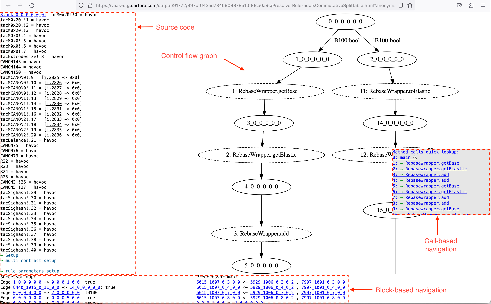

Diagnostic Tools
================


(tac-reports)=
## TAC Reports

% TODO  write this -- https://certora.atlassian.net/browse/DOC-355

% TODO: writing "verification condition" should write "rule", or what?..

TAC Reports provide an under-the-hood view on a given verification condition as
well as the result that the prover produced for that verification conditon, if
available. There are four variants of TAC reports, one each for the results SAT,
UNSAT, TIMEOUT, and one contains no information from the result. In the
following, we will discuss these variants one by one. We'll begin with the TAC
report without prover result information, since its constituents are present in
the other variants as well.

## Plain TAC reports



At the center of a TAC report is a visualization of the verification condition's
{term}`control flow graph` (CFG).[^nested-cfg] There are two kinds of nodes.
Regular nodes and call nodes. Regular nodes have a solid outline, while call
nodes have a dashed outline. Clicking on a regular nodes will made the source
code box (discussed below) focus on the corresponding source code; clicking on a
call node will replace the currently displayed CFG with the CFG that belongs to
the called method. 

```{note}
Only external calls are explicit in the TAC report's CFGs. Internal calls are 
inlined on the TAC source code level.
```

[^nested-cfg]: Strictly speaking, there is a set of CFGs available for each
    verification condition. Every external call has its own CFG, and the CFGs
    are related by call nodes which lead from a call site to the corresponding
    callee's CFG. Intuitively, this set can be viewed as one CFG with nested 
    sub-CFGs for the calls.

The upper-mid left part of a TAC report contains the TAC source code. The
details the TAC language are outside the scope of this documentation. Generally
speaking, TAC is generated by compiler-style transformations of the EVM bytecode
together with the CVL specification. Many patterns from EVM bytecode are
retained in TAC, however inlining of functions and various simplifications have
already happenend. Especially since the source code in the TAC reports is taken
from a stage directly before the SMT solving. The source code is useful because
it "speaks the truth", i.e., it has all the summarizations and inlinings and
optimizations already applied, it is very close to what the SMT solver sees.
There are source code pointers in the TAC, too. These are the statements with a
dotted underline; the source code location they have been translated from is
revealed on hovering with the mouse over such a statement, as displayed in the
image below.


The call-based navigation on the mid-right side of the report lists all the
calls. Each call is identified by a number. After the number there is a number
of arrows, indicating the nesting depth of the call. After that the name of the
called method is given. Each of these calls is clickable and will lead to the
corresponding CFG.

At the bottom of the TAC report are the successor and predecessor relations of
the CFG on a per-block/per-node basis. These are usually not useful for the tool
user, so we will ignore them in the remainder of this document.

## SAT TAC reports


## UNSAT TAC reports

```{todo}
This section still needs to be written.
```

## Timeout TAC reports

### Statistics- and explanation-box

### Split- and heuristical difficulty-coloring

### TAC source code box


There is a brief explanation of how to use TAC reports in the 
[webinar on timeouts](https://www.youtube.com/watch?v=mntP0_EN-ZQ).
