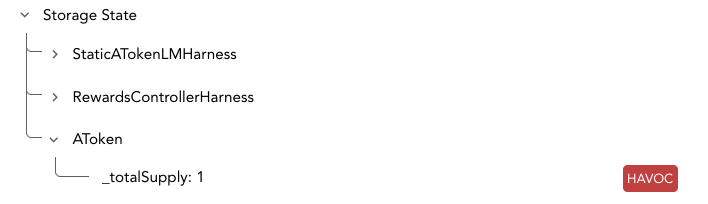

Storage in Call Trace
============
When the Prover finds a counterexample to an assertion, 
the resulting trace contains information about the state of the contracts at the beginning of the rule, 
as well as information about updates to the storage during the execution of the contracts' functions.
The Call Trace should show the values in the storage of each contract, as can be illustrated in this picture:



How can the storage change?
---------------------------
While specific storage slots/fields can be assigned new values,
it is possible for the storage of the whole contract to revert to the previous state.  
This is as a result of either a Solidity require statement failing, explicit Solidity revert statement,
storage being restored to a previously saved state in CVL (e.g., `func() at init)`,
or havoc’d (due to invoking functions that havoc the state of contracts).  

When do we show the storage state?
----------------------------------
In the Call Trace section, the storage state will be presented in 3 kinds of places:
At the beginning of the execution, right after the failed assert, and after internal function calls.  

One can enable or disable presentation of the storage state using a toggle button highlighted in red here:


What do we show?
----------------
For each contract in the spec, we show all storage _access paths_ instantiated with concrete indices
(as determined by the counterexample), used (i.e., read / written) during the execution trace.  
These access paths are lexicography ordered.  
For each access path, we show its source-code name, value (if known, `*` if unknown), “computational type”,
and whether it was changed since the previous time we showed the storage.  

What are the “computational types”?
-----------------------------------
There are currently four types:  
* Concrete - the value of this variable in the counterexample is explicitly set to this value in the spec or contract,
so it must be similar in all counterexamples.  // TODO: this is unclear. Why must it be similar? What does similar mean here?
* Don’t care - the value of this variable is not used before it is written, so its initial value is not relevant.  
* Havoc - the SMT chooses a random value.  
* Havoc dependent - the value is a result of some computation involving another havoc or havoc dependent variable.
We distinguish it from havoc’d variables, because if we know the values of all havoc’d variables,
this value can be calculated as well (unlike havoc’d variables which are completely random).  

// TODO: I also noticed Unknown here https://prover.certora.com/output/33050/d22a36b3d50b4ef1812a6cc03d72d7aa/?anonymousKey=0c21d1fa076ce622bb4f57624101a5197fead3ef in the call to refreshRewardTokens. Should we doc it too?

Limitations of the current “computational type” resolution
-----------------------------------------------------------
We currently only consider assignments and storage changes (store, havoc, restore (`func() at init` and revert).  
However, we don’t consider requires or values that cause revert so in
```
uint256 a;
require a == 10
```
we consider `a` as havoc instead of concrete.
Additionally, in the following example
Solidity:
```
function foo(address sender) {
    require(sender == OWNER);
}
```
CVL:
```
address addr;
foo(addr);
```
we consider `addr` as havoc instead of concrete.

We don’t support showing strings / bytes keys of maps, so if `balances` is a map with such keys,
they will be shown as `balances[*]` or `balances[hash_X]`.  
As a result, distinct keys may collide with each other when shown in the Call Trace.
