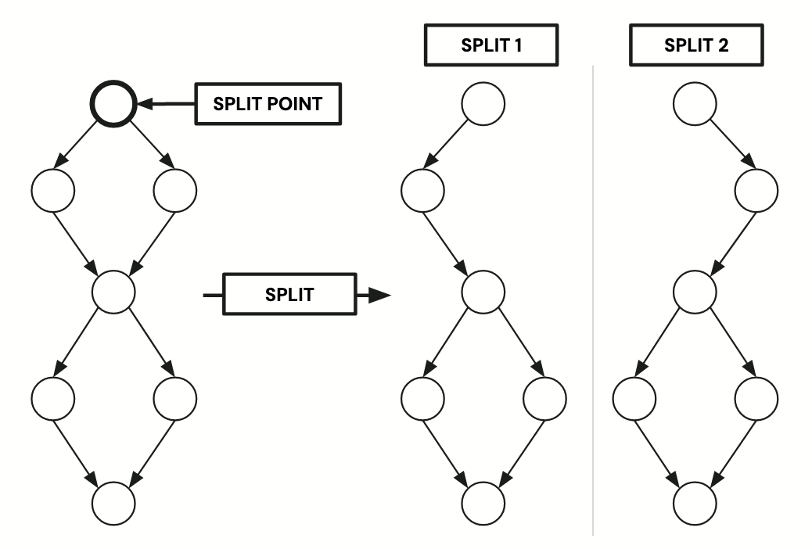

Techniques Used by Certora Prover
=================================

In this chapter, we describe some of the techniques used inside the Certora
Prover. While this knowledge not essential for using the prover, it can
sometimes be helpful when the prover does not behave as expected, for instance
in case of a prover timeout.

(control-flow-splitting)=
# Control Flow Splitting


Control flow splitting (or short "splitting") is one of the techniques that
Certora Prover employs to speed up solving. In the remainder of this section, we
will give an overview of how the technique works. This background should be
helpful when using the settings described [here](control-flow-splitting-options)
to prevent prover timeouts.

Splitting is best illustrated using the {term}`control flow graph` (CFG) of a given
CVL rule.

A single splitting step proceeds as follows:
 - Pick a node with two successors in the CFG, the *split point*.
 - Generate two new CFGs, we call them *splits*; both splits are copies of the 
   original CFG, except that in the first (second) split, the edge to the first 
   (second) successor has been removed. The algorithm also removes all nodes and 
   edges that become unreachable through the initial edge removal.

The following picture illustrates a single splitting step.




There is an internal heuristic deciding which branching nodes to pick for each
single splitting step.

Certora prover applies these single splitting steps recursively as follows:

```
Recursive Splitting Algorithm:
Input: CFG input_program

worklist.add(input_program)

while (worklist != [])
    g = worklist.pop()

    res = check(g)
    when (res) 
        SAT, model -> return (SAT, model)
        UNSAT -> continue
        TIMEOUT -> 
            if (max_depth_is_reached())
                return timeout
            else
                worklist.add_all(split_single(g))
return UNSAT
```

Intuitively, the the algorithm explores the tree of all possible recursive
splittings along a fixed sequence of split points up to the maximum splitting
depth. We call the splits at maximum splitting depth split leafs.

The main settings with which the user can influence these process are the
following (each links to a more detailed description of the option):

 - [Maximum split depth](-depth) controls the maximum recursion depth
 - [Smt timeout](--smt_timeout) controls the timeout that is applied at maximum
   recursion depth; if this is exceeded, the prover will give up with a TIMEOUT 
   result, unless [the corresponding setting](-dontStopAtFirstSplitTimeout) says 
   to go on.
 - [Medium timeout](-mediumTimeout) controls the timeout that is applied when
   checking splits that are not at the maximal recursion depth. 
 - Setting the [initial splitting depth](-smt_initialSplitDepth) to a level 
   above 0 will make the prover skip the checking and immediately enumerate all 
   splits up to that depth.

   

