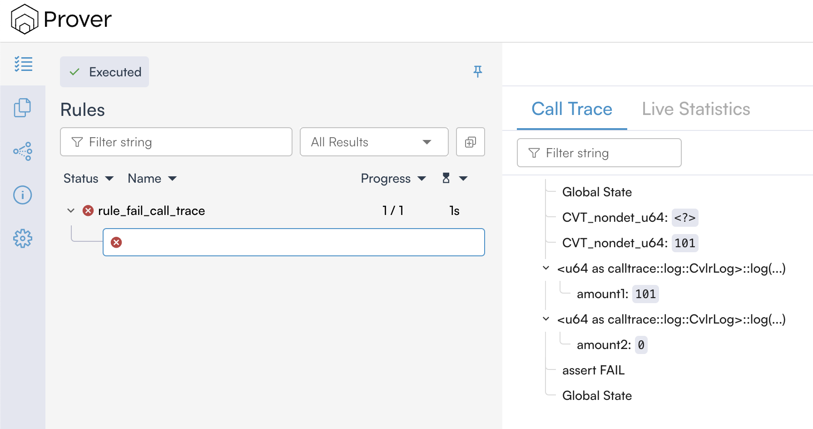

# Understanding Prover Output for Solana Programs

## Overview

This guide explains how to interpret verification results from the Certora Prover for Solana programs. It's designed for developers familiar with Solana/Rust development and formal verification concepts.

## Verification Tasks

A verification task consists of one or more rules that verify specific properties of your Solana program. Each rule contains at least one of the following:

* Assert statements `cvlr_assert!`
* Satisfy statements `cvlr_satisfy!`

## Understanding Rule Results

### Assert Statements

When using `cvlr_assert`, the Prover attempts to prove that the assertion holds true for all possible program states. For example:

```rust
cvlr_assert!(amount > 10);
```

The Prover will return one of two results:


1. **PASSED**: The assertion is proven true for all possible computation paths and initial values


2. **FAILED**: A counterexample (CEX) was found, i.e a starting state and computation path that violates the assertion.
    The Prover stops at the first counterexample found, even if multiple counterexamples exist

### Satisfy Statements

`cvlr_satisfy` statements verify that a certain condition is reachable. For example:

```rust
cvlr_satisfy!(amount > 10);
```

The results can be:

1. **PASSED**: At least one execution path exists where the condition is true
2. **FAILED**: The condition is unreachable under any execution path

## Analyzing Counterexamples

When a rule fails, the Prover generates a counterexample showing the execution path that led to the failure. Counterexamples can be:

1. **Valid**: Indicating a genuine bug in the code
2. **Spurious**: Resulting from over-approximation of possible program states

### Call Trace Analysis


The call trace provides detailed information about the execution path. Here's how to interpret it:

#### Nondeterministic Values

* Appear at the beginning of the trace
* Represent the starting state which leads to a violation
* Format: `CVT_nondet_u64: <value>`

#### Variable Values

* The values of variables can be printed using the `clog!` macro
* Example: `let x: u64 = nondet(); clog!(x);`

#### Method Calls

* Automatically logged
* Show the sequence of function calls
* To see parameter values, you need to change the original code with Certora's
  `cgdb!` print macros

#### Let's look at a concrete example

[Prover output](https://prover.certora.com/output/1324651/741e8ee5a5754c1ab8db0aa36be39e4d?anonymousKey=ca602f5139de3bfbae17eb1fbf9c11145be3a912)

```rust
#[rule]
pub fn rule_fail_call_trace() {
    let amount1: u64 = nondet();
    let amount2: u64 = nondet();

    cvlr_assume!(amount1 > 100);
    cvlr_assume!(amount2 != 10);

    clog!(amount1);
    clog!(amount2);

    cvlr_assert!(amount1 < 100);
    cvlr_assert!(amount2 < 100);
}
```

When this rule fails, the Prover generates a counterexample that looks like
this:


   Let's analyze this counterexample:

   1. **Nondet Values**: 

        * The Prover chose `101` for `amount1` and implicitly `0` for `amount2`
        * These values are chosen to demonstrate the violation of our assertions
        * `<?>` means that the value is not important for the counterexample 

   2. **Variable States**:

        * `amount1` is 101, which satisfies our assumption `cvlr_assume!(amount1 > 100)`
        * `amount2` is 0, which satisfies our assumption `cvlr_assume!(amount2 != 10)`

   3. **Assertion Failure**:

        * The assertion `cvlr_assert!(amount1 < 100)` fails because we have a contradiction:
            * We previously assumed `amount1 > 100`
            * But then we assert `amount1 < 100`
        * This is impossible to satisfy, hence the counterexample


## Rule Sanity Checking

To ensure rules aren't passing vacuously (due to contradictory assumptions), add sanity checking to your configuration:

```json
{
    "rule_sanity": "basic"
}
```

This adds an implicit `cvlr_assert!(false)` at the end of each rule. If this assertion is unreachable, it confirms that:

1. Your assumptions aren't contradictory
2. The rule's success is meaningful

### Common Sanity Check Results

1. **Sanity Check PASSED**: The desired outcome - confirms rule isn't vacuously true
2. **Sanity Check WARNING**: Warning sign - indicates contradictory assumptions

See [Rule Sanity Checks](./sanity.md) for more details.


## Best Practices

1. Always enable rule sanity checking in your configuration
2. Review full call traces when investigating failures
3. Validate counterexamples against your program's expected state space

## Advanced Topics

### Analyzing Functions Complexity

The Certora Solana Prover offers the Live Statistics panel to analyze the complexity of individual functions. The Live Statistics provide information, for instance, about the number of paths of a function body which may help when having difficult to solve rules.
Refer to the [Timeouts](../user-guide/out-of-resources/timeout.md) section for further information.

### Over-approximation Detection

When analyzing counterexamples, consider:

1. Initial state feasibility: Is the starting state reachable for the code you're analyzing?
2. Transaction sequence validity: Does the computation path make sense? Did you overlook a certain scenario?
3. State transition legitimacy: Do the values throughout the computation match? Are the parameters of your rule changing as expected?

If any seem impossible in your actual program, the counterexample might be due to over-approximation.
