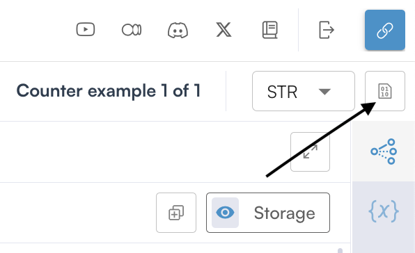
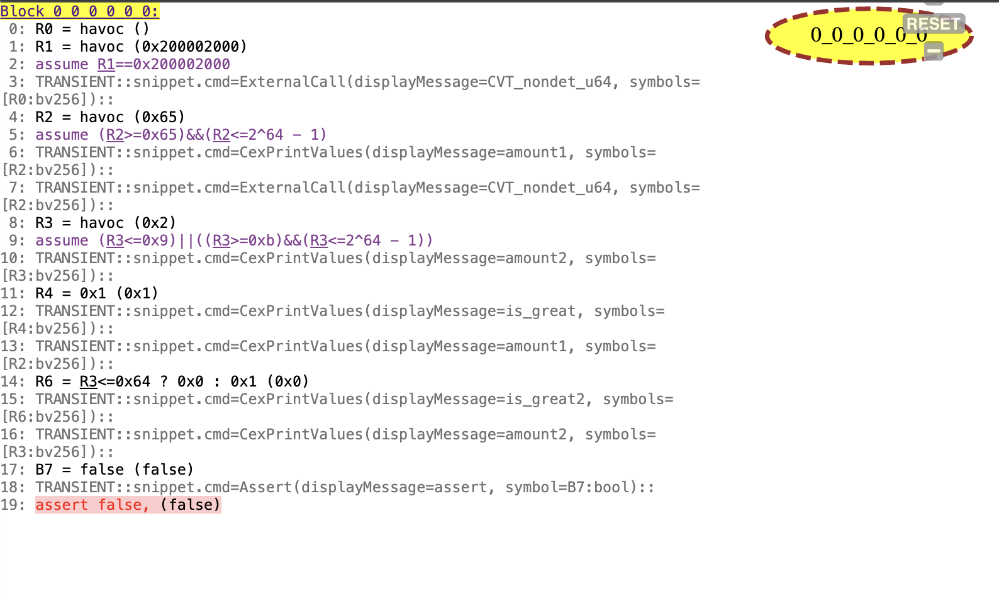

Understanding Prover Output for Solana Programs
============================================

Overview
--------

This guide explains how to interpret verification results from the Certora Prover for Solana programs. It's designed for developers familiar with Solana/Rust development and formal verification concepts.

Verification Tasks
----------------

A verification task consists of one or more rules that verify specific properties of your Solana program. Each rule contains at least one of:

* Assert statements (``cvt_assert!``)
* Satisfy statements (``cvt_satisfy``)

Understanding Rule Results
------------------------

Assert Statements
~~~~~~~~~~~~~~~

When using ``cvt_assert!``, the prover attempts to prove that the assertion holds true for all possible program states. For example:

.. code-block:: rust

    cvt_assert!(amount > 10)

The prover will return one of two results:

.. image:: img/passed.png
   :alt: A passed rule in the Certora Rule Report

1. **PASSED**: The assertion is proven true for all possible computation paths and initial values

.. image:: img/failed.png
   :alt: A passed rule in the Certora Rule Report

2. **FAILED**: A counterexample (CEX) was found, i.e a starting state and computation path that violates the assertion.

.. note::
    The prover stops at the first counterexample found, even if multiple counterexamples exist.

Satisfy Statements
~~~~~~~~~~~~~~~

``cvt_satisfy`` statements verify that a certain condition is reachable. For example:

.. code-block:: rust

    cvt_satisfy(amount > 10)

Results can be:

1. **PASSED**: At least one execution path exists where the condition is true
2. **FAILED**: The condition is unreachable under any execution path

Analyzing Counterexamples
-----------------------

When a rule fails, the prover generates a counterexample showing the execution path that led to the failure. Counterexamples can be:

1. **Valid**: Indicating a genuine bug in the code
2. **Spurious**: Resulting from over-approximation of possible program states

Call Trace Analysis
~~~~~~~~~~~~~~~~
.. image:: img/call_trace_example.png
   :alt: A call trace example

The call trace provides detailed information about the execution path. Here's how to interpret it:

Nondeterministic Values
**********************

* Appear at the beginning of the trace
* Represent the starting state which leads to a violation
* Format: ``CVT_nondet_u64: <value>``

Method Calls
**********

* Automatically logged
* Show the sequence of function calls
* To see parameter values, you need to munge the original code with CVT-style print statements

Variable Values
************

Printed using the special macro ``cvt_cex_print_u64!()``. For named printing, you can add the following macro to your ``utils.rs``, this will print the name of the variable your passing. 

.. code-block:: rust

    macro_rules! nice_print {
        ($e:expr) => {
            cvt_cex_print_u64!($e, $e)
        };
    }
    pub(crate) use nice_print;

.. _example: https://prover.certora.com/output/696612/daa2d29059234c459ab0d2c7f6784cde?anonymousKey=cddfa55db76600ea920eea729a454cde61fe278e 

Let's look at a concrete example_:
*********************************

.. code-block:: rust

    pub fn is_greater_than_100(amount: u64) -> bool {
        amount > 100
    }

    #[rule]
    pub fn rule_fail_call_trace() {
        let amount1: u64 = nondet();
        let amount2: u64 = nondet();

        let is_great = is_greater_than_100(amount1);
        cvt_assume!(is_great);
        let is_great2 = is_greater_than_100(amount2);
        cvt_assume!(amount2 != 10);
        
        nice_print!(is_great);
        nice_print!(amount1);
        nice_print!(is_great2);
        nice_print!(amount2);
        
        cvt_assert!(amount1 < 100);
        cvt_assert!(amount2 < 100);
    }

When this rule fails, the prover generates a counterexample that looks like this:

.. container:: call-trace-analysis
   :name: call-trace-example
      
   .. image:: img/call_trace_detail.png
        :alt: A call trace example
        :align: right
        :width: 300px

      Call trace output showing counterexample values

   Let's analyze this counterexample:

   1. **Nondet Values**: 

        * The prover chose ``101`` for ``amount1`` and implicitly ``2`` for ``amount2``
        * These values are chosen to demonstrate the violation of our assertions
        * ``<?>`` means that the value is not important for the counterexample 

   2. **Variable States**:

        * ``is_great`` is assumed, thus ``1`` (true) as ``amount1`` (101) is indeed greater than 100
        * ``amount1`` is 101, which satisfies our assumption ``cvt_assume!(is_great)``
        * ``is_great2`` is ``0`` (false) because ``amount2`` (2) is not greater than 100
        * ``amount2`` is 2, which satisfies our assumption ``cvt_assume!(amount2 != 10)``

   3. **Assertion Failure**:

        * The assertion ``cvt_assert!(amount1 < 100)`` fails because we have a contradiction:
            * We assumed ``is_great`` is true, which means ``amount1 > 100``
            * But then we assert ``amount1 < 100``
        * This is impossible to satisfy, hence the counterexample

Rule Sanity Checking
------------------

To ensure rules aren't passing vacuously (due to contradictory assumptions), add sanity checking to your configuration:

.. code-block:: json

    {
        "rule_sanity": "basic"
    }

This adds an implicit ``cvt_assert!(false)`` at the end of each rule. If this assertion is unreachable, it confirms that:

1. Your assumptions aren't contradictory
2. The rule's success is meaningful

Common Sanity Check Results
~~~~~~~~~~~~~~~~~~~~~~~~

1. **Sanity Check PASSED**: Desired outcome - confirms rule isn't vacuously true
2. **Sanity Check WARNING**: Warning sign - indicates contradictory assumptions

See `Sanity <#solana-sanity-section>`_ for more details.

Best Practices
------------

1. Always enable rule sanity checking in your configuration
2. Use ``nice_print!`` macro for clearer counterexample analysis
3. Review full call traces when investigating failures
4. Validate counterexamples against your program's expected state space

Advanced Topics
-------------

Over-approximation Detection
~~~~~~~~~~~~~~~~~~~~~~~~~

When analyzing counterexamples, consider:

1. Initial state feasibility: Is the starting state a reachable state for the code you're analyzing?
2. Transaction sequence validity: Does the computation path make sense, did you overlook a certain scenario?
3. State transition legitimacy: Do the values throughout the computation match? Are the parameters to your rule changing as expected?

If any seem impossible in your actual program, the counterexample might be due to over-approximation.

The Dump
~~~~~~~~

The dump output shows the underlying verification conditions in the prover's intermediate representation. It provides detailed insight into how the prover interprets and processes your code.

Example Dump
**********

.. _dump: https://prover.certora.com/output/696612/daa2d29059234c459ab0d2c7f6784cde/Report-rule_fail_call_trace-example1.html?anonymousKey=cddfa55db76600ea920eea729a454cde61fe278e

For our previous example rule, here's the corresponding dump_:

Let's analyze this dump line by line:

Initialization (Lines 0-3)
************************

* ``R0 = havoc ()``: Initializes the first register with a nondeterministic value
* ``R1 = havoc (0x200002000)`` and ``assume R1==0x200002000``: Sets up memory addressing

First Variable Setup (Lines 4-6)
*****************************

* ``R2 = havoc (0x65)``: Sets ``amount1`` to ``0x65`` (101 in decimal)
* ``assume (R2>=0x65)&&(R2<=2^64 - 1)``: Constrains ``amount1`` to be ≥ 101 and within u64 bounds
* Prints ``amount1`` value via ``CexPrintValues``

Second Variable Setup (Lines 8-10)
******************************

* ``R3 = havoc (0x2)``: Sets ``amount2`` to ``0x2`` (2 in decimal)
* ``assume (R3<=0x9)||((R3>=0xb)&&(R3<=2^64 - 1))``: Implements ``amount2 != 10`` constraint
* Prints ``amount2`` value

Boolean Operations (Lines 11-16)
****************************

* ``R4 = 0x1``: Sets ``is_great`` to true (1)
* ``R6 = R3<=0x64 ? 0x0 : 0x1``: Computes ``is_great2`` based on ``amount2 <= 100``
* Various print commands show the values of variables

Assertion Checking (Lines 17-19)
****************************

* ``B7 = false``: The assertion ``amount1 < 100`` evaluates to false
* Final ``assert false``: Indicates the failure of the verification condition

.. tip::
   Understanding the dump can help you:
     * Debug complex verification conditions
     * Understand how the prover interprets your assumptions
     * Identify where contradictions occur in your rules

.. note::
    The regular prover view allows to show values in decimals by using the convert to dec option on the upper right corner. 
    The dump uses hexadecimal values (0x prefix) and shows the underlying register operations. Converting these to decimal can help match them with your original code. 

.. warning::
    The dump format may vary depending on the prover version and configuration. Focus on understanding the general structure rather than memorizing specific formats.
