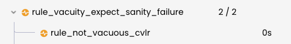

Rule Sanity Checks (Solana)
==========================

The {ref}`--rule_sanity` option enables automatic checks that warn the user
about potential problems in the specification. Currently only one sanity check has been implemented: 
the vacuity check.

```{note}
This is the documentation for the sanity checks for Solana. 
If you are looking for the Sanity checks for Solidity, please refer to [this section](https://docs.certora.com/en/latest/docs/prover/checking/sanity.html).
```

The `--rule_sanity` option can be set to `none` or `basic` and controls whether the sanity checks should be executed:
 * With `--rule_sanity none` or without passing `--rule_sanity`, no sanity
   check is performed.
 * With `--rule_sanity basic` or just `--rule_sanity` without a mode, the
   sanity checks are executed.

Each sanity check adds a new child node to every rule in the rule tree of the rule report. Each check transforms the underlying
representation into a deviated subprogram from the original one under verification and attempts to verify this new program.  
If the sanity check fails on a rule, the sanity node in the rule report will be displayed as a yellow icon, 
and its status propagates to the parent rule's node (see below for an example).

The remainder of this document describes the vacuity check in detail. 

(solana-sanity-vacuity)=
Vacuity checks
--------------

The **vacuity** sanity check ensures that even when ignoring all the
user-provided assertions, the end of the rule is reachable. This check ensures
that the combination of `require` statements does not rule out all
possible counterexamples. Rules that rule out all possible counterexamples
are called {term}`vacuous`. Since they don't actually check any
assertion, they are almost certainly incorrect.

For example, the following rule would be flagged by the vacuity check:

```rs
#[rule]
pub fn rule_vacuity_test_expect_sanity_failure() {
    let amount: u64 = nondet();

    cvlr_assume!(amount >= 2);
    cvlr_assume!(amount <= 1);
    cvlr_assert!(amount == 1); // Expect a sanity failure here as the assumes are conflicting.
}
```

Since the two assumes `amount >= 2` and `amount <= 1` contradict each other, this rule
will always pass, regardless of the behavior of the contract. This is an
example of a {term}`vacuous` rule &mdash; one that passes only because the
preconditions are contradictory.

In the rule report, a vacuity check adds a node called `rule_not_vacuous_cvlr` to each rule.  
For example, see how the rule `rule_vacuity_test_expect_sanity_failure` from above
is reported as failing sanity, as `rule_not_vacuous_cvlr` fails. 
Below you see an example of a rule without the contradicting `assume`s that does not fail vacuity.

