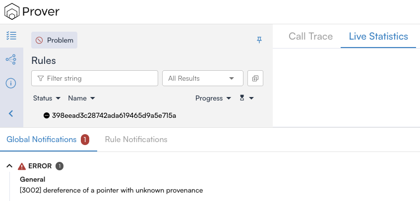

Troubleshooting
===============

This section describes resolution of common issues when using the Solana Prover.

Unable to run ``certoraSolanaProver``
-------------------------------------

The ``certoraSolanaProver`` command has been introduced in version ``7.22.0`` of
the Certora Prover package.
Run ``certoraRun --version`` to verify that you are using a version greater or
equal to ``7.22.0``.
It is possible to upgrade the Certora Prover package with the following command:
``pip3 install --upgrade certora-cli``.
For information about how to install the Certora Prover package, refer to
:doc:`Installation <../user-guide/install>`.

Jump to Source feature not working
----------------------------------

For the Jump to Source feature to work, the source code must be compiled with
debug information enabled.
This can be done by using the following compiler flags:
``-C strip=none -C debuginfo=2``.
Furthermore, the feature will not work if the source files are not correctly
uploaded to the cloud.

Prover Errors
-------------

The Solana Prover is currently under development, and some features are not
supported yet.
The most common source of errors from the Prover are stack-allocated arrays.
Accessing an element in an array that has been allocated on the stack can
result in an error.
For instance, the following rule will trigger a Prover error.

.. code-block:: rust

    #[rule]
    fn access_stack_element() {
        let ints = [0, 1, 2];
        let index: usize = nondet_with(|x| *x < 3);
        cvlr_assert!(ints[index] < 3);
    }

The Prover will display the following error message:

To solve this, modify the source code to move the array to the heap.
For instance, in the previous example it is sufficient to modify the type of
``ints`` from ``[i32; 3]`` to ``Vec<i32>``:

.. code-block:: rust

    #[rule]
    fn access_stack_element() {
        let ints = vec![0, 1, 2];
        let index: usize = nondet_with(|x| *x < 3);
        cvlr_assert!(ints[index] < 3);
    }