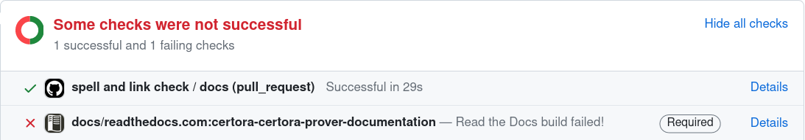
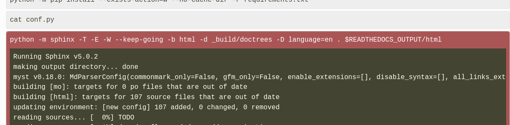
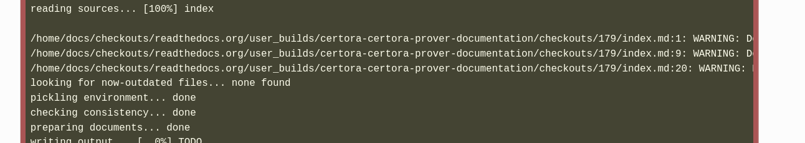
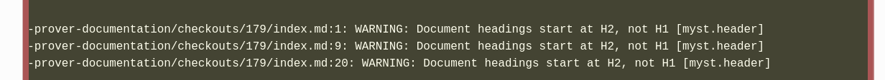
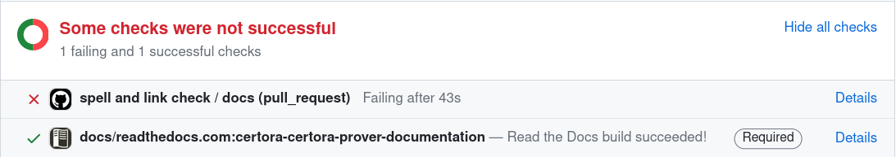
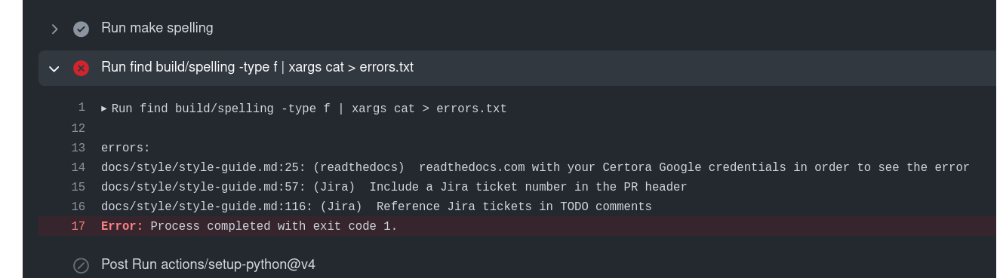

Documentation Style Guide
=========================

TODO: intro

```{contents}
```

Process
-------

This section outlines the steps you should take before submitting a PR. 

```{contents}
:local:

```

(docs-build)=
### Make the documentation build

When you create a documentation PR, Read the Docs will automatically attempt to
compile it to generate the HTML documentation.  You can see generated
documentation at the bottom of the PR:



If the documentation didn't build successfully, the "details" link to the right
will point you to the error messages.  You will need to log in to
readthedocs.com with your Certora Google credentials in order to see the error
messages (otherwise you will get a **404 Not Found** page).

The error messages can be hard to find because they usually go past the end of
the window:



You need to scroll down to find the long lines:



and then scroll to the right:



Ask in #documentation if you need help fixing the errors.

(docs-spell)=
### Make the spell checker pass

The other CI check that must pass before a PR can be merged is the spell check.



Clicking on the details link will show you the spelling errors:



This will show you the files and lines of the misspelled words.

The most common cause of misspelled words are when you forget to {ref}`use code
font for code <docs-code-font>`; words surrounded by backticks are not spell
checked.

If you need to, you can add new words to the dictionary by editing
`spelling_wordlist.txt` in the top-level directory; but {ref}``don't add `prover`
to the dictionary <docs-prover-capitalize>`` and {ref}`don't add code to the
dictionary <docs-code-dictionary>`.

(docs-prover-capitalize)=
### Don't add `prover` to the dictionary

You should always capitalize "Prover"; the spell checker will fail if you don't.
This is by design; capitalize it!

(docs-code-dictionary)=
### Don't add code to the dictionary

Anything that is code {ref}`should be <docs-code-font>` surrounded by backticks
or in a code block; if code gets flagged by the spell checker, you should mark
it as code instead of adding it to the dictionary.

(docs-read)=
### Read the generated documentation

When you create a PR, the CI will generate the documentation and add a link to
the checks section at the bottom of the PR (click "details"):


Before submitting for review, read over the generated documentation.  This can
help you easily catch formatting mistakes that aren't obvious in the markdown,
such as bad text for `{ref}` links, incorrect formatting commands, misaligned
bullets, and incorrect sectioning.

### Check the navigation tree

While reading your generated documentation, it is especially helpful to look
over the navigation bar on the left side to make sure it looks good.  This can
help you remember to use short section titles, {ref}`docs-page-headers`,
{ref}`docs-section-headers`, and also just make sure that your information is
well organized.

(docs-link-to-generated)=
### Link to the generated documentation in the PR

While you {ref}`docs-read`, create a link to the specific page you're editing
and put it in the PR description.  This helps reviewers easily find the text to
read.

(docs-jira-pr)=
### Include a Jira ticket number in the PR header

There should be a ticket on the Doc Jira board for every PR in progress; include
the ticket number in the one-line PR description.

(docs-check-links)=
### Check external links

Although we used to have automation to check external links, it is currently
broken.  Therefore, you should click on any external links while reviewing to
make sure they are correct.

(docs-structure)=
Structure
---------

Broadly speaking, the documentation is split into the following sections:

 - The **user guide** is aimed at users who are learning to use the tool to do
   a specific task.  The user guide is everything contained in the
   `docs/user-guide` folder.  See {doc}`../user-guide/multicontract/index`
   for a good example of a user guide page.

 - The **reference manual** is aimed at users who want to know how a specific
   feature of the Prover works.  The reference manual includes everything in
   `docs/cvl`, `docs/prover`, `docs/gambit`.  See {doc}`../cvl/methods` for
   a good example of a reference manual page.

 - The **white paper** (in `docs/whitepaper`) is a historical document that
   should not be edited.

 - The **old documentation** (in `docs/confluence`) is deprecated documentation
   that should be replaced.

This section contains style recommendations that are specific to these sections.

```{contents}
:local:

```

### User guide: Orient pages around tasks

The user guide should tell the user how to do something they already want to do.
Good user guide topics include "how to address timeouts", "how to work with
multiple contracts", "how to set up a project", "how to understand a
counterexample", and "how to specify properties of your contracts".  Bad user
guide topics include "how to write a methods block" or "how hooks work"; these
discuss specific features and are better suited for the reference manual.

### User guide: Give advice and experience

The user guide is telling people how to do new things; it is a good place to
include common pitfalls, useful ideas, or to advocate for the best way to do
something.

### User guide: Link to the reference manual

If a user guide page discusses or uses a feature, it should link to the
reference manual page on that feature.

(docs-ug-detail)=
### User guide: Avoid extraneous detail

The user guide should focus on the most common cases and avoid giving too much
detail about the features it discusses.  For example, a page about timeouts
should mention summarization, but it probably shouldn't list all of the possible
kinds of summaries.

### User guide: Use running examples

A user guide page is designed to be read from start to finish.  It is therefore
helpful to introduce a topical running example at the beginning of the page and
then use the same example throughout.

Examples in the user guide should be real DeFi concepts such as ERC20 contracts.

### User guide: Be conversational

When writing a user guide page, you are teaching the user.  You should write as
if you and the reader are working together to accomplist a goal.  For example,
the following is appropriate for the user guide:

```markdown
To start, let's write a basic property of the pool and run the Prover on the
`Pool` contract to see how it handles calls to unknown code.
```

while the following is probably too terse:

```markdown
Each entry in the methods block contains a pattern that matches some set of
contract functions.
```

### Manual: Orient pages around features

The reference manual is for users who already know what information they are
looking for.  The reference manual should be organized around Prover features;
each page should focus on a specific facet of the Prover's operation.

For example, each page of the CVL reference manual covers a particular part of
the CVL syntax.

### Manual: Include complete details

Everything a user might need to know about a feature should be included in the
reference manual.

### Manual: Avoid advice (other than "use with care")

The reference manual should be unopinionated, within reason.  Information about
how to best use a feature should be contained in the user guide.

An important exception is when a feature is unsound or can lead to confusing
behavior when misused; in that case it is good to give the user a heads up.

### Manual: Link to the user guide

If there is a user guide page on a particular feature, the reference manual
should link to it.  For example:

```markdown
See {ref}`unknown-contracts` for an extended example demonstrating these
features.
```

### Manual: Use simple independent examples

Users are likely to read a single section of the reference manual at a time.
Therefore, examples should be simple and self-contained.

Examples can use DeFi language when appropriate, but it is also fine for
examples in the reference manual to just use dummy names like `example_rule` or
`function C.f(uint x)`.

### Manual: be succinct

Text in the reference manual should be as concise as possible while still
being technically correct.

### Manual: Use the standard structure for CVL pages

Each page in the CVL manual has the following structure:

 - an introduction,
 - a `{contents}` block
 - a Syntax section
 - an Examples section
 - additional sections

### Manual: Update the syntax section for CVL pages

The Syntax section of each CVL page should be kept up-to-date.

### Old docs: Don't edit these, except to remove them

The old documentation (in `docs/confluence`) shouldn't be edited; it should be
rewritten in accordance with this style guide and combined into the current
documentation (or left alone).

Sectioning
----------

This section contains recommendations for breaking text into sections.

```{contents}
:local:

```

(docs-page-headers)=
### Use title case for page headers

Page headers should use title case:

```markdown
Example Header for the Top of a Page
====================================
```

(docs-section-headers)=
### Use sentence case for section headers

Section headers should use sentence case:

```markdown

Example major section header
----------------------------

### Example subsection 1

### Example subsection 2
```

(docs-contents-blocks)=
### Add contents blocks where appropriate

Pages with more than two sections should contain a `{contents}` block after the
introductory paragraph for the page.

It is also occasionally useful to include a local contents section within a page
when a top-level section has many subsections.  You can do this using the local
flag to the `{contents}` directive:

````markdown
```{contents}
:local:

```

This technique is helpful when you want to remind the user of the outline for a
subsection.  See {ref}`cvl2-methods-blocks` for an example.

### Start every section with an introduction

Every section should have at least a sentence of introduction.  This is even
true if the section is just a bunch of subsections: it is still useful to have
a sentence or two explaining what the subsections are (and possibly including
a {ref}`local contents block <docs-contents-blocks>`).

### Use short section titles

The navigation tree on the left of the page is easier to use if each page header
and top-level section header fits on a single line.  This is less important
for third-level headers and below (`###`, `####`, etc).

Linking
-------

### Link to terms when they are first used

### Always link to command-line options

### Cross-link between user guide and reference manual

### Include links in sentences where possible

(docs-link-syntax)=
### Use reference-style external link syntax

### Add glossary entries where appropriate

### Alphabetize the glossary

### Link glossary entries to the documentation

### Reference Jira tickets in TODO comments

### TODO: label format

### TODO: github links

Audience and content
--------------------

### Assume the reader has smart contract background

### Assume the reader is not familiar with Prover internals

 - SMT
 - TAC
 - Verification condition
 - SAT / UNSAT
 - `assume`
 - EVM bytecode

### Add a caution box when discussing an unsound feature

### Instructions should be clear and actionable

Examples
--------

### Use ERC20 or ERC4626 wherever possible

### Use DeFi examples wherever possible

### Link to the `Examples` repository

### Include descriptive text

### Include relevant snippets

### Elide irrelevant details

### Use CVLDoc comments

### Don't rely on examples alone

### TODO: snake case for examples?

### Include assert messages

### Include line numbers when necessary

Grammar, style, phrasing
------------------------

### Use correct hyphenation

### Avoid passive voice

### Use complete sentences

### Address the reader

### Avoid long bullets

### Capitalize and punctuate bullets correctly

### Use a new paragraph when starting a new idea

### Mirror language from an introductory paragraph

### Use Oxford commas

### Use footnotes for important but uncommonly needed information

### Be consistent in parallel constructions

### Prefer brevity

### Use "the Prover" or "the Certora Prover"

### Avoid abbreviations and shorthand

 - Use "Solidity files" instead of "`.sol` files"

Images
------

### Include screenshots where appropriate

### Ensure screenshot text is legible

### Add captions for images

Common non-English idioms
-------------------------

### Avoid "it is recommended that"

Instead of "It is recommended that the widgets be frobnicated", prefer "We
recommend that you frobnicate the widgets."

Formatting
----------

### Wrap lines at 80 characters

Long lines in the markdown make editing harder and introduce more merge
conflicts than are necessary.  You should wrap to 80 characters whenever
feasible.  Note that {ref}`reference-style links <docs-link-syntax>` make
this easier by putting long URLs on their own lines.

### Use 4 spaces for indentation

Consistency is important; when indenting inside of code blocks, use 4 spaces.

### Include the language for code blocks

In order to trigger syntax highlighting, code blocks should identify the
language that they are written in.  For example:

````markdown
```cvl
rule example_rule {
    ...
}
```
````

Available languages include:
 - `cvl`
 - `solidity`
 - `sh` (for command-line stuff)
 - `json` (for config files)

### Avoid bold and italic markup

Using markdown bold (`**`) is usually the wrong thing to do.  If you are
bolding an entire line, you probably want to use a section header.  If you are
bolding for emphasis, it is probably not needed.

Bolding is useful for making certain words stand out from the text.  This can be
useful to higlight important parts of the text, e.g. in bulleted lists.  See
{ref}`docs-structure` for an example.

Similarly, italicizing is usually unnecessary, although it is less disruptive
than bolding.

(docs-code-font)=
### Use code font for things the user would type

Anything that is code should be surrounded by backticks (or inside a code
block).  This includes command-line arguments, variable names, and specific
syntax (like `@withrevert` or `methods`).

Sometimes the syntax for something matches the English description of the thing.
In that case, code font is optional.  For example, "the methods block" and "the
`methods` block" are equally valid.

### Prefer bulleted lists over numbered lists

Numbered lists should be used sparingly.  They are useful for the following
reasons:

 - the items form a natural sequence, such as a list of steps (e.g. "In order to
   wash the widget, you must (1) remove the widget, (2) dip the widget in warm
   soapy water, (3) rinse the widget, and (4) replace the widget."

 - you need to refer back to specific items later in the text.

