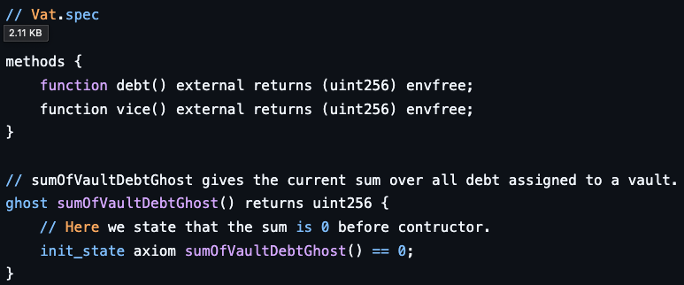
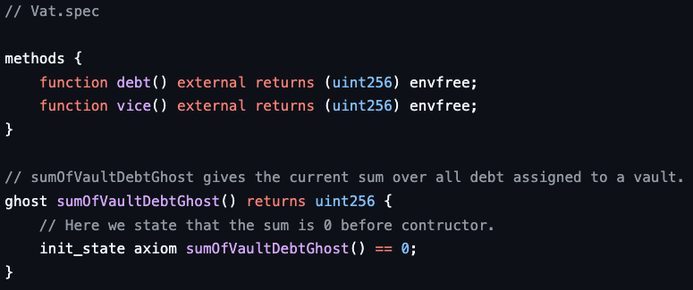

```{index} single: GitHub
```

Syntax Highlighting on GitHub
============
This guide explains how to improve syntax highlighting in your GitHub repository for Certora Prover [configuration](conf-files) and [specification](cvl-language) files.

Before and After Comparison
---------------------------

### .spec files

A `.spec` file without highlighting will appear on GitHub (in dark mode) as:



After following the instructions on this guide it will look like:



### .conf files

A `.conf` file without highlighting will appear on GitHub (in dark mode) as:


After following the instructions on this guide it will look like:


Steps
-----

1. Create a `.gitattributes` file in the root directory of your repository if it doesn't exist.

2. Append the following lines to the end of the `.gitattributes` file:

```
*.spec linguist-language=Solidity
*.conf linguist-detectable
*.conf linguist-language=JSON5
```

3. Commit and push the changes to your repository.

4. Wait for GitHub to process the updates (this may take up to 24 hours).

Explanation
-----------
The `.gitattributes` file instructs GitHub’s Linguist to classify `.spec` and `.conf` files with appropriate syntax highlighting:

`.conf` files are [JSON5](https://json5.org/) files with a different extension. Assigning them to JSON5 enables proper syntax highlighting.

`.spec` files use [CVL](cvl-language), which is currently unsupported by GitHub. However, since CVL shares significant syntax with Solidity, applying Solidity highlighting significantly improves readability compared to GitHub’s default.


Troubleshooting
---------------

### Step 1 - Verify Local Language Detection
To ensure `.gitattributes` was updated correctly, run the following command in your Git repository:
```
git check-attr linguist-language -- **/*.spec **/*.conf
```

You should see output similar to:
```
path/to/file.spec: linguist-language: Solidity
path/to/file.conf: linguist-language: JSON5
```

If the output shows `unspecified`, the `.gitattributes` file may be missing or incorrectly placed (it must be in the root directory of the repository).
```
CLIFlags/solc_via_ir.conf: linguist-language: unspecified
```

### Step 2 - Verify GitHub Server Update
Run the following API query to confirm GitHub’s Linguist has updated the classification:
`https://api.github.com/repos/YOUR-ORG/YOUR-REPO/languages`
A successful update should return output similar to:
```
{
  "Solidity": 21038,
  "JSON5": 443
  ...
}
```

If the response is an empty JSON (`{}`), ensure that:
- The `.gitattributes` changes were pushed.
- There are no conflicting `.gitattributes` rules that override the new settings.

