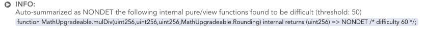

(timeouts-introduction)=
# Timeouts

In the following, we will give a basic classification of timeouts, explain some
candidate causes for timeouts, and show ways to sometimes prevent them. See
{ref}`timeouts-background` for a glimpse into some of the theoretical background
on verification timeouts.

(timeouts-classification)=
## Classification of Timeouts

For a first classification of timeouts in Certora Prover, we consider on where
in the Prover's pipeline they occur. The pipeline starts by compiling a CVL rule
and the linked EVM bytecode into an intermediate language (called {term}`TAC`).
This is followed by many static analyses and program transformations.
Afterwards, the TAC program is iteratively split into parts and translated into
logical formulas. The logical formulas are then sent to an {term}`SMT` solver.
For more details on how programs are split up see {ref}`control-flow-splitting`.
 For a more comprehensive overview of the Certora Prover, see the
{ref}`whitepaper-technical` section of the Certora Technology White Paper.

We classify Certora Prover timeouts as follows:
1.  timeouts that happen before SMT solvers are running 
2.  timeouts where the SMT queries in sum lead to a global timeout
3.  timeouts where a single SMT query could not be solved 

Types 1. and 2. are signified by a hard stop of the Prover. That means the
Prover ran into the timeout of the cloud job, which is set at 2 hours, and was
forcefully shut down from everything it was doing (it is possible to lower that
timeout using the {ref}`--global_timeout` flag). A message like "hard stop
reached" appears in the "Global problems" pane of the
[report](verification-report), and error symbols next to one or many rules.

```{figure} hard-stop-in-report.png
:name: hard stop in report
:align: center
:height: 130px
A hard stop message appearing under Global Problems
```


% TODO made CERT-3797 so we get a clear indication to the user, hopefully
% then, CVT should indicate via report-logs
%  - whether there was a hard stop
%  - whether SMT has started


Type 3. is signified by a soft stop. This means an SMT solver shut down due to
hitting the limit for a single SMT run (set via {ref}`--smt_timeout`). 

```{figure} rule-timeout-in-report.png
:name: rule timeout in report
:align: center
:height: 200px
A rule that timed out in the SMT solver
```

In the remainder, we will focus on the mitigation of SMT timeouts, i.e., types
2. and 3. Non-SMT Timeouts (Type 1.) should be reported to Certora. 

% TODO: we could suggest that the users try DELETE summaries for type 1, but 
%  first I think we'd need some feedback from the tool, what would be good to
%  delete (and also document DELETE summaries)

(timeout_causes)=
## Identifying timeout causes

As a first step towards resolving an SMT timeout, we need to diagnose its root
causes. In our experience, the following are some of the most common reasons for
SMT timeouts:

 - non-trivial amount of nonlinear arithmetic
 - very high path count
 - high Storage/Memory complexity

The term {term}`nonlinear arithmetic` refers to computations involving
multiplications or divisions of variables. These are notoriously hard for
solvers. The path count is the number of paths from initial location to final
location in the  rule's {term}`control flow graph`. In the worst case, this
leads to a very high number of sub-cases that the solver needs to consider.
Furthermore, a high number of updates to Storage or Memory can be challenging
for the solver, because it needs to reason about
[aliasing](https://en.wikipedia.org/wiki/Aliasing_(computing)) of Storage/Memory
locations.

This list is not exhaustive, but the majority of timeouts we have observed so
far can be traced back to one or more of these causes. While these are not the
only sources of complexity, they provide a good idea of the probable causes for
a given timeout. 


### Complexity feedback from Certora Prover

Certora Prover provides help with diagnosing timeouts. We present these features
in this section.

#### Difficulty statistics

Certora Prover provides statistics on the problem sizes it encounters. These
statistics are available in the {ref}`tac-reports` that are generated in case of
an SMT timeout. The statistics are structured according to the timeout reasons
given above.

%TODO: once stats are available in the html reports, mention it here

Currently, the Prover tracks the following statistics:
 - nonlinear operations count
 - path count
 - memory/storage complexity measures

For a very short summary we give one summarizing number for each of the
statistics, along with a LOW/MEDIUM/HIGH statement. 

%This occurs as an INFO
% message in the Global Problems pane of the Prover reports.

The meanings of the LOW/MEDIUM/HIGH classifications are as follows:
 - LOW: unlikely to be a reason for a timeout
 - MEDIUM: might be a reason for a timeout; the timeout might also be a result
   of the combined complexity with other measures
 - HIGH: likely to be a reason for a timeout, even if it is the only aspect of
   the verification problem that shows high complexity

% These categories map to intervals as follows (for the memory/storage complexity, 
% we are still collecting data).

%|    | LOW | MEDIUM | HIGH |
%|----|-----|--------|------|
%| Path count | 0 to 2<sup>20</sup> | 20<sup>20</sup> to 2<sup>80</sup> | > 2<sup>80</sup> |
%| Nonlinear operations | 0 to 10 | 10 to 30 | > 30 |
% TODO: memory/storage complexity, once we have a feeling for that

For more details on the individual statistics and how to make use of them, also
see the section on {ref}`dealing-with-complexity` below.

(timeout-tac-reports)=
#### Timeout TAC reports

For each verification item, there is a TAC graph linked in the verification
report. In case of a timeout this graph contains information on which parts of
the program were part of the actual timeout, and which were already solved
successfully. It also contains statistics on the above-described timeout causes.

% Find more documentation on TAC reports in general [here](tac-reports).

In the timeout case, the TAC reports contain some additional information that
should help with diagnosing the timeout.


#### Finding timeout causes through modularization

In addition to the other techniques described here, it can be insightful to
remove parts of the code in order to isolate the timeout reason. If timeouts are
eliminated through this, modular verification techniques can be employed in 
order to prove correctness of the parts separately.
These techniques are a relatively blunt instrument, but can be necessary in 
particular with large or complex code bases.

##### Sanity rules

One way of isolating the timeout cause is by running with a trivial
specification.  This way, the specification is ruled out as the source of
complexity. Thus, a timeout on such a rule hints towards some parts of the
program code being challenging for the solver, rather than the program code in
combination with another, less trivial, spec.

Sanity rules are such trivial specifications. For documentation on them, see
{ref}`sanity <built-in-sanity>` and {ref}`deep sanity <built-in-deep-sanity>`. 

(timeout-causes-library-contracts)=
##### Library contracts

Some systems are based on multiple library contracts which implement the
business logic. They also forward storage updates to a single external contract
holding the storage.

In these systems, it can be appropriate to verify each library independently.

If you encounter timeouts when trying to verify the main entry point contract to
the system, check the impact of the libraries on the verification by summarizing
all external library (delegate) calls as `NONDET`, using the option
`-summarizeExtLibraryCallsAsNonDetPreLinking` as follows:

```sh
certoraRun ... --prover_args '-summarizeExtLibraryCallsAsNonDetPreLinking true'
```

```{note}
This option is only applied for `delegatecall`s and _external_ library calls.
Internal calls are automatically inlined by the Solidity compiler and are 
subject to summarizations specified in the spec file's `methods` block.
```

(timeout-prevention)=
## Timeout prevention

Timeout prevention approaches fall into these categories.
1. changing tool settings
2. changing specs
3. changing source code

Changing tool settings is least invasive and easy to do, thus it is usually
preferable to the other options. However, there are cases when parts of the
input code that are very hard to reason about need to be worked around.
Sometimes a combination of approaches is needed to resolve a timeout.


In the following we will discuss some concrete approaches to timeout prevention.
This collection will be extended over time based on user's experiences and tool
improvements.

```{note}
The old documentation has a section on
{doc}`troubleshooting </docs/confluence/perplexed>` that addresses timeouts, 
which might complement the information given here.  
There is also some helpful information in the section on
{ref}`summarization <old-summary-example>`.
Some of the information in these references is out of date.
```

(timeout-single-rule)=
### Running rules individually

The Certora Prover works on the rules of the specification in parallel.
Even if no rule is very expensive on its own, working on all of them in parallel
can add up quickly and thereby exceed the timeout.
Try running individual rules only via the {ref}`--rule` option, or split the
specification into separate files. Keep in mind that a {term}`parametric rule`,
as well as an {term}`invariant`, spawns a sub-rule for every contract method.
This can further be reduced via the {ref}`--method` option.


(detect-candidates-for-summarization)=
### Detect candidates for summarization

In a large codebase it can be hard to find all the functions that may be difficult for the Prover.
A traditional approach would be to run a simple parametric rule to explore all functions in the 
relevant contracts, and studying resulting potential timeouts. 
However such an approach prolongs the feedback loop of working with the Prover.

As an alternative approach, the Prover supports an {term}`overapproximating <overapproximation>` _auto-summarization_ mode.
It is based on the idea that internal `view` or `pure` functions (in Solidity) that are analyzed
and found to be heuristically difficult for the Prover can be automatically summarized as `NONDET`, 
resulting in two positive outcomes:
1. The run is faster since complex code is summarized early in the Prover's pipeline.
2. The Prover emits the list of _new_ summaries (i.e., for functions that were not summarized already in the given specification) 
it auto-generated, so that the user can then adapt the list
and make the user-specified summaries more precise, or remove them altogether if the user wishes so.

The Prover will not auto-summarize methods that were already summarized by the user.

To enable this mode, add {ref}`--nondet_difficult_funcs` to the `certoraRun` command.
The minimal difficulty threshold used for the auto-summarization
can be adjusted using {ref}`--nondet_minimal_difficulty`.

#### Example usage

Many DeFi protocols use the `openzeppelin` math libraries.
One such library is `MathUpgradeable`, providing a `mulDiv` functionality:
`function mulDiv(uint256 x, uint256 y, uint256 denominator) internal pure returns (uint256 result)`.
The implementation is known to be difficult for the Prover due to 
applying numerous multiplication, division and `mulmod` operations, 
and thus is often summarized.

However, it is sometimes easy to miss the library also contains a more generalized version
of `mulDiv` that supports either rounding-up or rounding down:
`function mulDiv(uint256 x, uint256 y, uint256 denominator, Rounding rounding) internal pure returns (uint256)`.
Sometimes it can be beneficial to summarize the generalized function as well. 
The auto-summarization will highlight the generalized function in its output:

The contents can be copy-pasted into the `methods` block directly for future runs.

The "Contracts Call Resolutions" tab and the "Rule Call Resolution" bar also show
the instrumented auto-summaries, and distinguishes between them and user-defined summaries.

(dealing-with-complexity)=
### Dealing with different kinds of complexity

% screenshots in this subsection are taken from this run:
% https://vaas-stg.certora.com/output/80942/9101c7e51a27456eb51bd9d088949c92?anonymousKey=25cca030b7594b795d994e937b5a027812d9406d
% and from the (usual) delvtech/element example

In this section we list some hints for timeout prevention based on which of the
statistics (path count, number of nonlinear operations, memory/storage 
complexity) is showing high severity on a given rule.

```{note}
The techniques described further down under [modular verification](modular-verification) 
are worth considering no matter which statistic is showing high severity.
```

(high-path-count)=
#### Dealing with a high path count

The number of control flow paths is a major indication of how difficult a rule
is to solve. Intuitively, in order to obtain a correctness proof for the rule, 
an argument for the correctness of each of its paths has to be found.

The Certora Prover indicates the path count in the Live Statistics panel. 
The path count is given once for the whole rule and, separately on a per-call 
basis.
The per-call path count always includes the paths of all deeper calls (the 
same holds for the count of nonlinear operations of the call).

```{figure} path-count-stats.png
:name: path-count-stats
Global and per-call path counts are displayed in the Live Statistics panel for 
each rule.
```

##### Path explosion

The number of paths that are given in the path count statistic might seem very high 
to users. The essential reason for these high number is known as the 
[path explosion problem](https://en.wikipedia.org/wiki/Path_explosion): The path count
is usually exponential in the number of nodes and edges in the control flow graph.

For some intuition on how this happens, see the following illustration. Whenever there 
is a sequence of subgraphs that branch and then join again, the simplest variant of this
being the diamond shapes in the picture, the path count of the whole graph is the product 
of these subgraph's path counts. Thus it is typical for the path count of a control flow
graph to grow exponentially in its number of nodes (or edges).

```{figure} path-diamonds.png
:name: path diamonds
:height: 400px
Illustration of path explosion through a sequence of *n* "diamond" shapes in the control 
flow graph. The shown control flow graph has 2<sup>n</sup> paths.
```

The path count statistic for a given rule is based on the control flow graph of
the rule with all calls (and their calls and so forth) inlined. For example, if
some method with 5 paths is called 10 times within the rule, its control flow
graph will appear 10 times as a subgraph of the rule's control flow graph. If,
for instance all these calls were made in sequence, and there was no further
branching in the rule, the path count would be 5<sup>10</sup>. 

A particular potential cause for path explosion are {ref}`dispatcher`. How much a 
`DISPATCHER` summary contributes to the path count depends on three factors:
 - how many potential call targets there are (how many known implementations)
 - how often the summarized function is called
 - whether the function is called in sequence or in parallel in the control flow 
   (generally control flow branchings in sequence lead to an exponential path explosion)

##### Mitigation approaches

In order to reduce the path count of a rule, the usual modularization techniques,
like method summarization, can be applied. (See also the section 
{ref}`modular-verification` below.)

As pointed out in the previous sub-section, `DISPATCHER` summaries can lead to a path 
explosion, so replacing them for instance with `AUTO` summaries can have a significant 
impact. (See also {ref}`auto-summary`.)

Furthermore, it can help to change the parameters of the *control flow
splitting* feature of the Certora Prover. Control flow splitting is a natural
area to consider when the path count of a rule is high. When applying this
technique, the Certora Prover internally divides each verification condition
into smaller subproblems and attempts to solve them separately. For a more
detailed explanation, see {ref}`control-flow-splitting`.

We list a few option combinations that can help in various settings. There is a
tradeoff between spending time in different places: The Prover can either try to
spend much time at a low splitting level in the hope that no further splitting
will be needed, or it can split quickly in the hope that the subproblems will be
much easier to solve. 

The options on control flow splitting are described in more detail in the
[corresponding section of the CLI
documentation](control-flow-splitting-options). In the following, we list some
brief examples how they can be used to avoid timeouts in certain scenarios.

When the relevant source code is very large, the shallow splits have a chance of
being too large for the solvers, thus eager splitting might help:

```sh
certoraRun ... --prover_args '-smt_initialSplitDepth 5 -depth 15'
```

When there are very many subproblems that are of medium difficulty there is a
chance that the Prover has to split too often (not being able to "close" any
sub-splits). In that case, a lazier splitting strategy could help. We achieve lazier
splitting by giving the solver more time to find a solution before we split a
problem.

```sh
certoraRun ... --prover_args '-mediumTimeout 30 -depth 5'
```

It can also help to have splitting run in parallel (the splits are solved
sequentially by default).

```sh
certoraRun ... --prover_args '-splitParallel true'
```

If the expectation is that the rule is violated (or not violated in case of a
`satisfy`-style rule), the {ref}`-dontStopAtFirstSplitTimeout` option can prove
useful.

```sh
certoraRun ... --prover_args '-dontStopAtFirstSplitTimeout true -depth 15 -mediumTimeout 5' --smt_timeout 10
```

(high-nonlinear-op-count)=
#### Dealing with nonlinear arithmetic

Nonlinear integer arithmetic is often the hardest part of the formulas that the
Certora Prover is solving. 

The Certora Prover displays the absolute number of nonlinear operations, as well
as their number per external call, in the Live Statistics panel. In the per-call
display, there is a warning-sign next to the call when there is a non-trivial
number of nonlinear operations in the call or its sub-call. Currently,
everything above and including two nonlinear operations is marked in this way.

```{figure} nonlinear-ops-field.png
:name: nonlinear ops field
Field in the Live Statistics panel indicating the number of nonlinear operations 
in the selected rule
```

```{note}
Counting the number of nonlinear operations is a rather coarse
statistic. There are formulas with 10 nonlinear operations that are out of reach
of current SMT solvers, while in other cases formulas with 120 operations are
solved. Nevertheless, reducing the number of nonlinear operations has often
proven a successful measure in timeout prevention even if some remained.
```

The main techniques in reducing these numbers are modularization and
underapproximation. 

Modularization, typically by introducing method summaries, can help reduce the
size of the rule, thus reducing the nonlinear operations. The per-call
statistics in the Live Statistics panel (picture below) can help with
identifying nonlinearity hot spots. Summarizing these hot spots in particular
can help reduce the number of nonlinear operations, especially when a method is 
called multiple times.

```{figure} nonlinear-ops-call.png
:name: nonlinear-ops-call
Entry in Live Statistics indicating how many nonlinear operations are made in a given 
call, including its sub-calls
```

In some rules it is feasible to only consider an underapproximation of the
actual behavior by fixing some value that is used very often in nonlinear
computations to a concrete value. A typical example would be the decimal digits
in fixed decimal arithmetic -- having this unconstrained can increase
nonlinearity in the rule massively, although only a small range of values is
actually feasible. Of course, great care has to be taken in choosing these
underapproximations, since they lead to missed bugs otherwise.

A weaker form of underapproximation would be to introduce an extra requirement
on the range of some variable that contributes to nonlinearity. For example for
the number of decimals in a fixed decimal computation only values between 0 and
256 make sense, and in practice values from an even smaller range are likely to
be used. This measure will not change the values in the Live Statistics panel, 
but it has prevented timeouts in some cases nonetheless.

(high-memory-complexity)=
#### Dealing with high memory (or storage) complexity

The memory complexity of each rule or parametric rule is displayed in the Live
Statistics panel in the Certora Prover reports. 

% if we would want to slim it down to graph size only, we could write this:
% Memory complexity is measured by
% the *number of updates* statistic. This statistic indicates how often an update
% to memory is performed anywhere in the rule. Note that any form of memory, i.e.
%  EVM memory, EVM storage, ghost variables, or ghost functions, is counted here.
% This number gives rough estimate of how much work the SMT solvers have to do to
% reason about (non-)aliasing of memory references.

The Certora Prover performs a decompilation of bytecode in a way that all EVM
primitives can ultimately be modeled as SMT constructs. This process introduces
key-to-value mappings for EVM memory and EVM storage. Additionally the CVL
specification may introduce ghost mappings. The Prover runs static analyses to
reduce the load on these mappings by splitting them into smaller pieces,
(smaller mappings or scalar variables), but this is not always possible and some
mappings usually remain in the final SMT formula.

Under this model, the "#total updates" is a measure of how many times we store
into a key-value mapping such as memory, storage, or a ghost function. The
"longest update sequence" statistic represents the length the longest sequence
of updates (i.e. store operations) performed on one of the mappings. In both
cases, a smaller number indicates a less difficult problem for the Prover to
solve.

% :align: center
```{figure} memory-complexity-field.png
:name: memory complexity field
:height: 90px
Entry in the Live Statistics panel indicating memory complexity
```

In the following we consider common culprits for high memory complexity.

##### Passing complex structs

One common reason for high memory complexity are complex data structures that
are passed from the specification to the program, or also inside the program.
`struct` types that contain many dynamically-sized arrays are especially
problematic. 

% TODO: which calls exactly? external calls? all of them?

```cvl
rule myRule() {
    MyStruct x;
    foo(x);

}
```

```solidity
struct MyStruct {
    // several dynamically-sized arrays
    bytes b;
    string s;
    uint[] u1;
    uint8[] u2;
}

function foo(MyStruct x) public {
    ...
}
```

In this case, it can help to identify fields of the struct that are not relevant
for the property of the program that is currently being reasoned about and
comment out those fields. In our experience these fields exist relatively often
especially in large structs. Naturally, the removal might be complicated by the
fact that all usages of these fields also need some munging steps applied to
them.

##### Memory and storage in inline assembly

The Certora Prover employs [static analyses and
simplifications](storage-and-memory-analysis) in order to make the reasoning
about Storage and Memory easier for the SMT solvers. These static analyses are
sometimes thrown off by unusual code patterns (most often produced when using
inline assembly), which can make the SMT formulas too hard to solve. 

CVT reports these failures of Storage or Memory analysis in the Global Problems
pane of the reports, along with pointers to the offending source code positions
 (typically inline assembly containing `sstore`/`sload`/`mstore`/`mload`
 operations). To resolve such failures, the relevant code parts need to be
summarized or munged. (Naturally, the Certora developers are working make such
failures less frequent as well.)


(modular-verification)=
### Modular verification

Often it is useful to break a complex problem into simpler subproblems; this
process is called modularization. You can modularize a verification problem by
first proving a property about a complex piece of code (such as a library or a
method) and then using that property to summarize the complex code.  In the
following we elaborate on modularization techniques that can help with timeout
prevention.


(library_timeouts)=
#### Library-based systems

As mentioned here [before](timeout-causes-library-contracts), systems with
libraries are a natural candidate for modularization.

Alternatively to using the `-summarizeExtLibraryCallsAsNonDetPreLinking true`
option mentioned before, one can summarize all the methods of a single library
using a {ref}`catch-all summary <catch-all-entries>`.  For example, to use a
`NONDET` summary for all functions of `MyBigLibrary`, one could add the
following:

```
methods {
    function MyBigLibrary._ external => NONDET;
    function MyBigLibrary._ internal => NONDET;
}
```

The above snippet has the effect of summarizing as `NONDET` all external calls
to the library and _internal_ ones as well. Only `NONDET` and `HAVOC` summaries
can be applied. 
For more information on method summaries, see {ref}`summaries`.


(timeout-cli-options)=
### Command line options

There are a number of command line options that influence specific parts of the
Prover's pipeline. While their default values generally yield the best results,
changing them is known to improve running time in certain cases.


#### `--prover_args '-calltraceFreeOpt true'`

This option allows for some rather aggressive simplifications. However, it
possibly breaks call trace generation.
