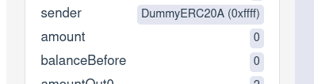

(producing-examples)=
Producing Positive Examples
===========================

Sometimes it is useful to produce examples of an expected behavior instead of
counterexamples that demonstrate unexpected behavior.  You can do this by
writing a rule that uses {ref}`satisfy` instead of the `assert` command.  For
each `satisfy` command in a rule, the Prover will produce an example that makes
the condition true, or report an error.

The purpose of the `satisfy` statement is to produce examples that demonstrate
some execution of the code.  Not every example is interesting &mdash; users
should inspect the example to ensure that it demonstrates the expected
behavior.

For {clink}`example </DEFI/ConstantProductPool/certora/spec/ConstantProductPool.spec>`,
we may be interested in showing that it is
possible for someone to deposit some assets into a pool and then immediately
withdraw them.  The following rule demonstrates this scenario:

```{cvlinclude} /Examples/DEFI/ConstantProductPool/certora/spec/ConstantProductPool.spec
:cvlobject: possibleToFullyWithdraw
:caption: Positive example
```

Although the Prover produces an example ([report][zero-amount]) that satisfies
this rule, the example is rather uninteresting because the amount that is
minted and withdrawn is 0:


[zero-amount]: https://prover.certora.com/output/6554/9159f9b128d04d3b9ad5591cc6bbb69d?anonymousKey=182b460d9c654c4580eced3b6d86beed4b324e32

Of course minting and withdrawing 0 tokens leaves the sender's balance
unchanged!  We can add a `require` statement to force the Prover to consider a
more interesting case:

```cvl
/// Demonstrate that one can fully withdraw deposited assets
rule infeasiblePossibleToFullyWithdraw(address sender, uint256 amount) {
    // force `amount` to be nonzero
    require amount > 0;

    // remainder of the rule is the same...
}
```


% ```{todo}
% This next paragraph could be clearer, and a demonstrative screenshot would help.
% ```

Again the Prover produces an example ([report][infeasible-example]), but again
it is an uninteresting one: the underlying token is minted for 999 LP tokens,
which should be impossible.  The problem is that the Prover is able to start the
rule in an infeasible state.

[infeasible-example]: https://prover.certora.com/output/6554/b131d9f56d72480586e125d987d45caa?anonymousKey=015c6d3510daaeaa6448eca27c22effba365f7e1

We can remedy this by adding some additional setup assumptions (see the [full
spec][constant-product-spec] for details of the `setup` function):

```cvl
/// Demonstrate that one can fully withdraw deposited assets
rule possibleToFullyWithdraw(address sender, uint256 amount) {
    // beginning of the rule is the same

    setup(envMint);

    // remainder of the rule is the same...
}
```

With this additional requirement, the Prover produces a [satisfactory example][good-example].

[good-example]: https://prover.certora.com/output/6554/883ad682094f4b0da4e0e8bb976a17c5?anonymousKey=061c652dbfdf3693b52ade29d0cc78c5e9ed9ebc


