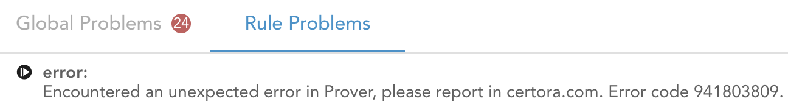

Troubleshooting
===============

The Certora Prover is a powerful tool, and by nature of powerful tools,
it is also easy to use it incorrectly.
While Certora keeps improving the usability of the tool and the clarity of 
error messages, we keep additionally a reference guide for errors, 
as a practical tool for working with the tool on more challenging use cases.

This guide's goal is to help you understand some errors or issues you may see while working with the tool,
and how to correctly interpret those.
Most importantly, it will give you practical tips to investigate and overcome the issues on your own.

## Certora Prover Error

Indicates that the Prover process completed unsuccessfully.
Usually, it means that it did not complete solving all of the given rules.
You may still find partial results available to study.
The rules that could not complete will have an exclamation mark (`!`) icon sign 
on a red circle background: 


Clicking on the icon will open the "Rule Problems" bottom-pane tab, showing the concrete list of errors:


The error may or may not have a message detailing the nature of the error and potential action items.
In this example, the key to understand more about the error is the string `Error code 941803809`.
This error code number can be searched for in the logs file to see more details.
The logs button can be found in the "Job Info" left-pane tab:


While these errors can sometimes be very specific and require more support from Certora, but there are other cases where the root cause can be found easily.

```{note}
Error codes may not stay the same between different versions of Prover.
```

In our example, error code `941803809` yields this line:
`Error code of java.lang.NoClassDefFoundError: smtlibutils/cmdprocessor/SmtFormulaCheckerResult$Single$Other: ExceptionDetailsForErrorCode(exceptionName=java.lang.NoClassDefFoundError, context=smtlibutils.cmdprocessor.SmtFormulaCheckerResult$Companion.Interrupted(SmtFormulaCheckerResult.kt:478)): 941803809`

In the next section, we will detail the error messages.

### Error messages in logs file, and what to do

#### `java.lang.NoClassDefFoundError: smtlibutils/...`
Java classloader errors related to SMT are actually cascaded errors of the machine 
running out of physical memory.
Once this is understood as the root cause of the issue, attempt to fix it is usually straightforward:
1. If you run on multiple rules, pick just one rule at a time for every job
2. If you run on a single rule but it is an invariant or a parametric rule, pick just a single method at a time for every job
3. If you run single rule and single method, you may have enabled advanced flags that increase parallelism of Prover, especially options that allow running more solvers concurrently. Try to disable those. Example flag that increases parallelism: `-splitParallel`.
4. You may want to instruct the Prover to run just one solver. E.g. give `--prover_args '-s z3'` to run only using `z3` SMT solver. Other options are `yices` and `cvc5`.

```{todo}
This document is incomplete.  See the [old documentation](../confluence/perplexed.md).
```

## Global Problems
The "Global Problems" tab will show any issue the tool had with either processing the contracts or with the run as a whole. 
Importantly, the first phases of the Prover's pipeline are focused on pre-analysis of the contracts before the CVL rules and invariants are compiled. These phases are colloquialy referred to as the "preprocessing step".
If the Prover encounters errors during the preprocessing step they will be shown under the Global Problems tab.
While usually these errors are not fatal (i.e., the Prover can continue to try and solve the rules),
they can have negative impact on running time or on precision.
For example:
1. A failure to analyze the EVM's memory access patterns may make it impossible to infer that a contract A must be calling a contract B. The Prover will assume A can call _any_ contract instead.
2. The same kind of error may also impede more advanced optimization of final formula sent to the SMT solvers, leading to timeouts.
3. A failure to analyze the EVM's storage layout and to compare it to the storage layout as reported by `solc` may make CVL hooks non-compilable, thus rules that depend on those hooks will fail to solve.

If an analysis failure occurs in a portion of the bytecode that has associated source-maps (see the [official Solidity documentation](https://docs.soliditylang.org/en/develop/internals/source_mappings.html)), the Global Problems tab will show alongside the error also the relevant source snippet, including the file path and line number, associated with the code that caused the failure.
For example, one could infer that some piece of inline-assembly referred to by the source map is indeed not memory-safe, explaining why the code analysis failed.
In such cases, either:
1. The memory unsafety is indeed problematic and needs to be fixed.
2. The function containing the inline assembly code can be summarized so that the analysis does not have to consume the problematic code.

If an analysis failure occurs in a portion that does _not_ have an associated source map, we can only guess where approximately the error is. The error description will tell which contract, and which analyzed method contained the problematic code.