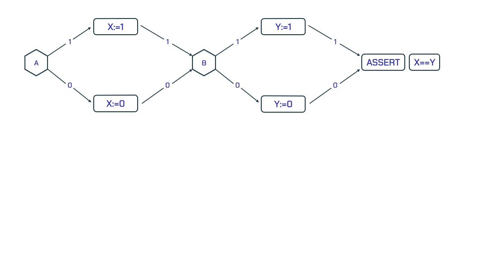
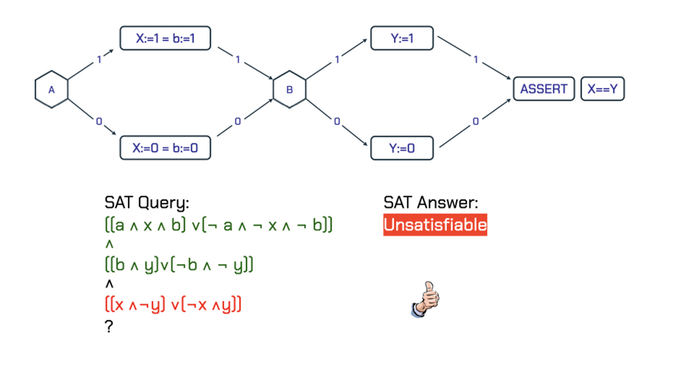
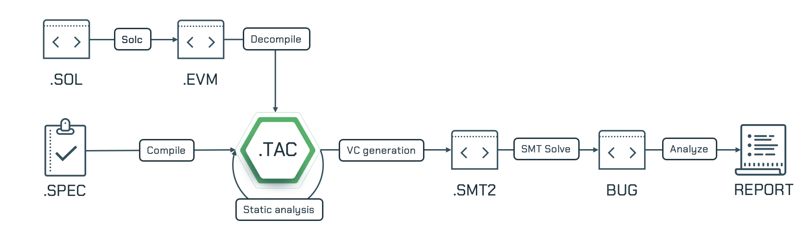

(white-paper)=
# Certora Technology White Paper

June 29, 2022

Certora is a leading provider of technology and services for eliminating vulnerabilities in smart contracts. This white paper outlines the technology that makes Certora unique, explaining both its power and its current limitations. 

We assume readers are familiar with the basic ideas of smart contracts. More details of the examples mentioned in this document can be found in the [demo](https://demo.certora.com/) area of our website.

## Certora Tool Suite

Certora offers a suite of tools for auditing smart contracts, including both the detection of vulnerabilities and the generation of assurances that essential properties always hold.

The core of the tool suite is the Certora Prover, a verification tool that takes a low-level [EVM bytecode program](https://ethereum.github.io/yellowpaper/paper.pdf) and a specification written in [CVL (Certora Verification Language)](/docs/cvl/index.md).[^1] The Prover analyzes the code and the spec together to identify scenarios where the code deviates from the specification.

The technology automatically locates critical vulnerabilities that even the best auditor may miss and increases confidence in code security by proving that certain key properties are satisfied.

At a high level, the Certora Prover is essentially a sophisticated compiler, translating the smart contract bytecode and the specified properties into a mathematical formula that concisely defines the exact conditions under which the program may violate the expected behavior specified in the properties. This formula is fed into state-of-the-art open source solvers that examine the infinite space of possible executions and find any violating scenarios, which are then translated back by the compiler into the domain of the smart contract.

Additionally, Certora also has tools for analyzing the complexity of contracts, specification checking using mutations and vacuity detection, and a fuzzer for light-weight verification.

<!--- Other tools include... -->

## Verification vs. Auditing

Since a vulnerability in a smart contract can expose the creator of the contract and its users to huge losses, contract developers are eager to eliminate vulnerabilities _before_ their contracts are deployed. Many security companies provide services based on manual auditing, either performing the auditing with their own experts or outsourcing it through a vulnerability bounty program. 

Manual audits, while essential, have serious limitations. Certora's tool suite complements them in many ways:

(1) **Automatic Rechecking**. Every time the code changes, a new audit is needed which requires hiring the same team of external auditors. Scheduling recurring audits ahead of time at a predetermined cadence can be a significant operational challenge; different versions of the same project may therefore end up with different auditors because of which the historical context of project codebase / concerns is lost. In contrast, Certora's approach lets developers specify critical properties early in the development process which can then be automatically rechecked whenever the code changes --- _Specify Once, Verify Often!_

(2) **Collaborative Codification**. Auditing is usually performed by external security personnel who have extensive general experience but may lack a deep prior understanding of the specific contract at hand. Certora's property-based approach lets developers and auditors work *together* to formulate properties that codify security-relevant aspects of the contract, allowing more application-specific and deeper logical flaws to be detected.

(3) **Stronger Guarantees**. Any small mistake or oversight from an auditor can cause a critical vulnerability to be missed. The Certora tool suite has found major vulnerabilities even after extensive auditing. This is not surprising because errors are practically inevitable in manual audits. A user of the Certora tool on the other hand, focuses all their attention on specifying the properties themselves. Since the checking of the properties is fully automated, a successful check guarantees *mathematically* that the property holds: the Prover, unlike a human auditor, never makes reasoning errors. A failed check helps the developer by pinpoint a failing scenario.

(4) **Ready Availability**. The best auditors are typically booked 18 months in advance. Due to the steep learning curve, lack of structured onboarding resources/initiatives, and high expectations from  auditors, Ethereum may continue to endure a significant shortage of code security professionals in the foreseeable future. Because Certora’s approach leverages automatic verification techniques to reduce the amount of repetitive effort needed, its services are more readily available to developers/experts who can specify properties on their code.

(5) **Shift Left**. The Secure Software Development Lifecycle in Web3 has unfortunately been reduced to a 3-step “Build-Audit(s)-Launch” linear timeline where there are enormous and unrealistic expectations from the audit phase(s) which is unsustainable. Specifying and checking of security properties by developers/experts using Certora's tools will catalyze a “Shift Left” effort where security will be better addressed and significantly improved at earlier stages of the application lifecycle.

Preliminary experience suggests that auditing and formal verification work well together. Manual audits can help specify or identify missing rules in formal verification while formal verification can identify corner cases missed by manual audits,  especially when code is continuously modified over time.

<!-- Preliminary experience suggests that auditing and formal verification work well together. Manual audits can identify missing rules in formal verification and formal verification can identify corner cases missed by manual audits and specifically when code is changed. -->
<!-- _What to call it? Formal verification? Exhaustive defect analysis?_ -->

<!-- Vs auditing, monitoring, testing... -->

<!-- > [Not sure what this last para adds]Because Certora's approach is systematic and automated, it can detect critical bugs that even the best auditor might miss, and can provide solid confidence in the security of a smart contract by proving mathematically that certain properties always hold. -->

## Verification vs. Testing

Like any software, smart contracts need to be tested. But testing may not be sufficient for exposing security flaws due to a few limitations.

(1) **Path Explosion**. Every if-statement in a function potentially doubles the number of paths that an execution can take. So paths typically grow exponentially with the size of the code. Testing is rarely able to cover even a high proportion of paths, let alone all of them, so some paths are omitted, leaving dangerous gaps in analysis. Tools based on verification, such as the Certora Prover, consider *every* path.

(2) **State Explosion**. The number of states of a contract likewise grows exponentially with the number of state components. A tester will usually try and pick some representative states to test, along with some outliers and some that are suspected to be tricky cases. But these will only cover a tiny proportion of the states that can arise in practice. Tools based on verification, such as the Certora Prover, consider *every* state.

(3) **Test Suite Cost**. A comprehensive test suite is very tedious and difficult to write, maintain, and comprehend. Expected properties, which are the basis of Certora's technology, are usually much more compact because a single property generalizes over a large number of test cases.


## Experience to Date

Certora has analyzed hundreds of smart contracts for a variety of clients, finding serious vulnerabilities, which, if undetected, might have led to major losses. Below is a small select set of interesting vulnerabilities that the Certora Prover has detected:
- _Transfer-related_. When the sender's address is the same as the receiver's (`to`), a contract might allow a transaction in which the sender transfers assets to their own account. Contrary to what one might expect, a typical transfer code will produce the wrong results in this case, allowing the sender to create assets out of thin air:
```
function transfer(address to, uint amount) public {
    uint srcBalance = balances[msg.sender];
    uint dstBalance = balances[to];
    balances[msg.sender] = srcBalance - amount;
    balances[to] = dstBalance + amount;
}
```


- _Solvency-related_. A common class of vulnerabilities that the Certora Prover has successfully detected in multiple contracts is when a user receives assets for free without paying any money in return. We have found this problem in some ERC20 contracts. The KashiPair case study described in the following section is an example of this vulnerability.


- _Staking-related_. Systems based on proof-of-stake distribute rewards based on time periods. They calculate the current rewards to be sent out using the value of elapsed time: `block.timestamp - lastTimestamp`. But if `lastTimestamp `is not initialized to `block.timestamp` when creating the contract or when starting to distribute rewards, this measure of time will be equal to `block.timestamp - 0`, which is a huge number, and the amount of rewards to be distributed will be a lot more than expected.


- _Edge case-related_. CVL's expressivity is particularly well suited for writing properties about mathematical formulae appearing in smart contracts. An example of this is the famous Maker DAO case study described in the following section. Relatedly, the Certora Prover has also found vulnerabilities due to overflow / underflow in computations.

### Case Studies
To give a sense of Certora's impact in practice, this section presents three case studies that demonstrate how the Certora Prover was able to find Vulnerabilities in real and complex smart contracts.

#### Constant Product Pool
[Trident](https://medium.com/sushiswap-org/introducing-the-sushi-next-generation-amm-trident-7dea6aa3cbc2) is SushiSwap’s platform for launching and running liquidity pools and managing their interactions with users; it is expected to handle billions of dollars worth of SUSHI tokens. The Certora Prover found a pool-draining exploit in the Trident protocol which was subsequently fixed by SushiSwap.

The exploit concerns the automated market maker contract for Constant Product Pools (CPPs). In a CPP, Liquidity Providers (LPs) deposit two types of underlying tokens (`Token0` and `Token1`) in exchange for LP tokens. They can later "burn" (or exchange) LP tokens to reclaim a proportional amount of `Token0` and `Token1`. Trident users can swap one underlying token for the other by transferring some tokens of one type to the pool and receiving some number of the other token. To determine the exchange rate, the pool returns enough tokens to ensure that

```{math}
(reserves_0 ⋅ reserves_1)^{pre} = (reserves_0 ⋅ reserves_1)^{post}
```

where {math}`reserves_0` and {math}`reserves_1` are the reserves for `Token0` and `Token1` respectively.

The ability to burn LP tokens into underlying tokens suggests an important invariant: if there are any LP tokens (the `totalSupply > 0`), then neither {math}`reserves_0` nor {math}`reserves_1` should ever become zero (otherwise the pool could not produce the underlying tokens). More formally, the CVL property we wrote was:

`(totalSupply = 0 <=> reserves0 = 0) && (totalSupply = 0 <=> reserves1 = 0)`

We ran the Certora Prover on the Trident Protocol to verify this invariant and found that an operation called **burn-single**  violates it. The burn-single operation combines a _burn_ and a _swap_: it first burns LP tokens to produce both kinds of underlying tokens, then swaps one type for the other (producing only a single kind of underlying token). Even though the `swap()` and `burn()` operations maintain the invariant, the combined operation had a flaw that allowed a malicious user to drain the pool. More details on this can be found in our [blog post](https://medium.com/certora/exploiting-an-invariant-break-how-we-found-a-pool-draining-bug-in-sushiswaps-trident-585bd98a4d4f).

#### Kashi Pair

We used the Certora Prover to verify the [KashiPair](https://github.com/sushiswap/kashi-lending) contract, which allows users to deposit assets as _collateral_ and to _borrow_ other assets against them with flexible oracles and interest rates based on the utilization of the system. The Certora Prover found multiple vulnerabilities in KashiPair. Here we discuss one of the properties that KashiPair violated, called the _antimotonicity of liquidation_. Consider the `liquidate` method shown below. It is called as part of the `batchCalls` method, which invokes multiple transactions.

```

/* 
* Liquidation of a user that is in insolvent state.
*  user - address to liquidate
*  to   - address to receive collateral
*/ 
function liquidate(address user, address to) public {
  require(!_isSolvent(user), "user is solvent");

  uint256 borrow = userBorrowAmount[user];
  uint256 collateral = userCollateralAmount[user];

  userBorrowAmount[user] = 0;
  userCollateralAmount[user] = 0;

  // msg.sender gives borrowToken to the system and `this` contract
  // sends collateralToken to 'to'
  borrowToken.transferFrom(msg.sender, address(this), borrow);
  collateralToken.transfer(to, collateral); 
}


/*
* Allows calling a few functions in a batch mode
* and interact with other contracts.
*/
function batchCalls(address[] calldata callee, bytes[] calldata datas) external {
  ...
  callee[i].call(datas[i]);
}
```

One important properties of `liquidate` is that `borrow` and `collateral` must be inversely proportional, i.e.,
```
// before calling liquidate
{b = borrowToken.balanceOf(system) /\ c = collateralToken.balanaceOf(system)}

liquidate(x, y)

// after calling liquidate
{borrowToken.balanceOf(system) > b <=> collateralToken.balanaceOf(system) < c}
```
This property was written in CVL (see later sections in "Rules" for more details on how to write these properties) by the Certora team together with the SushiSwap team, and a violation was found. It turns out that in this version of `liquidate`, it is possible to use  `batchCalls` to invoke a call to `liquidate` where `msg.sender` is set to the current contract's address which allows the system to transfer the collateral to the current contract without the latter paying any amount in return. This vulnerability was later fixed by the SushiSwap team by adding an additional requirement at the top of the `liquidate` method that does not allow `msg.sender` to be the same as the current contract's address.

```
require(msg.sender != address(this));
```

More details can be found in our [verification report][kashi-report].

[kashi-report]: http://www.certora.com/wp-content/uploads/2022/02/KashiLendingMar2021.pdf

#### Maker DAO
[The Maker protocol](https://makerdao.com/en/) consists of the smart contracts that create and sustain the DAI stablecoin.  DAI is backed by _debt_. Debt is either assigned to a _Vault_, meaning it is associated with a lien against some collateral asset, or it is “unbacked”, meaning it is the protocol’s (i.e., MKR holders’) responsibility. These two sources of debt, when added, should equal the sum of all DAI balances. This crucial invariant is called the “Fundamental Equation of DAI” (FEoD):
```
dai == vice + sumOfVaultDebt
```
where `dai` is the sum over all DAI balances and `vice` is the total unbacked debt. The FEoD is the most famous Multi-Collateral DAI “invariant”, known since at least 2018, and until recently it was believed to be mathematically provable. The Maker team together with Certora wrote down this invariant in CVL and used the Certora Prover to prove it.

Surprisingly, the Prover found a violation of this invariant and generated a concrete counterexample showing that the property did not hold after the execution of the so-called `init()` function. Crucially, the counterexample showed that the property was true in the "prestate" (before `init()` was invoked) but it was no longer true in the "post-state" (after `init()`'s execution). Such a counterexample is known as a counterexample to induction, i.e., it shows a scenario in which the system transitioned from a state where the property was true to a state where it is not true (see {ref}`later sections <whitepaper-technical>` for more details on invariants). It is possible that the counterexample is not a "true" counterexample, i.e., the starting state of the "bad" transition may not actually be reachable. This happens if the invariant's definition failed to account for some system property. This was however not the case here. The Maker team in fact identified a [sequence of function invocations](https://github.com/makerdao/xdomain-dss/issues/2) that could lead to this violation in practice.

The next deployment of the protocol will have a fix to ensure that the invariant is satisfied. More details including the CVL features used in writing the specification can be found in a recent [blog post](https://hackmd.io/Vd4zcN_VTNSzqvaxYbdEdA?view).


## Key Features

<!-- _What features are included in the tool suite? Verification against specs? Generating counterexample scenarios? Vacuity checking of specifications? Interactive support? Equivalence checking?_ -->

**1. Fully Automated Verification**
The Certora Prover offers push-button verification. The user writes the specification and invokes the Certora Prover with the smart contract to be verified and the specification as arguments. From there on, the user is not required to intervene in the verification process. Ultimately, the Certora Prover produces a user-friendly report listing both properties that were satisfied and those that were not.

**2. Generation of Counterexample Scenarios**
Merely knowing that a property was not satisfied by the smart contract is not sufficient for a user to understand where the contract might have vulnerabilities. Therefore, the Certora Prover makes it easier to interpret the verification result by presenting the user with a counterexample. The counterexample represents a concrete state of the smart contract which helps the user narrow down the root cause of the specification violation.


**3. Rich Specification Language**
Unlike traditional unit tests, which describe the output for a particular input, the Certora Prover considers the _entire_ (potentially infinite) space of possible inputs. Instead of writing a large number of test cases, one writes a more compact and general specification in CVL. CVL supports invariants, parametric functions, uninterpreted functions, "ghost" functions that can model contract states not explicitly present in the contract, and relational properties. This allows reasoning about infinite behaviors, and also allows equivalence checking between programs (for example that a code refactoring doesn't introduce new behaviors).

**4. Powerful Interactive Support**
Since formal verification is an undecidable problem, there will always be properties that cannot be verified automatically for some programs.  The Certora Prover provides a rich set of features for approximating difficult-to-verify code, giving users fine-grained tools for trading soundness for completeness. These include: (1) bounding the number of executed loop iterations or providing checked loop invariants (2) breaking large code into several pieces which are modularly verified.

**5. Spec Checking**. One of the hardest challenges in formal verification is coming up with the right specification. Errors in a specification can lead users to incorrectly conclude that their contracts are correctly implemented. Therefore, Certora implements techniques for preventing certain patterns of bad specifications. For example, a tautology invariant of the form `x = 5 ==> x > 0` will be flagged as a potentially incorrect specification by the system.
Certora also offers a mutation verification tool that automatically generates and verifies variations of the original contract, generated by mutating the code. Mutants that pass verification may indicate that the specification had loopholes that can be fixed.

## Design Principles

Certora's approach is guided by a number of design principles:

**1. Verify What You Execute.**
The tool suite is built on the EVM bytecode instead of the Solidity code. This decision significantly increases security as we verify the code that is actually executed. In particular, it does not trust the compiler (e.g., Solidity compiler) that generates EVM bytecode from the source. This decision does complicate the verification problem as the compiler often generates sophisticated, optimized code. Certain information is lost in the translation, which adds to the verification complexity, and complicates diagnosability when verification fails. The Certora Prover is able, however, to perform a static program analysis to reconstruct this information when possible to aid users in diagnosing counterexamples.

**2. Trust But Verify**
The EVM provides a rich interface. Moreover, the compilers that generate EVM bytecode from the source code utilize dynamic loading, making general-purpose verification nearly impossible. Therefore, we place certain restrictions on the analyzed EVM bytecode to make verification scalable. Our static analysis algorithm enforces these restrictions. When the static analysis algorithm fails, we analyze the failure. In [some](https://medium.com/certora) cases, this reflects a vulnerability in the Solidity compiler, which is reported to the Solidity team. We are constantly working to improve and generalize the static analyses to handle more smart contracts.

**3. Separate The Specification From The Code**
The CVL specification is written in a separate file, making it usable across different code versions of the same contract. Additionally, Certora has curated a database of general correctness properties that can be easily adapted for different contracts. Having a separate specification language also makes it easier to use the properties across different smart contract languages like Vyper, and other blockchains like Solana.

<!-- _not clear what next sentence means_
However, certain features of Solidity are harder to express, e.g., access to private fields, loop invariants, and internal functions. CVL provides several features that can be used to address these challenges.
Chandra: commenting this out. We already discussed ghosts, parametric rules, etc. under "Key Features".
-->

(whitepaper-technical)=
## Technical Details

This section provides more details about how properties are specified and checked using the Certora tool suite.

### Formal Specification

One of the biggest challenges in software development is specifying the intended behavior of the program. Developers often use unit tests to specify the expected outputs for given inputs, but unit tests can only enumerate a finite number of input scenarios to be tested. In contrast to unit tests, specifications in CVL describe the expected output for _every_ possible input.  Since this article describes only some of the mechanisms used in CVL specifications; we refer readers to the [reference manual](/docs/cvl/index) that contains complete details.

### Inductive Invariants

A program is a description of a state transition system. A specification of a program is a predicate that should hold on all reachable states of the state transition system. That specification is an _invariant_ if it does in fact hold on _all_ reachable states. If it does not hold on all reachable states, the program has a vulnerability. An input which causes the program to reach a state that does not satisfy the specification is a _counterexample_. It shows that the specification is _not_ an invariant for the program. For example, in a contract that keeps bank account balances, an invariant may require that the total balance is equal to the sum of all balances.

Inductive invariants are invariants that are preserved by arbitrary executions. An inductive invariant must hold at all initial states of the transition system. Additionally, when a transition is executed in an arbitrary state, `s`, that satisfies the invariant, and `s` steps to state, `s'`, the invariant must hold at `s'`. Inductive invariants can guarantee that a program is correct irrespective of the number of instructions executed. A counterexample to induction is a transition from a state satisfying the invariant into a bad state violating the invariant.
<!-- For example, the invariant that the balance in every address in an ERC20 is less than or equal to the total balance is correct but _not_ inductive. -->

Unlike a regular counterexample described earlier, a counterexample to induction _does not_ necessarily indicate that the program has a vulnerability, because it may reflect a state that may be impossible for the program to reach; it may only indicate that the specification is not inductive. Such specifications can be made inductive by _strengthening_. This mimics proofs by induction. To learn more about inductive invariants, we refer the reader to the presentation [Inductive Reasoning about Smart Contracts Safety](https://www.youtube.com/watch?v=30BspXZs7q8). You can learn more about invariants in CVL in the [documentation](/docs/cvl/invariants).

### Rules

<!-- _Not clear what a rule is: applies to every transition independent of code location?_ -->

A [rule](/docs/cvl/rules) in CVL describes properties of possible transitions of the system. In smart contracts, such transitions can be made by invoking functions. A rule can therefore be viewed as a "wrapper" around functions invoked from the smart contract being verified. The call is "wrapped" by predicates that must hold before and after the function call is made. A rule must describe: (1) the state before the transition, (2) the transition, (3) and the state after the transition. Describing a state means setting requirements on the set of possible states. Describing a transition means specifying which function is invoked and what conditions the inputs satisfy. Using the notation of [Hoare triples](https://en.wikipedia.org/wiki/Hoare_logic), a rule can be written as:
```
{ state before };
f(function inputs);
{ state after };
```

For example, we might want to track the change in the balance of user _Alice_ when user _Bob_ performs a deposit call to a pool contract. The triple above can take the form:
```
{ uint256 x = BalanceOf(Alice) };
Deposit(Bob, amount);
{ BalanceOf(Alice) == x };
```
## Verification via Constraint Solving

The Certora Prover compares the behavior of the bytecode and the spec to find vulnerabilities and formally prove their absence. Intuitively, the idea is to model both the semantics of the EVM and the specifications as logical formulas in a language known as SMT (Satisfiability Modulo Theories). SMT formulas are constraints over symbolic variables. Symbolic variables are very different from program variables - their value can be arbitrary. For example, the formula `x * x > 4` is satisfiable, e.g., for `x = 3`. However, the formula `x * x + 1 < 0` is not satisfiable. A solver for SMT can generate a formal proof that this formula is not satisfiable for any `x` and it can also generate a model for the former formula that is satisfiable.

In the following subsections we explain the verification process in easy steps. 

### Boolean Satisfiability
A classic problem in computer science is boolean satisfiability: given a boolean (0, 1) formula over logical variables: `v1, v2, ..., vk`, is there a value to the logical variables that makes the formula true. For example, `a && !a` is `false` for both `a = 0` and `a = 1`, so it is not satisfiable.

The satisfiability problem for `n` variables can be solved by enumerating all the $2^n$ combinations of values. This becomes rapidly intractable as `n` grows. Worse, a famous theoretical result of computer science demonstrated that this problem is inherently intractable: there are no algorithms that can solve every instance more efficiently than brute force enumeration. In practice, however, it was discovered that most instances of the problem that actually arise _can_ be solved efficiently, and an extensive ecosystem of tools known as SAT solvers has been developed. A state of the art SAT solver can often find a solution to a formula with thousands of variables in seconds.

### Formal Verification by Reduction to Satisfiability

Given a loop free program and an assertion about it, one can verify the assertion using Boolean Satisfiability ([SAT](https://en.wikipedia.org/wiki/Boolean_satisfiability_problem)). For example, Figure 1 shows the control flow of a small program. In order to determine if the assertion at the end of the program holds, we check the SAT query:

```
((a && x) \/ (!a && !x)) /\
((b && y) \/ (!b && !y)) /\
((x && !y) \/ (!x && y))
```
Notice how this formula compactly defines 4 paths of the program. The SAT solver identifies that for `a = 0` and `b = 1`, the values of `x` and `y` are `0` and `1` respectively, which shows a violation of the assertion. 



Figure 1: A program's control flow with an assertion `X == Y` that is not always true.

Modern SAT solvers can also determine that formulas are not satisfiable, often in clever ways without enumerating all values. They enable formally verifying the program on all paths. For example, Figure 2 shows a code fragment with a valid assertion.



Figure 2: An example with a valid assertion.

In this case, the SAT query
```
((a && x && b) \/ (!a && !x && !b)) /\
((b && y) \/ (!b && !y))            /\
((x && !y) \/ (!x && y))
```

is not satisfiable for all the values of a, b, x, and y. Therefore, the assertion is valid.

### Beyond Booleans: SMT 
Boolean formulas are only good for representing finite state spaces. For a smart contract, the state space typically comprises structures (such as arrays) that are unbounded, so a richer notion of satisfiability is needed.

[SMT](https://en.wikipedia.org/wiki/Satisfiability_modulo_theories)(Satisfiability Modulo Theories) were developed for exactly this purpose, and extend the kind of constraint solving previously applied to SAT to more general formulas.

There exist many open source software for solving SMT constraints, including [Z3](https://github.com/Z3Prover/z3), [CVC5](https://cvc5.github.io/), [Yices](https://yices.csl.sri.com/), and [Vampire](https://vprover.github.io/index.html). The Certora verifier utilizes all of these solvers. These solvers can generate counterexamples and formal proofs in many interesting cases.

### Speeding Up Constraint Solving with Static Analysis

<!-- 
_This isn't really relevant since the whole thing is undecidable. Make it clearer what the problem is_
Unfortunately, SMT solving is an undecidable problem. Even when all the values are booleans, the complexity is NP-complete.  -->

Smart contracts often use complex mathematical formulae which involve non-linear arithmetic. SMT solvers struggle to solve these queries. Furthermore, the Solidity compiler generates nontrivial instructions that manipulate memory in nontrivial ways, often using dynamic loading to hide the program's control flow. These strategies make formal reasoning about program correctness using SMT solvers even harder by requiring the solvers to infer complex facts about the program.

To mitigate this, Certora has developed sophisticated static analysis algorithms (also known as abstract interpretation) for automatically inferring nontrivial invariants from the bytecode in a preprocessing phase.

For many common programs, Certora's static analysis algorithm can mitigate the complexity of SMT solving without sacrificing coverage. For example, consider the following EVM code snippet:
```
l1: mem[index] = “foo()”;
l2: mem[index + 4] = x;
l3: mem[otherIndex] = 44;
l4: send(contract, mem[index .. index + 36])

```
The Solver needs to ensure that the only invoked method in the `send` command on line `l4` is `foo`. This requires proving that the writes to memory on lines `l2` and `l3` do not change the content of `mem[index]`. This is in general an undecidable problem, and a technique that reasons about this is called _pointer analysis_. The Certora Prover implements pointer analysis which enforces invariants on the patterns of memory access generated by the compiler in order to solve the problem in many cases.

### Modularity

Automatically verifying that a contract satisfies a specification is an undecidable problem in theory and can have high complexity in practice. To reduce the resources required to complete the proof, a user of the Certora Prover can take several approaches to simplify the problem. An important class of techniques is based on modularity, i.e., splitting the verification problem into multiple independent subproblems.

Under modular verification, the user selects some methods from the smart contract to *summarize*. A summary approximates the behavior of the method. By replacing the method with its summary, the user simplifies the overall verification problem for the Certora Prover. Many different kinds of summarization are possible. For example, the body of the method could be summarized as returning an arbitrary value, a constant, some ghost state, or some other simplified description of the method's behavior.

With summaries, instead of verifying the entire program in one pass, the problem is broken down into two kinds of subproblems. First, in the entire verification condition of the program instead of using the method's definition, we use its summary. Second, we check that the method's summary is a correct approximation of the actual method definition. In practice, it is sometimes useful to omit the second check to give rule writers maximum flexibility. 


## The Certora Prover Architecture

The Certora Prover implements a sophisticated tool chain for verifying low level code. It currently supports EVM bytecode but its tool chain is generic and can be adapted to other bytecodes, e.g., eBPF and Web Assembly.

Figure 1 depicts the Certora Prover architecture. It operates on EVM bytecode which is a stack-based language. A decompiler maps each stack location into a symbolic value, called a register, and then converts the bytecode instructions into instructions over registers. A similar technique was implemented in [Soot](http://soot-oss.github.io/soot/). A static analysis algorithm then infers sound invariants about the code, drastically simplifying the verification task. Then, the VC generator outputs a set of mathematical constraints which describes the conditions under which the program can violate the rules. Finally, the Certora Prover invokes off-the-shelf SMT solvers that automatically search for solutions to the mathematical constraints which represent violations of the rules. As described earlier, this is an undecidable problem and these solvers _can_ fail in certain cases by timing out with an inconclusive answer. The Certora Prover takes the result from the solver, processes it to generate a detailed report, and presents it to the client/user of the Prover.


Figure 3: The Certora Prover Architecture

## Related Tools and Other Approaches
Smart contract correctness has received considerable attention in industry and Academia. Below are some related tools that use approaches both similar and orthogonal to Certora's.

### Unit Testing and Fuzzing
Testing and fuzzing of smart contracts can be very effective in tools like [Foundry](https://github.com/foundry-rs/foundry/tree/master/forge), [MythX](https://mythx.io/), [Manticore](https://github.com/trailofbits/manticore), and [Echidna](https://github.com/crytic/echidna). The Certora Prover improves coverage beyond these tools by using the powerful CVL specifications and harnessing SMT solvers for identifying potentially rare paths showing cases where violations occur. 

### Traditional Static Analysis
Lightweight static analysis tools that work directly on source code like [Slither](https://github.com/crytic/slither) can also be used to identify potential vulnerabilities in smart contracts.
The Certora Prover, on the other hand, works at the bytecode level and can provide stronger guarantees. It provides witnesses for rule violations and formal correctness guarantees for rules that are verified, both of which are beyond the scope of simple static analyses that do not take into account control flow. This however, makes the Certora Prover much more computationally expensive and slower to run on larger contracts.

### Proof Assistants
Proof assistants such as [K](https://kframework.org/), [Coq](https://coq.inria.fr/), and [Isabelle/HOL](https://isabelle.in.tum.de/) implement a radically different approach for obtaining provably correct code. The programmer writes a mathematical proof about the model and additional tools extract code from the proofs. Instead, using the Certora Prover might feel similar to unit testing and fuzzing. In the Certora Prover, the ground truth against which the bytecode is verified is the high-level CVL specification.
<!-- It compares low level bytecode against high level CVL specifications. -->

## Conclusions

The Certora Prover supports reasoning about *all* executions of an Ethereum bytecode program. The Prover takes as input the bytecode program along with a specification written in CVL. The goal of the Prover is to check whether all executions of the bytecode satisfy the specification. The Prover achieves this by analyzing the bytecode and converting it, together with the specification, into a system of constraints. These constraints are then solved by a suite of underlying SMT solvers. The solvers either report that all executions are correct, or they return a specific input that causes an execution that violates the specification. In either case, the information is translated into a high-level format and shown to the user.

The main challenge with using any formal verification technology is complexity. For practical contracts and specifications, the constraints generated by the Prover can be very challenging for the solvers. In these cases, the user can break down the proof by summarizing complex pieces of code. With good summaries, each piece of the proof can be handled by the solver, and the pieces add up to a proof of the original specification.

[^1]: We are actively working on extending the documentation.
