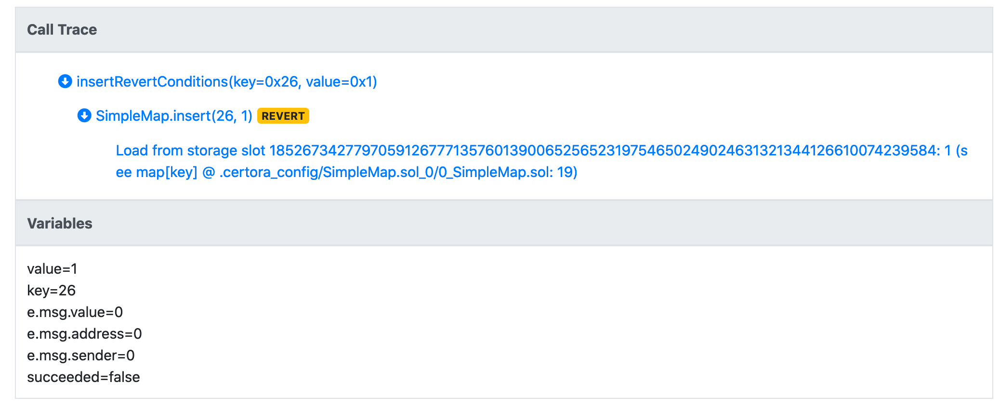

# From basic to advanced

In this tutorial we will cover the basics of the Certora Prover and reach some of the most advanced features available the Prover offers. You will learn about common specification patterns, how to diagnose violations reported by the Prover, and troubleshoot wrong configurations of the Prover.

Our running example will be a smart contract implementing a Map. Initially, we will implement a map that doesn't provide much beyond the standard primitvie `mapping` type of Solidity, but as we progress we will support iteration over the map's keys \(slightly akin to OpenZeppelin's `EnumerableMap` contract\).

### The SimpleMap contract

#### The code

The below code contains the implementation of a simple map data structure, holding `uint` keys, `uint` values, and assuming that the value `0` indicates a non-existent key. It is possible to get, insert, or remove a key from the map.

```text
pragma solidity ^0.7.0;

contract SimpleMap {
    mapping(uint => uint) internal map;
    function get(uint key) public view returns(uint) { return map[key]; }

    function insert(uint key, uint value) external {
        require(value != uint(0), "0 is not a valid value");
        require (!contains(key), "key already exists");
        map[key] = value;
    }

    function remove(uint key) external {
        require (map[key] != uint(0), "Key does not exist");
        map[key] = uint(0);
    }

    function contains(uint key) internal view returns (bool) {
        if (map[key] == uint(0)) {
            return false;
        }

        return true;
    }
}
```

In the next sections of the tutorial, we will generalize this trivial contract to support enumeration of the keys in the map.

### Writing specs

Writing rules requires us to consider what are the high-level properties our contract should satisfy. We show some simple and useful patterns for rules.

#### Generalized unit tests

Rules that generalize unit tests focus on a single state-mutating function of the contract, and make sure that the state is mutated in the expected way. The main benefits of these rules is that they are easy to come up with, due to their similarity to unit tests. The added benefit compared to unit tests is that they only use symbolic values, meaning that we check not a single set of concrete values in the unit test, but _all_ possible values.

Here is a simple rule for the `insert` function:

```text
rule checkInsert(uint key, uint value) {
    env e;
    insert(e, key, value);
    assert get(key) == value, "value of key is not equal to the inserted value";
    assert contains(key), "key is not contained after successful insertion";
}
```

This rule checks that once a key is successfully inserted with `insert`, getting the key with `get` returns the value inserted. The `key` and `value` parameters declared in the rule's header are completely arbitrarily chosen. The `env` \(environment\) variable `e` is capturing the \(symbolic\) values of the blockchain variables, such as `msg.sender` and `block.number`. The invocation of insert expects to get as a first argument the environment variable, followed by the arguments according to the function's declaration.


Note that by default, the invocation of a function is assumed to succeed. That is, reverting paths of the function are ignored.


After calling `insert`, we wish to examine if the mutated state is as expected. Therefore, we assert that calling `get(key)` is returning the value `value` inserted. It is possible to add an explanation string to the assertion, which may help in finding out which assertion was violated if a rule contains more than one assertion.

We are now ready to run our the tool: suppose the contract is saved in a file called `SimpleMap.sol`, and the spec is saved in a file `simpleMap.spec`, we can run the tool as follows:

```text
certoraRun SimpleMap.sol --verify SimpleMap:simpleMap.spec
```

Which tells the tool to include the `SimpleMap` contract in its verification context, and to verify it using the provided spec file.

Unfortunately, the tool outputs the following error:

```text
[main] ERROR log.Logger - Syntax error in spec file (9:5): could not type expression "get(key)", message: Could not find an overloading of method get that matches the given arguments: uint. Method is not envfree; did you forget to provide the environment as the first function argument?
```

The cause of the failure is that we did not pass an environment variable to the invocation of `get`. While it is possible to reuse `e` or even declare another environment variable, we note that `get` actually does not depend on any of the blockchain related variables. Thus, we can tell the Prover to relieve us from specifying the environment, by adding the following declaration to the top of the spec file:

```text
methods {
    get(uint) returns uint envfree
}
```

#### Revert conditions

As noted before, by default invocations are assuming only the non-reverting paths of the function. It is useful to precisely characterize all conditions that guarantee that the function would not revert. We write such a rule for `insert`:

```text
rule insertRevertConditions(uint key, uint value) {
    env e;
    insert@withrevert(e, key, value);
    bool succeeded = !lastReverted;

    assert value != 0  => succeeded;
}
```

Here, we invoke `insert` but append to the function name the modifier `@withrevert` that tells the Prover to skip the pruning of reverting paths. \(One could also stress that a function should prune the reverting paths using `@norevert`, although this is equivalent to not writing any modifier at all.\) We then save into a boolean variable the negation of `lastReverted`, which is a special keyword that is set to `true` if the last invocation reverted. We then assert that if the value inserted is non-zero \(recall that we consider 0 to be an illegal value in our map implementation\), then the value of `succeeded` must be true.


`lastReverted` will _always_ be `false` following an invocation that is not permitting reverting paths.


Running the Prover on the new rule, it returns a failure. The failure is happening because `value` is non-zero yet the `insert` function reverted anyway. 


A hint towards what happened can be found in the `Variables` section. The value of `e.msg.value` is indicating the `msg.value` used in `insert`. Since `insert` is not a payable function, it is expected to revert when `msg.value` is non-zero, which is indeed our case here.

We refine the rule as follows, and require that `e.msg.value` is 0:

```text
rule insertRevertConditions(uint key, uint value) {
    env e;
    insert@withrevert(e, key, value);
    bool succeeded = !lastReverted;

    assert (e.msg.value == 0 
        && value != 0)
        => succeeded;
}
```

We run the rule again, but it still fails: 



We get a call trace that tells us the most important operations performed by the bytecode of the contract, on which the Prover operates. The call trace tells us that we were reading from a storage slot the value 1. To assist us in identifying the issue, in parenthesis we get a reference to the matching source code, which is the load of `map[key]` in line 19, which is where the `contains` function is defined. We understand that we forgot to include the condition that the key does not already exist in the map. So we refine the code again:

```text
rule insertRevertConditions(uint key, uint value) {
    env e;
    insert@withrevert(e, key, value);
    bool succeeded = !lastReverted;

    assert (e.msg.value == 0 
        && value != 0
        && !contains(key))
        => succeeded;
}
```

And finally our rule is successfully verified.

#### Inverses

In some cases, wider coverage can be reached if we write rules that check the interaction of multiple functions with each other. In the map implementation, it is natural to check that `insert` and `remove` inverses of one another. Specifically, we'd like to check that:

* Invoking `remove` after a successful `insert` must succeed too.
* The value of a key that was inserted and immediately removed is not the value that we inserted.

The below rule shows how we can check these two assertions:

```text
rule inverses(uint key, uint value) {
    env e;
    insert(e, key, value);
    env e2;
    require e2.msg.value == 0;
    remove@withrevert(e2, key);
    bool removeSucceeded = !lastReverted;
    assert removeSucceeded, "remove after insert must succeed";
    assert get(key) != value, "value of removed key must not be the inserted value";
}
```

Note that we use two separate environments for `insert` and `remove` for better coverage.


Reuse of environment variables could lead to vacuity, which is expanded upon in other sections of this manual.



It is recommended to keep `lastReverted` in separate variables to clearly indicate which invocation we refer to, and to avoid confusion if invocations are reordered.


This rule is verified by the Prover.

### The IterableMap contract

The `IterableMap` will maintain an internal array of the keys inserted to the map. In the next section, we will add an iteration function.

```text
contract IterableMap {
    mapping(uint => uint) internal map;
    function get(uint key) public view returns(uint) { return map[key]; }

    uint[] internal keys;
    function numOfKeys() external view returns (uint) { return keys.length; }

    function insert(uint key, uint value) external {
        require(value != 0, "0 is not a valid value");
        require (!exists(key), "key already exists");
        map[key] = value;
    }

    function remove(uint key) external {
        require (map[key] != 0, "Key does not exist");
        map[key] = 0;
        uint i = indexOf(key);
        if (i < keys.length - 1) {
            keys[i] = keys[keys.length-1];
        }
        keys.pop();
    }

    function contains(uint key) internal view returns (bool) {
        if (map[key] == 0) {
            return false;
        }

        return true;
    }

    function indexOf(uint key) internal view returns (uint) {
        for (uint i = 0 ; i < keys.length ; i++) {
            if (keys[i] == key) {
                return i;
            }
        }
        require(false, "Could not find key");
    }
}
```

We can now run the original spec file on the new contract. Unfortunately, not all rules are passing. The `inverses` rule is failing. The assertion message tells us `Unwinding condition in a loop`. It is output whenever we encounter a loop that cannot be finitely unrolled. To avoid misdetections of bugs, the Prover outputs an assertion error in the loop's stop condition. We can control how many times the loops are unrolled, and in the future the Prover will also support specification of inductive invariants for full loop coverage. In our example, we can start by simply assuming loops can be fully unrolled even if only unrolled once, by specifying `--settings -assumeUnwindCond` in the command line for running the Prover.

Even then `inverses` still fails. Let's consider the call trace for this rule: 


We see that we were able to nullify the entry in the map, but the last operation that we see in the call trace under `remove` is that we load from `keys` a value of 0. It is known that the Solidity compiler associates the storage slot that of an array to its length. Here we see that the read length is 0. This means the `key` array is empty. However, it shouldn't have been empty after invoking `insert`. This is exactly the bug that we have in the code - we need to add the inserted key into the `keys` array:

```text
function insert(uint key, uint value) external {
        require(value != 0, "0 is not a valid value");
        require (!contains(key), "key already exists");
        map[key] = value;
        keys.push(key);
    }
```

Oddly enough, the rule still fails:


It is still reported that the length of `keys` is 0, but this is unexpected. We examine the operations performed by `insert`, and we see that it loaded a length of `ff....ff`, and then stored a length of 0. That is, our array filled-up and reached the length of max `uint256`. This may look absurd or unrealistic, but that's where the power of the Prover lies - it doesn't miss any edge case. If we believe it is unrealistic for the length of `keys` to reach the maximum value, we should:

* assume that the length of the array is less than max `uint256`.
* assert that it is indeed infeasible to directly overwrite the length slot, or to increment the length by more than `1` in each operation.

We start by adding a simple assumption in the rule. \(We will later replace it with an assumption of an invariant, that will also assert that reaching max `uint256` is infeasible.\)

```text
rule inverses(uint key, uint value) {
    require numOfKeys() < max_uint;
    env e;
    insert(e, key, value);
    env e2;
    require e2.msg.value == 0;
    remove@withrevert(e2, key);
    bool removeSucceeded = !lastReverted;
    assert removeSucceeded, "remove after insert must succeed";
    assert get(key) != value, "value of removed key must not be the inserted value";
}
```

\(don't forget to add `numOfKeys` to our `envfree` declarations!\)

#### Adding iteration

Our goal in adding the `keys` variable was to allow iteration over the keys. We start with an extremely simple example, that sets all keys' values to 100:

```text
function iterate() external {
    for (uint i = 0 ; i < keys.length ; i++) {
        uint key = keys[i];
        doSomething(key, get(key));
    }
}

function doSomething(uint key, uint value) virtual internal {
    map[key] = 100;
}
```

We also want to add a basic check rule:

```text
rule checkIterate() {
    env e;
    iterate(e);
    uint someKey;    
    require contains(someKey);
    assert get(someKey) == 100;
}
```

The rule fails with the following call trace:


Let's unpack what can be seen here. First, the length of the `keys` array is 1, and we read a key `22f2`. We than write `100` to it in the map, and then `iterate` function is done. We then note that `someKey`, the key that we want to check for, is not `22f2`, but rather `20c9`. While we assumed that it is contained in the map, using the `contains` function, it is not contained in the `keys` array. This is expected since the state that the Prover starts with can be completely arbitrary, subject to constraints that we specify on the state. We wish to leave the `contains` function to be an `O(1)` complexity function, and rather provide the tool with the invariants that will allow it to see only states that "make sense", or in more precise terms, we only want to see states where the `keys` array contains exactly the same elements as the non-zero valued keys in the map.

In mathematical terms, the invariant that our `IterableMap` contract should satisfy is:

$$
\forall x. (map(x) \neq 0 \iff \exists i. 0\leq i \leq keys.length \land keys[i] =x)
$$

This invariant can be encoded directly in the spec file, as follows \(for convenience we assume `keys` is public and has a getter\):

```text
invariant inMapIffInArray(uint x) 
    get(x) != 0 <=> 
        (exists uint i. 0 <= i && i < getNumOfKeys() && keys(i) == x)
```

It is however not recommended to invoke the underlying contract directly within quantified expressions \(such as `exists uint i. ...`\). The complexity of the underlying bytecode might lead to timeouts, and thus it is recommended to move to _ghost variables_. Ghost variables, once properly instrumented, allow us to write specs that are separated from the many technicalities of low-level bytecode, and are thus a powerful abstraction tool. 

We will write the above invariant using ghost variables exclusively. First, we will declare ghost variables for the underlying map structure as a function mapping keys to values:

```text
ghost _map(uint) returns uint;
```

The above declaration declares a _ghost function_. The ghost function takes a `uint` argument \(represnting a key in the map\) and returns a `uint` value. We want `_map` to return for each given key the same value as returned by the `map` in the code. We can state this property as an invariant:

```text
invariant checkMapGhost(uint someKey) get(someKey) == _map(someKey)
```

Currently, the rule fails for all state-mutating functions, and even in the contract's initial state after constructor \(rule `checkMapGhost_instate`\):


This is in fact unsurprising. There is nothing in the spec that links the value of the ghost to its Solidity counterpart. To make that link, we write _hooks_. Hooks allow us to instrument the verified code, that is, to wrap a bytecode operation with our own code, defined in the spec file. 

For example, we can hook on `SSTORE` operations that write to the underlying map as follows:

```text
hook Sstore map[KEY uint k] uint v STORAGE {
    havoc _map assuming _map@new(k) == v &&
        (forall uint k2. k2 != k => _map@new(k2) == _map@old(k2));
}
```

This hook will match on every storage write to `map[k]`, denoting the written value by `v`. Optionally, and not shown in the syntax above, we can also specify the ovewritten value of `map[k`\]. The body of the hook is the injected code. It will apply `havoc` on the `_map` ghost, meaning that every key-value association it stored is "forgotten" by the prover, and results in a completely new instance of `_map`. However, we restrict the new instance of `_map` using the old `_map` definition, with the `assuming ...` syntax. Under `assuming` we get a two-state context: we can see both old and new instances of `_map`, accessible with `_map@old` and `_map@new`. We require that `_map@old` and `_map@new` are exactly the same for all keys except for `k`, the one we write to, and for `k` we require that `_map@new(k) == v` .

If we run `checkMapGhost` with only the `SSTORE` hook, the rule will pass for all functions but fail in the initial state, where no values were written. It is possible to specify initial state axioms on ghosts.

Similarly, one could define `SLOAD` hooks:

```text
hook Sload uint v map[KEY uint k] STORAGE {
    require _map(k) == v;
}
```

This hook says that every time the Prover encounters an `SLOAD` operation that reads the value `v` from `map[k]`, it will inject the code within the body of the hook after the `SLOAD`. This will make our `checkMapGhost` rule pass, but it's also become a tautology, because it's always true: by calling `get` we're already calling instrumented code that requires `_map(k) == v` whenever we load an arbitrary value `v` from the key `k`.

